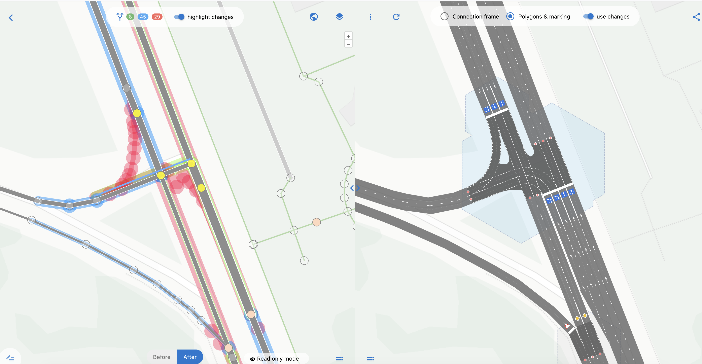
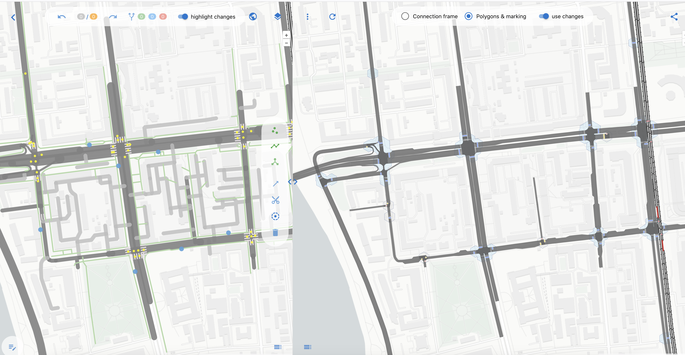
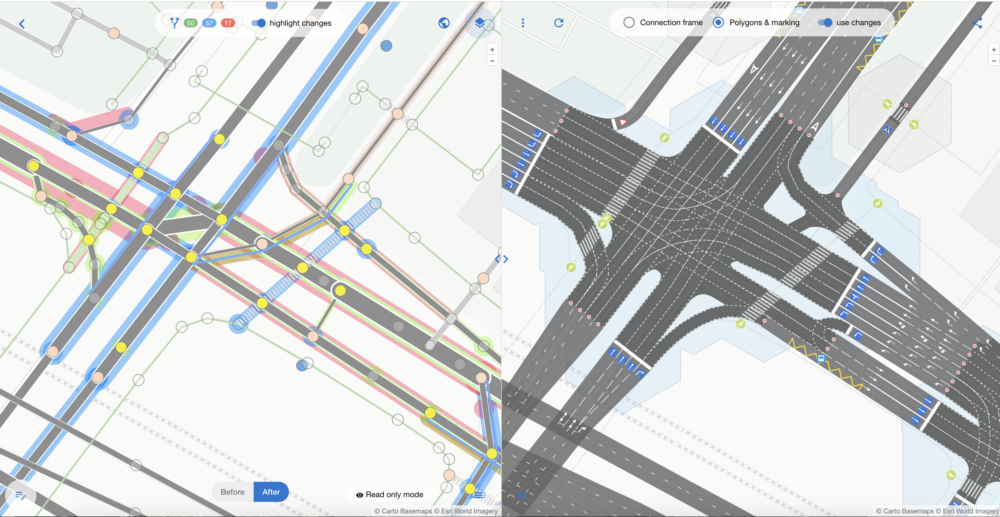
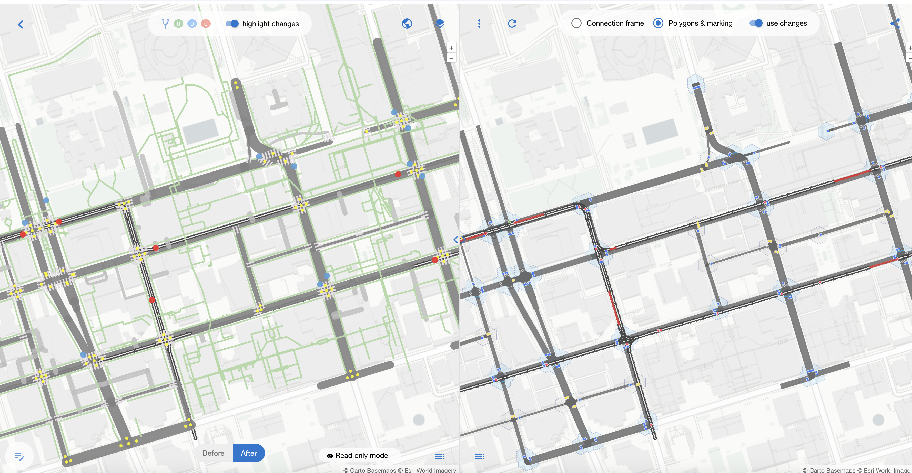
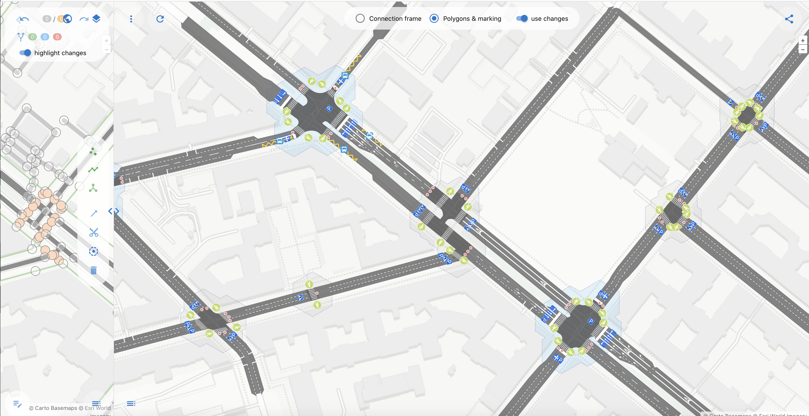

## Bakery Gallery

Here we will collect various examples of corrected intersections, simple and complex, broken and perfected.

| Simple Intersection, 2 left turn lanes | An impressive part of Omsk city center |
| :---------------- | :------ |
|  |  |
| [osmpie link](https://osmpie.org/app/editor?bakeId=8e6d87b4-3f58-4876-9e5e-1c0d7469f0e8&pos=73.343202&pos=54.972568&zoom=20.00) | [osmpie link](https://osmpie.org/app/editor?bakeId=4e1057cb-3be4-4b5f-a14c-aa1d57c5591d&pos=73.383979&pos=54.972774&zoom=16.50&tile=Carto+Light) |

| Complex Intersection in Moscow | Downtown Toronto (uncorrected) |
| :---------------- | :------ |
|  |  |
| [osmpie link](https://osmpie.org/app/editor?bakeId=3f865538-017f-4fd8-92db-0240111ac257&pos=37.570537&pos=55.718326&zoom=19.07&tile=Carto+Light) | [osmpie link](https://osmpie.org/app/editor?pos=-79.38276&pos=43.650668&zoom=17.04&bakeId=30fc53c8-636e-478e-8fb3-e019e7f91f71&tile=Carto+Light) |

| Removed relation:connectivity somewhere in the USA (not in OSM) | Berlin Sonnenallee (uncorrected) |
| :---------------- | :------ |
|  |  |
| [osmpie link](https://osmpie.org/app/editor?pos=-95.957922&pos=36.089777&zoom=19.85&tile=Esri+World&bakeId=1822b8af-5eb4-4b3e-8ddc-ffd548359e22) | [osmpie link](https://osmpie.org/app/editor?pos=13.441555&pos=52.481094&zoom=18.27&bakeId=b7811107-52fa-4549-97ac-d8ddc0cf3d0e&tile=Carto+Light) |