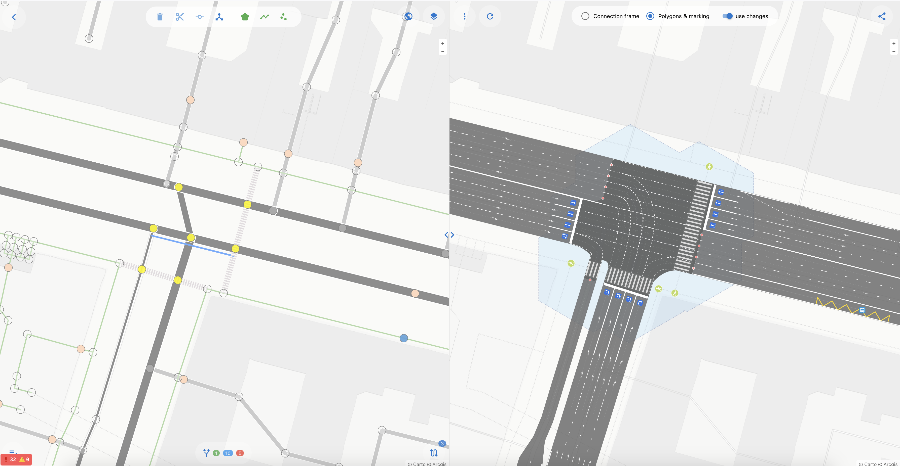
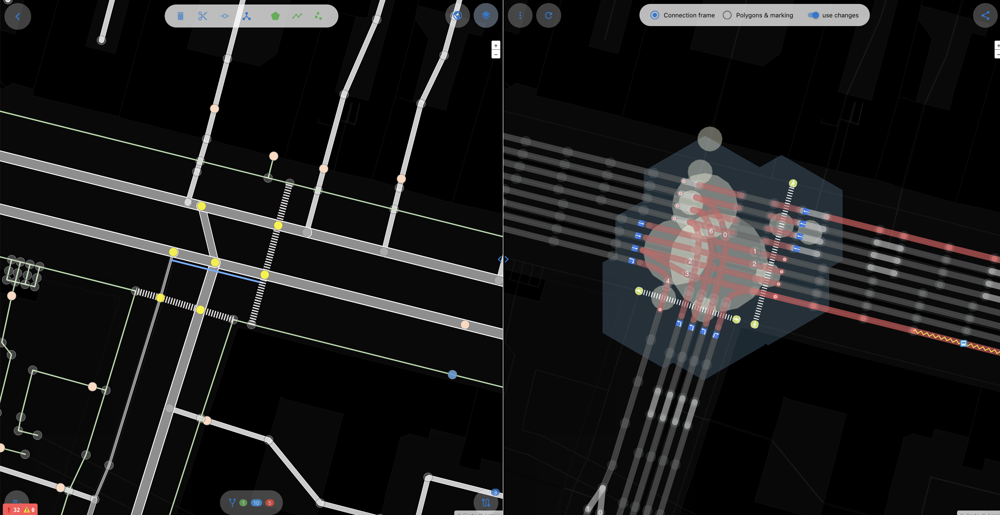
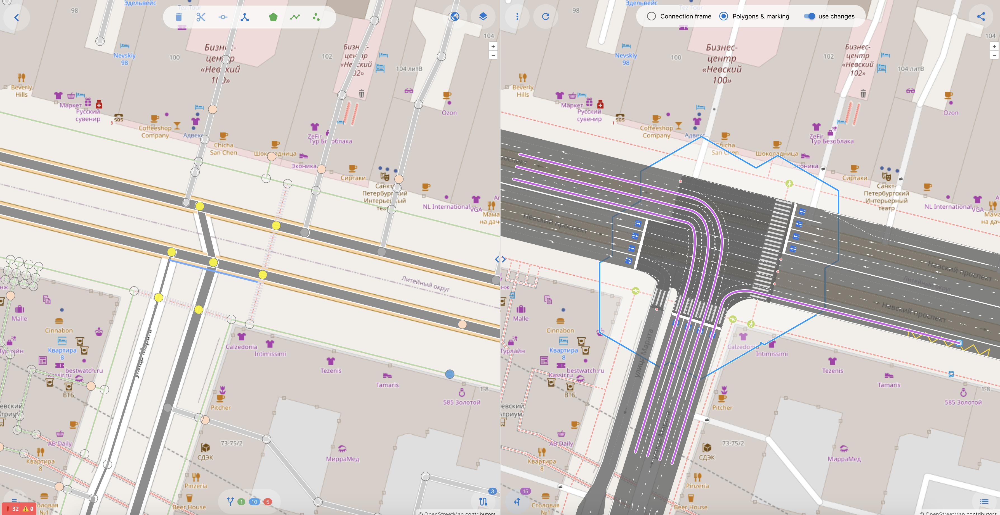
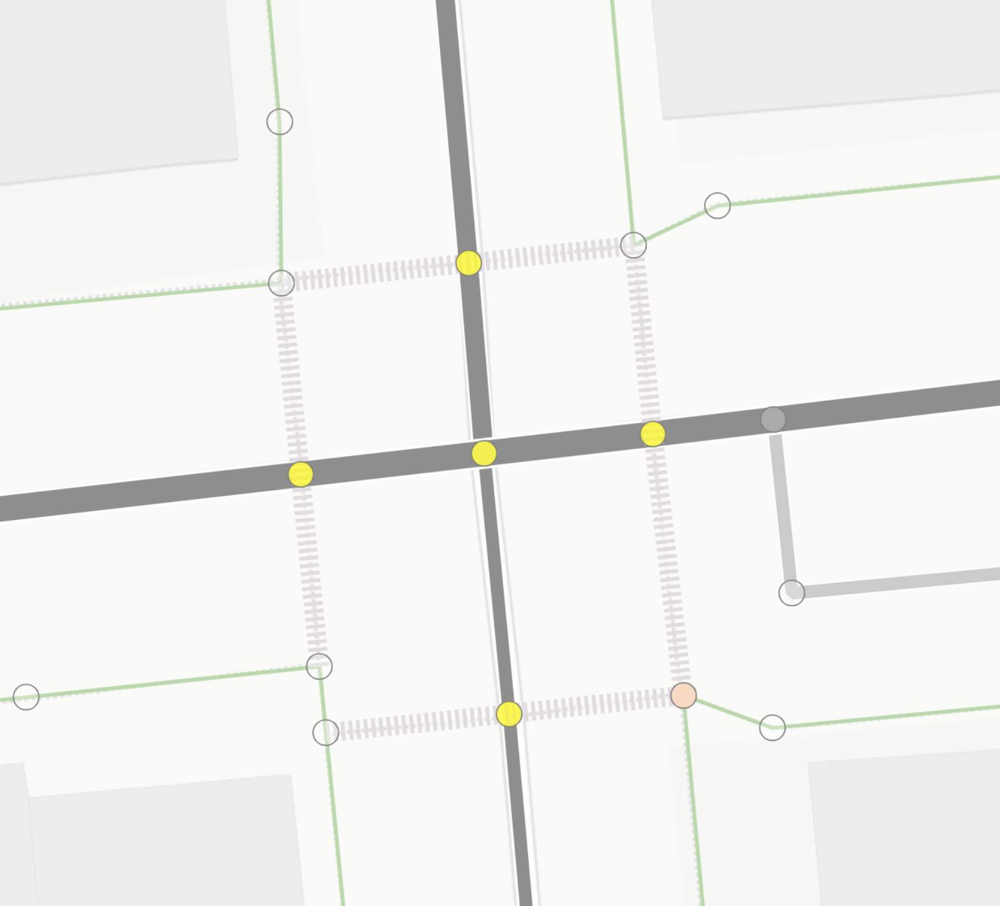
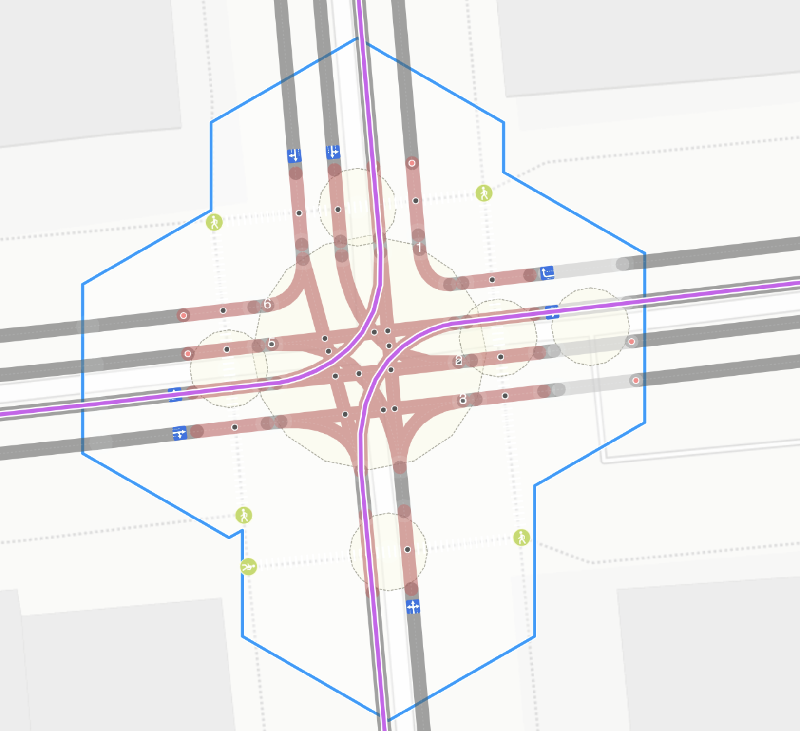
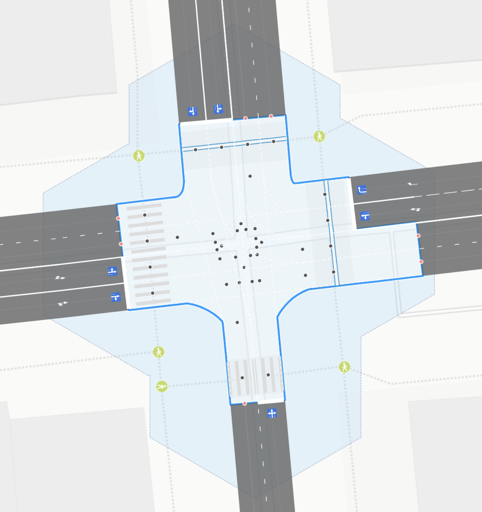
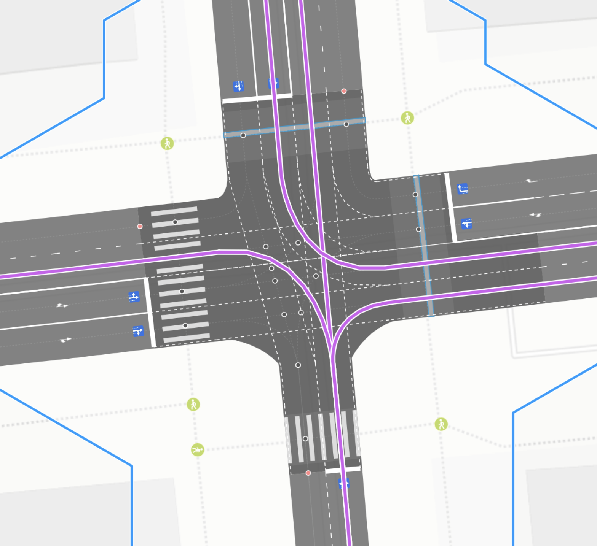

# OSMPIE — Perfect OpenStreetMap Junction Editor

In **OpenStreetMap**, at maximum zoom, you can find carefully drawn [trees](https://wiki.openstreetmap.org/wiki/Tag:natural%3Dtree), [bicycle parking](https://wiki.openstreetmap.org/wiki/Tag:amenity%3Dbicycle_parking), [lowered curbs](https://wiki.openstreetmap.org/wiki/Key:kerb) at crossings, [manholes](https://wiki.openstreetmap.org/wiki/Key:manhole), and [benches](https://wiki.openstreetmap.org/wiki/Tag:amenity%3Dbench). However, such a complex object as a junction is often simplified to a couple of colored lines. This lack of accuracy makes it impossible to solve practical tasks related to road infrastructure. Restoring the real topology of a junction requires incredible patience and ingenuity.

**OSMPIE** was created to solve this problem!

## OSMPIE System Architecture

PIE consists of two key components:

**Road Rendering Engine** — processes OSM objects (`way`, `node`, `relation`) and creates a topologically and geometrically connected system of new geo-objects. The result is a detailed model with traffic lanes, stop lines, conflict zones, and road markings.

**Specialized Editor-Viewer** — a tool for quick and convenient mapping of roads and junctions in OSM. Supports WYSIWYG editing: change a tag — instantly see how the geometry updates.

## Practical Significance of the Project

**Accurate Road Model**

OSMPIE is more than a rendering engine for area road objects. At its core is the construction of an accurate topological and object model of most elements of the road network. It generalizes multiple points in the junction logic, creating objects (entry and exit points from the junction, conflict points, approaches) necessary for engineering calculations at the junction and traffic management.

**Advanced Navigation**

Extended object modeling and improved visualization quality provide more accurate road navigation, as they offer not only basic data on the number of lanes and road signs, but also comprehensive information on turn models, junction geometry, road markings, and other detailed infrastructure elements.

**OSM Enrichment**

Objects obtained as a result of OSMPIE rendering (for example, road polygons, area:highway, area:highway=* + junction=yes, marking signs, refined turn tags turn:lanes for way[highway], polygons and markings of pedestrian crossings, and much more) can be saved to OSM.

**Engineering Calculations, Modeling, v2x**

Objects and data obtained as a result of rendering can be used in a wide range of ADAS MAP, MAPem V2X technologies, 3D road visualizations, traffic object design, micro-modeling, and traffic light control program development.


**Data Analytics**

How many junctions are in your city? How many of them are controlled and uncontrolled? How complex are the junctions? OSM does not provide data that allows obtaining accurate answers to these questions. OSMPIE simplifies finding answers to these and more complex queries. OSMPIE represents junctions as separate objects with all necessary relationships, such as the number of conflict points or intersections with tram lines.



## Why Do I Need This? What's the Benefit?

- Use osmpie for correct and accurate road mapping in OSM, osmpie will act as an assistant and validator
- Send a link to a colleague for review before applying a changeset or for collaborative discussions.
- Download all rendering results in GeoJSON or upload to your GIS (QGIS, for example), you can do it directly via API or direct link. For your research work or personal projects. Remember about ODBL.
- You can obtain both a topological lane model with additional attributes for each lane, points and connections, and the final one — area-based with markings.
- Fill OSM with current and accurate data. Let the map reflect reality in all necessary details.

## Convenient Functional Interface

- **Visual tag validation** — if something is wrong, it's immediately visible
- **Collaborative work** — ability to share a link to edits for review before uploading to OSM  
- **Data export** — simple conversion to GIS formats (GeoJSON and others)

The result — fewer guesses and long discussions in chats, more accurate data on the map. 


### Step-by-Step Mapping Methodology

1. **First stage — graph construction.** Each traffic lane gets its own centerline. This provides the basis for an accurate topological network model.

2. **Second stage — junction connectivity.** At this stage, correct connection of lanes at intersections is ensured so that the logic of traffic flows is consistent.

3. **Third stage — geometry.** Only after completing the topology do we proceed to geometric transformations: drawing junction shapes, lanes, markings, and other details.


---

## Design Philosophy and Motivation

**Our approach** — topology first, then geometry

Existing tools help with visualization but do not prevent situations where the map looks beautiful but only approximately reflects reality. Such a model is not suitable for solving practical tasks.

**Our goal** — to create a *perfect junction* in OSM. This is a logically consistent junction model containing all the necessary data and guaranteeing that each element on the map is not only visually attractive but also **topologically correct**.


---

## Functional Junction Model

### What is a "Junction"?

From the perspective of functional modeling, a junction should include and interrelate the following set of basic objects:

- **Stop line or entry point**: The exact location where vehicles enter the junction (stopline — blue point — corresponds to road sign 5.15)
- **Approach**: A coordinated group of stop lines from one approach direction
- **Exit point**: A designated place where vehicles leave the junction (exitpoint — red point)
- **Route**: A defined path connecting entry and exit points (route — purple line)
- **Conflict points**: Critical locations where multiple routes intersect, creating potential vehicle conflicts (conflict point — black point)

### Fundamental Junction Characteristics

1. **Dual nature**: Junctions possess both area (areal) and graph properties, embodying [geometric](https://en.wikipedia.org/wiki/Geometry) and [topological](https://wikipedia.org/wiki/Topology) characteristics.

2. **Cluster composition**: A junction represents a cluster of multiple individual intersection points, not a single entity.

3. **Radius-based characterization**: Each intersection is characterized by two critical radii linking the graph and areal nature of junctions:
   - **Junction radius**: Defines the conflict zone area
   - **Clustering radius**: Defines the zone of influence of one junction on others

4. **Movement zone**: Junctions represent areas where traffic rules prohibit vehicle stopping, allowing only continuous movement along designated lanes and directions.

### Visual Representation Comparison

| OSM Objects | Lane Centerlines and Connections |
|:------------|:------------------------------------|
|||
|(node, way, relation)|(points, turns, connections)|

| Junction Area | Points and Routes |
|:-------------------|:-----------------|
|||
|`area:highway=* + junction=yes` ?|Multiple routes represented as lines and their intersections|

---

## How to Use OSMPIE?

### Required Actions

Users should use any standard editor to input OSM road tags, exercising particular caution with relation objects. Official OSM tags and proposals provide 90–95% of the functionality needed for comprehensive road mapping and rendering.

During OSMPIE development, we identified a minimal set of simple tags along with several extensions to existing schemas, achieving 100% functionality coverage.

### Required Tags

**Official OSM tags:**
```
highway
crossing
lanes:*
turn:lanes
width
width:lanes
psv:lanes
placement
parking:{side}:*
cycleway:{side}
bus_bay
tram
... and additional standard tags
```

**New extended tags:**
```
connect:lanes
junction:shape
junction:radius
junction:cluster:radius
crossing:corner
```

More details about all tags can be found in the [glossary](./osmpie.tags.glossary.md)

---

### Input Data Specifications

**Source data**: Overpass API queries returning complex `highway=*` objects and related road infrastructure elements. All objects are displayed in the left panel of the editor and remain accessible for modification (tags and geometry).

### Output Data Products

**Generated components**:
- **Lane graph structure**: A complete graph of traffic lanes, parking zones, tram tracks, and bike paths in the form of points and arcs, topologically corresponding to the movement directions of the original OSM ways and geometrically aligned with lane centerlines
- **Functional junction points**: Specialized identification of stop lines (entry points), exit points, and conflict points for each category of junction participants
- **Object clustering**: Systematic grouping of graph points and arcs into logical objects such as junctions and approaches
- **Areal objects**: Multi-polygon representations of junctions and road polygons (see [area:highway](https://wiki.openstreetmap.org/wiki/Key:area:highway))
- **Road marking objects**: Complex road marking elements in the form of polygons, lines, and points linked to corresponding graph edges

---
### Visual Validation Capabilities

The OSMPIE renderer functions as a sophisticated visual validator. If the rendered result looks imperfect or doesn't match satellite imagery, it's necessary to add tags or correct existing attributes.

## Current Version Limitations

The first public release of OSMPIE contains non-customizable road marking generation, which provides maximum coverage but may not reflect specific local marking conventions, such as parking spaces or pedestrian crossings. The marking renderer works for indicating object existence, lane presence, and dimensional characteristics. We prioritize rapid resolution of these limitations in upcoming future updates.

## Conclusion

OSMPIE represents a paradigm shift toward professional junction modeling in the OpenStreetMap ecosystem, filling the gap between simplified linear representations and the complex reality of modern road infrastructure. Through systematic application of extended tagging schemas and sophisticated rendering algorithms, OSMPIE enables cartographers to create accurate, visually compelling representations that serve both aesthetic and functional requirements.

## Recommended Articles

1. [Getting Started with OSMPIE](./getting-started.md)
2. [Workflow, Window and Form Descriptions](./workflow.and.forms.md)
