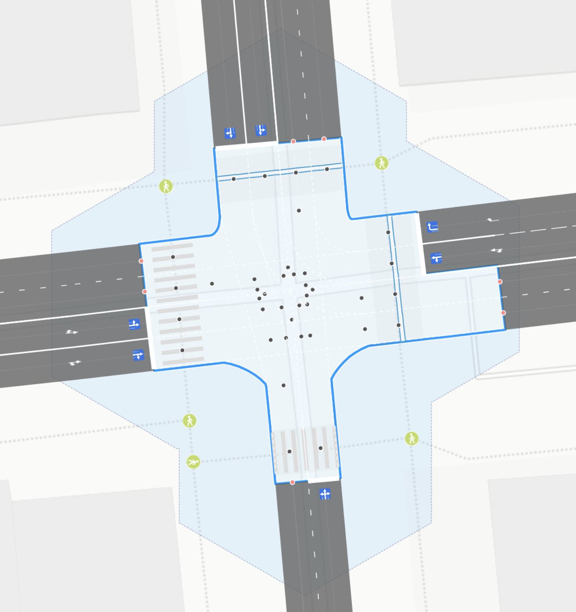

## OSMPIE — OSM Perfect Intersections Editor

At high zoom levels, we want to see real roads, not “orange and yellow ribbons.” In OpenStreetMap, you can find carefully drawn [trees](https://wiki.openstreetmap.org/wiki/Tag:natural%3Dtree), [bicycle parking facilities](https://wiki.openstreetmap.org/wiki/Tag:amenity%3Dbicycle_parking), [dropped kerbs](https://wiki.openstreetmap.org/wiki/Key:kerb) at crossings, [manholes](https://wiki.openstreetmap.org/wiki/Key:manhole), and [benches](https://wiki.openstreetmap.org/wiki/Tag:amenity%3Dbench) — but a complex object like an intersection is often just a couple of colored lines.  
OSMPIE is here to fix that!  

### What OSMPIE consists of
- **Road rendering engine** — takes OSM objects (`way`, `node`, `relation`), builds a topologically and geometrically linked set of new geo-objects. The result is not just lines, but a detailed model with traffic lanes, stop lines, conflict zones, and markings.  
- **Specialized editor/viewer** — a tool for quick and convenient road and intersection mapping in OSM. Supports WYSIWYG editing: change a tag, instantly see how geometry updates.  

### Why it matters
Road mapping is not for the faint-hearted. It requires attention to detail and skill in working with tags, including unofficial or experimental ones. **OSMPIE helps** by:
- visually validating tags — if something’s wrong, it’s visible immediately;  
- allowing you to share a link to edits for review before uploading to OSM;  
- making it easy to export data to GIS formats (GeoJSON, etc.).  

The result — fewer guesses and long chat threads, more accurate data on the map.  
And of course, a bit of joy in the process: it’s nice when an intersection in OSM looks like an intersection, not just a “colorful X made of two lines.”


---

## Background and Challenges

Years of experience working with road network models taught us a simple truth: if you want the picture on the screen to reflect the reality “on the ground,” you must start with logic, not looks. First comes **topology**, then **geometry**.

The main challenge was to implement a **graph unfolding** function and generate new connections that maintain a consistent topology with respect to both the original OSM data and the real-world layout.

1. **Step one – graph construction.** Each traffic lane gets its own centerline. This provides the foundation for an accurate topological model of the network.
2. **Step two – intersection connectivity.** This stage ensures correct lane connections at junctions so that traffic flow logic is consistent.
3. **Step three – geometry.** Only after the topology is complete do we move on to geometric transformations: drawing intersection shapes, lanes, markings, and other details.

The “structure first, picture later” approach prevents many common mistakes where a map looks nice but would be confusing or impractical to navigate in real life.


---

## Motivation and Design Philosophy
## Motivation

Mapping roads — and especially complex intersections — is no easy task. A cartographer needs not only knowledge of OSM tagging, but also strong spatial imagination. Existing tools certainly help with visualization, but often they only provide an “approximate resemblance.”

**Our goal** is to create the *perfect intersection* (more precisely, its accurate and logically consistent model), ensuring that every element on the map is not just visually appealing, but also **topologically correct**.


---

## Intersection Definition and Functional Model

### What Constitutes an "Intersection"?

From a functional modeling perspective, an intersection must possess and interconnect the following essential object set:

- **Stop Line or Entry Point**: The precise location where vehicles enter the intersection (stopline - blue point - corresponding to traffic sign 5.15)
- **Approach**: A coordinated group of stop lines from a single directional approach
- **Exit Point**: The designated location where vehicles leave the intersection (exitpoint - red point)
- **Route**: The defined path connecting entry to exit points (route - purple line)
- **Conflict Points**: Critical locations where multiple routes intersect, creating potential vehicle conflicts (conflict point - black point)

### Fundamental Intersection Characteristics

1. **Dual Nature**: Intersections possess both areal and graph-based properties, embodying both [geometric](https://en.wikipedia.org/wiki/Geometry) and [topological](https://en.wikipedia.org/wiki/Topology) characteristics.

2. **Cluster Composition**: An intersection represents a cluster of multiple individual crossing points rather than a singular entity.

3. **Radius-Based Characterization**: Each crossing can be characterized by two critical radii that bridge the graph-based and areal nature of intersections:
   - **Intersection Radius**: Defines the area of the conflict zone
   - **Clustering Radius**: Determines the area of influence one intersection exerts on others

4. **Movement-Only Zone**: Intersections represent areas where traffic regulations prohibit vehicle stopping, permitting only continuous movement through designated lanes and directions.

### Visual Representation Comparison

| OSM Objects | Lane Centerlines and Connections |
|:------------|:--------------------------------|
|||
|(node, way, relation)|(points, edges, connections)|

| Intersection Area | Points and Routes |
|:------------------|:------------------|
|||
|`area:highway=* + junction=yes` ?|Multiple maneuvers represented as route lines and their intersections|

---

## Implementation Guidelines

### Required Actions

Users should utilize any standard editor to input OSM tags for roads while exercising particular caution with relation objects. The official OSM tags and proposals provide 90-95% of the functionality required for comprehensive road mapping and rendering capabilities.

Through OSMPIE development, we have identified and defined a minimal set of simple tags along with several extensions to existing schemas that achieve 100% functionality coverage.

### Required Tags

**Official OSM Tags:**
```
highway
crossing
lanes:*
turn:lanes
width
width:lanes
psv:lanes
placement
parking:{side}:*
cycleway:{side}
bus_bay
tram
... and additional standard tags
```

**New Extended Tags:**
```
connect:lanes
junction:shape
junction:radius
junction:cluster:radius
crossing:corner
```

### Visual Validation Capability

The OSMPIE renderer functions as a sophisticated visual validator. When the rendered output does not meet aesthetic expectations, appears imperfect, or fails to correspond accurately to satellite imagery, this typically indicates the need for additional tags or correction of existing attributes.

---

## User Benefits and Practical Advantages

### Enhanced Workflow Capabilities

- **WYSIWYG Editing**: Road and intersection tag input and markup becomes significantly more accurate, precise, and user-friendly with [What You See Is What You Get](https://en.wikipedia.org/wiki/WYSIWYG) capabilities
- **Multi-Editor Compatibility**: Support for loading [*.osc](https://wiki.openstreetmap.org/wiki/OsmChange) files created in alternative editors
- **Export Functionality**: Save proposed modifications and open them in JOSM or other editors for continued refinement
- **Collaborative Review**: Share links with other users for modification discussion before implementation, particularly valuable for complex or ambiguous cases
- **Visual Change Tracking**: Comprehensive visual representation of all map modifications
- **Multiple Export Formats**: Export or save all OSMPIE-generated objects in GeoJSON format, with direct integration to `geojson.io` for conversion to Shapefile, CSV, KML, and other formats
- **Quality Enhancement**: Contribute to OSM improvement with reduced effort and increased precision

### Input Data Specifications

**Source Data**: Overpass API queries returning comprehensive `highway=*` objects and related road infrastructure elements. All objects appear in the editor's left panel and remain available for modification (tags and geometry).

### Output Data Products

**Generated Components**:
- **Lane Graph Structure**: Complete graph of road lanes, parking areas, tram tracks, and bicycle paths represented as points and arcs, topologically corresponding to original OSM way movement directions and geometrically aligned with lane centerlines
- **Functional Intersection Points**: Specialized identification of stop lines (entry points), exit points, and conflict points for each category of intersection participants
- **Object Clustering**: Systematic grouping of graph points and arcs into logical objects such as intersections and approaches
- **Areal Objects**: Multi-polygon intersection representations and road polygons (see [area:highway](https://wiki.openstreetmap.org/wiki/Key:area:highway))
- **Road Marking Objects**: Comprehensive road marking elements as polygons, lines, and points linked to corresponding graph edges


---

## Conclusion and Future Development

While the OSMPIE renderer maintains high accuracy standards, it may occasionally produce minor errors. However, its primary function involves precisely reflecting user specifications through OSM object tagging schemas, enhanced with aesthetic improvements including corner rounding and automatic marking generation.

### Current Version Limitations

The initial public release of OSMPIE features non-customizable road marking generation that produces maximum coverage but may not reflect specific local marking conventions, such as parking spaces or pedestrian crossings. The marking renderer operates to indicate object existence, lane presence, and dimensional characteristics. We prioritize rapid resolution of these limitations in immediate future updates.

### Technical Philosophy

OSMPIE represents a paradigm shift toward professional-grade intersection modeling within the OpenStreetMap ecosystem, bridging the gap between simplified line representations and the complex reality of modern road infrastructure. Through systematic application of enhanced tagging schemas and sophisticated rendering algorithms, OSMPIE enables cartographers to create precise, visually compelling representations that serve both aesthetic and functional requirements.
