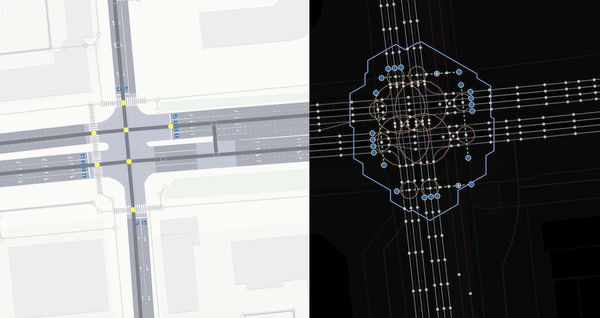
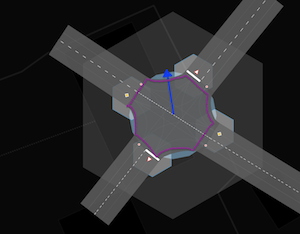

# The Essential Similarity of the `width` and `junction:radius` Tags in OpenStreetMap

This article is a response to a question on the article [junction:radius](./node.tags.junction:radius.md)
~~~
It's hard to immediately grasp what a conflict zone is and why it should be mapped?
~~~

## Introduction

When mapping in OpenStreetMap, we describe the geometric characteristics of topologically complex objects. We are forced to simplify these objects, but our description must preserve the characteristics necessary for solving practical problems. The objects must also look plausible on the map. The `width` tag for linear objects (ways) and the proposed `junction:radius` tag for point intersections (nodes) **represent the same principle** of simplifying complex geometric shapes using conditional parameters.

## A Unified Principle: From a Real Polygon to a Conditional Parameter

### The Essence of the Approach

Both `width` and `junction:radius` solve the same problem: how to describe a complex polygon with a single number. In both cases, we:

1.  **Acknowledge** that the real object is a complex polygon of arbitrary shape.
2.  **Simplify** it mentally to a simple geometric figure.
3.  **Describe** this imaginary figure with a single parameter.
4.  **Correlate** this parameter with the object's actual shape.

The only difference lies in which conventional figure we choose for simplification.

## The Concept of the `width` Tag: Simplification to a Rectangle

To understand the context of using `width`, we recommend reviewing the articles on the OSM wiki:

-   [https://wiki.openstreetmap.org/wiki/Key:width](https://wiki.openstreetmap.org/wiki/Key:width)
-   [https://wiki.openstreetmap.org/wiki/Street_parking](https://wiki.openstreetmap.org/wiki/Street_parking)

Examples from the documentation allow us to focus our attention on our thesis about the similarity of `width` and `junction:radius`.

~~~
width:lanes=1.5|2.5|2.5
~~~

~~~
parking:side:width for the width=* of the parking space: In many places, depending on the orientation of the vehicles
and the local norms, parking lanes have a default width that doesn't need to be mapped
explicitly, but there may be variations from this like very narrow or very wide parking spaces.
~~~

### How the `width` Tag Works

When we assign `width=3.5` to a road, we are **not claiming** that the road is a rectangle 3.5 meters wide. We are saying: "This complex polygon of the road **correlates** with a rectangle 3.5 meters wide."

This works because our linear thinking intuitively understands the concept of "width" for elongated objects.

## The Concept of the `junction:radius` Tag: Simplification to a Circle

Let's refer to the documentation on `junction`:

-   [https://wiki.openstreetmap.org/wiki/Tag:junction=yes](https://wiki.openstreetmap.org/wiki/Tag:junction%3Dyes)

The `junction` tag can be applied to a node to mark a point of intersection, and to a way with `area=yes` for a polygonal description:

~~~
Draw a closed way tagged with area=yes around the junction area as found on the ground,
and add the junction=yes tag.
~~~

### How the `junction:radius` Tag Works

The `junction:radius` tag works **on exactly the same logic** as `width`:

When we assign `junction:radius=8` to an intersection, we are **not claiming** that the conflict zone is a perfect circle with a radius of 8 meters. We are saying: "This complex polygon of the conflict zone **correlates** with a circle of 8 meters radius."

It's just that the radius is less intuitive for our linear thinking than width.

### Comparison of Approaches to `junction`

| Approach | Description | Application |
| :--- | :--- | :--- |
| `junction=yes` on a node | Point designation of an intersection | Simple intersections without detailed geometry |
| `junction:radius=X` on a node | Radius of the conditional circle of the conflict zone | Intersections where geometry is important for construction |
| `junction=yes` + `area=yes` on a way | Polygonal description | Complex interchanges with maximum detail |

Let's analyze examples:

| node[junction = yes] | node[junction:radius = 8] | way[junction=yes + area=yes] |
| :--- | :--- | :--- |
|  |  |  |
| Simple indication of the presence of an intersection | Conditional radius for describing the geometry of the conflict zone—the same principle as `width` for roads | Detailed polygonal mapping |

### Definition of `junction:radius`

**junction:radius** — the radius of a conditional circle **correlated** with the actual polygon of the conflict zone where road users interact.

## Why is `junction:radius` Needed?

### The Problem of Constructing Intersections

In OpenStreetMap, an intersection has a **dual nature**:
-   **Graph-based** (a point connecting lines in a topological network)
-   **Areal** (a real conflict zone on the ground)

Without information about the geometry of the conflict zone, it is impossible to correctly construct the intersection on the map. The radius is the **fundamental harmonic**, the key parameter that most quickly approximates the correct shape of the intersection.

### Analogy with `width`

Just as width connects the linear nature of a way with its real area on the ground, radius connects the point nature of a node with the real area of the conflict zone.

## Practical Recommendations

### When to Use Each Approach

**junction=yes** (without radius):
-   Simple intersections where topology is not critical.
-   Cases where topological information from the intersecting ways is sufficient to reproduce the intersection with adequate accuracy.

**junction:radius=X**:
-   Intersections where correct geometry is important for rendering.
-   Cases where automatic radius calculation yields an inaccurate result.
-   Complex intersections with non-standard conflict zone geometry.

**Polygonal junction**:
-   Large interchanges with complex shapes.
-   Cases requiring maximum accuracy.

### Automatic Calculation vs. Explicit Specification

**The principle is the same for both `width` and `junction:radius`:**
-   In many cases, the parameter can be calculated automatically from other data.
-   Explicit specification is necessary when deviations from standard formulas occur.
-   The goal is maximum correspondence with reality.

### Existing Practices

Using radii to describe areal objects via points is not new in OSM. For example, the Berlin parking mapping project:

-   [Parking in Berlin](https://github.com/SupaplexOSM/street_parking.py?tab=readme-ov-file)

| Linear Approach | Point-based Approach with Radius |
| :--- | :--- |
|  |  |

## Conclusion

`Width` and `junction:radius` are the same principle of simplifying reality when mapping, applied to different types of objects.

1.  **Unified Philosophy**: Both tags describe complex polygons using conditional parameters.
2.  **Equal Legitimacy**: If we accept `width` for roads, we should accept `radius` for intersections.
3.  **Practical Necessity**: `radius` is critical for the correct construction of intersections.
4.  **Complementarity**: `width` solves the problem of road width, `radius` solves the problem of intersection area.

The `junction:radius` tag has not yet been included in the official OSM documentation, but it is based on the same principles as the long-used `width` tag. It is a natural evolution of the ideology of simplified description of complex geometric objects.

## Additional Links

-   See the detailed article on [junction:radius](./node.tags.junction:radius.md).
-   See also [Key:diameter](https://wiki.openstreetmap.org/wiki/Key:diameter)
-   [diameter=*](https://wiki.openstreetmap.org/wiki/Tag:natural%3Dtree#Additional_tags)
