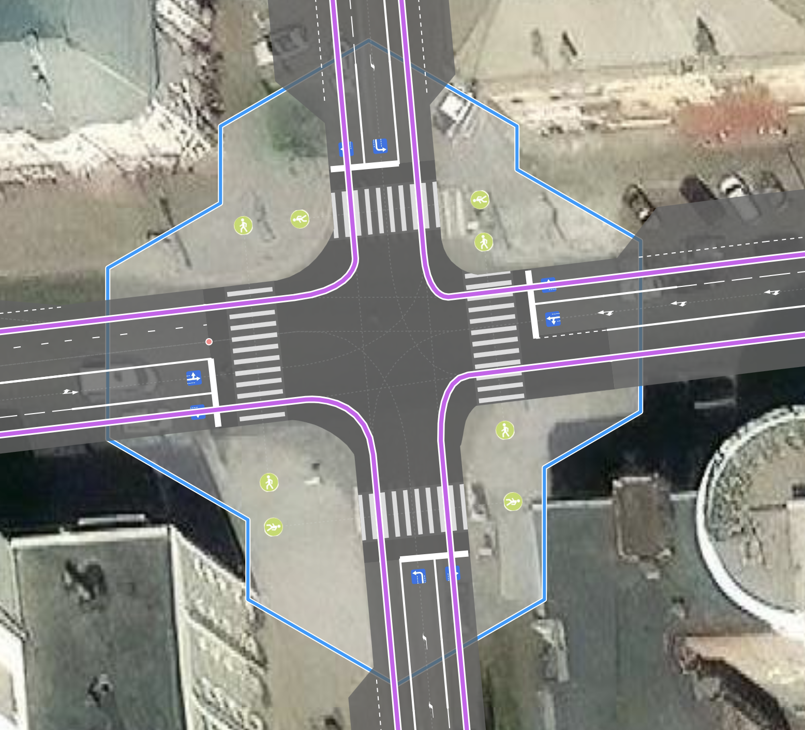

# crossing:corner - tag for designating a pedestrian crossing located close to the intersection carriageway

### Syntax
~~~
node.tags {
   crossing:corner: yes|no
}
~~~

### Applies to objects

This tag applies to objects of type `node`. This node must be a `highway=crossing`.

It denotes a pedestrian crossing at an intersection that passes very close to the carriageway of the intersection, essentially from sidewalk corner to sidewalk corner at the intersection.
A vehicle enters (or exits) this conflict with pedestrians at an angle.

That is, if the crossing is located within the intersection area but the conflict between right-turning vehicles and pedestrians occurs at an angle of approximately 90 degrees, then the tag should not be used.

The tag is also not applicable - and makes no sense - on regular pedestrian crossings.

| crossing:corner = yes | crossing:corner = no |
| :------- | :------ |
|||
| When turning right | Conflict between vehicles and pedestrians at an angle of approximately 90 degrees |

The main motivation for introducing this tag was to enable the distinction between pedestrian crossings that simply cross the carriageway and those that conflict with the right turn of a road.

In the OSMPIE renderer, the intersection of pedestrian and vehicle paths is always considered a `junction: controlled|uncontrolled` and therefore has its own radius. For pedestrian crossings, it is considered to be 3 m by default.

This is done based on the consideration that the most common pedestrian crossing has a width of 4 meters + 1 meter (on each side) = 6 m - the width of the conflict zone between Pedestrians and Vehicles (all these parameters can be changed with tags like `width` and `junction:radius`).

[junction:radius](./node.tags.junction:radius.md)

### Difference in display
For example, consider a typical compact intersection. On the left side, the tag `crossing:corner = yes` is specified for each pedestrian crossing node, while on the right side it is not.

| crossing:corner = yes | crossing:corner = no |
| :------- | :------ |
|||
| The intersection shape becomes smoother and more correct, the vehicle trajectory intersects the pedestrian trajectory at an obtuse angle | The intersection corners are sharper, the curvature of the vehicle trajectory is unrealistic, the radius is too small |

Using this tag will allow for a more accurate representation of the intersection shape and the structure of interaction among all participants on it.