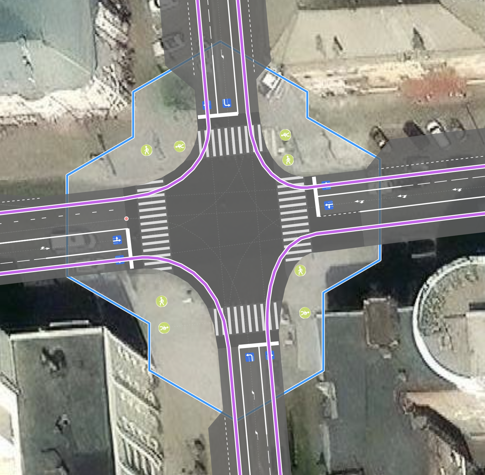
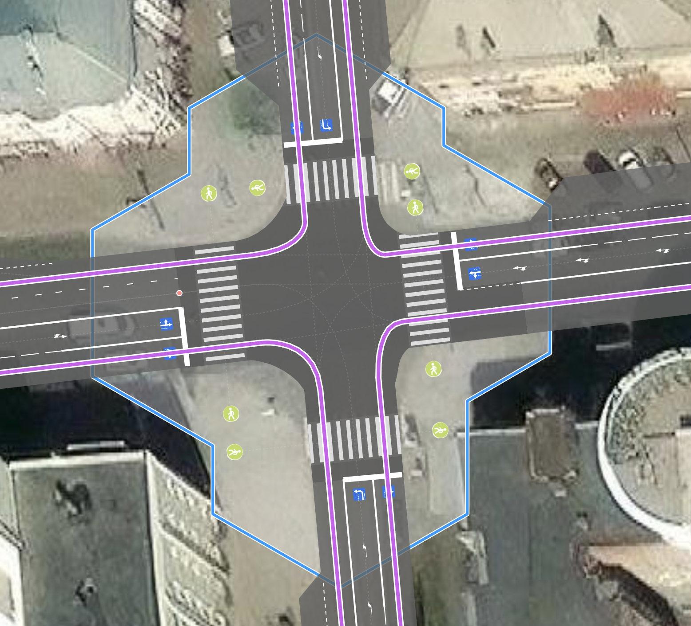

# crossing:corner — tag for a pedestrian crossing located close to a co-directional roadway
 
## Overview

The `crossing:corner` tag is introduced to indicate pedestrian crossings located in immediate proximity to the co-directional roadway of an intersection. This refers to crossings that are a continuation of the sidewalk, or are insignificantly offset from the roadway along which pedestrians walk. Often such crossings begin in the curve that forms the connection between the co-directional roadway and the perpendicular one.



This tag is necessary because in such a configuration, vehicles turning right from the co-directional roadway cross the pedestrian crossing at an angle other than perpendicular. Standard rendering tools draw unrealistic maneuvers with this crossing placement. For the renderer to draw a realistic maneuver, it is necessary to explicitly indicate the "corner" location of the pedestrian crossing.

This tag also indicates that the location of this crossing increases risks for pedestrians. This can be important for tasks related to improving road safety.

## Syntax

```
node.tags {
   crossing:corner: yes|no
}
```

### Valid values:
- `yes` — the pedestrian crossing is located in the corner zone of the intersection
- `no` — the pedestrian crossing is sufficiently far from the intersection of roadways

## Scope of Application

### Target Objects
The `crossing:corner` tag applies exclusively to nodes that must be previously classified as `highway = crossing`. Application of this tag to objects of other types is incorrect.

### Application Criteria

The tag `crossing:corner = yes` is applied in the following cases:

1. **Geometric location**: The pedestrian crossing passes in immediate proximity to the intersection zone of roadways, effectively connecting opposite corners of sidewalks at the intersection.

2. **Traffic flow conflict angle**: A motor vehicle enters the zone of potential conflict with pedestrian flow at an acute angle, which is characteristic of right-turn movement in corner zones of intersections.

| crossing:corner = yes | crossing:corner = no | 
| :--------------------- | :-------------------- |
|  |  | 
| When turning right, conflict between vehicles and pedestrians occurs at an acute angle | Conflict between vehicles and pedestrians at approximately 90° angle | 

The following example clearly demonstrates the need to indicate corner pedestrian crossings. With the tag value "no," vehicle trajectories become unrealistic.

| crossing:corner = yes | crossing:corner = no | 
| :--------------------- | :-------------------- |
|  |  | 
| The intersection shape is "smooth," the corner rounding of the intersection is reflected with proper curvature, the vehicle trajectory crosses the pedestrian trajectory at an acute angle, which corresponds to actual routes | The intersection corners are implausibly sharp, vehicles turn unrealistically, attempting to cross pedestrian trajectories at right angles, although this is not actually the case | 


### The tag is not applied in the following configurations

1. **Standard pedestrian crossings**: Crossings located on straight sections of roads outside intersection zones.

2. **Crossings with perpendicular conflict**: Pedestrian crossings at intersections where the angle of intersection between vehicle and pedestrian trajectories is approximately 90 degrees.

3. **Crossings remote from corners**: Crossings located at a significant distance from the immediate intersection zone of roadways.

## Technical Motivation

The `crossing:corner` tag identifies "corner" pedestrian crossings as distinct from others for the purposes of:

- **Navigation systems**: Providing more accurate routing and warnings about specific traffic conditions.
- **Visualization systems**: Correct display of intersection geometry in cartographic applications.
- **Traffic safety analysis**: Identification of zones with increased risk of conflict situations.

## Integration with Rendering Systems

### Display Parameters in OSMPIE

In the OSMPIE rendering system, all intersections of pedestrian and vehicle paths are classified as junctions of type `junction: controlled|uncontrolled` with assignment of an appropriate conflict zone radius.

**Default parameters:**
- Conflict zone radius for pedestrian crossings: 3 meters
- Estimated width of a standard pedestrian crossing: 4 meters
- Additional safety zone: 1 meter on each side
- Total conflict zone width: 6 meters

These parameters can be modified through the application of additional tags `width` and `junction:radius`.

## Practical Advantages of Application

1. **Increased accuracy of cartographic display**: More realistic representation of intersection geometry.

2. **Improved navigation**: Accurate information about the nature of pedestrian crossings for navigation system users.

3. **Optimized route planning**: Consideration of corner crossing specifics when building pedestrian routes.

4. **Traffic flow analysis**: Possibility of detailed modeling of interactions between different categories of road users.

## Application Recommendations

For correct application of the `crossing:corner` tag, it is recommended to:

1. **Detailed terrain analysis**: Thorough study of the geometric characteristics of the pedestrian crossing and its location relative to the roadway intersection zone.

2. **Conflict angle assessment**: Determination of characteristic angles of intersection between vehicle and pedestrian movement trajectories.

3. **Marking consistency**: Ensuring a uniform approach to classifying similar objects within the mapped territory.

4. **Data verification**: Checking the correctness of tag application through visual analysis of rendering results.

## Conclusion

The `crossing:corner` tag represents an important tool for increasing the accuracy and detail of OpenStreetMap cartographic data regarding pedestrian infrastructure description. Correct application of this tag contributes to the creation of more accurate and functionally useful cartographic products, which is especially important for navigation systems, traffic flow analysis, and road safety assurance.

## Recommended Articles

- [junction:radius](./node.tags.junction:radius.md)
- [junction:cluster:radius](./node.tags.junction:cluster:radius.md)
- [On the similarity of width and junction:radius](./junciotn:radius.vs.width.md)
