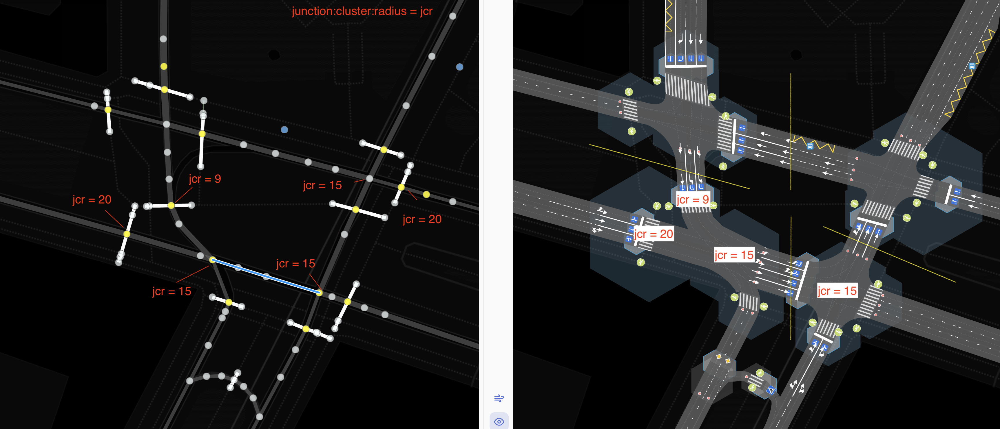
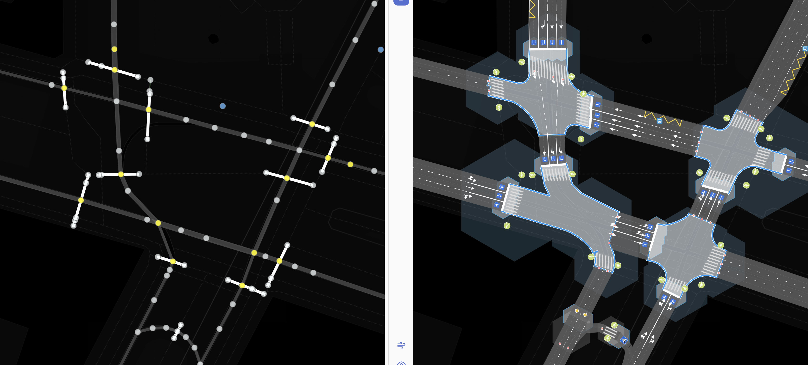
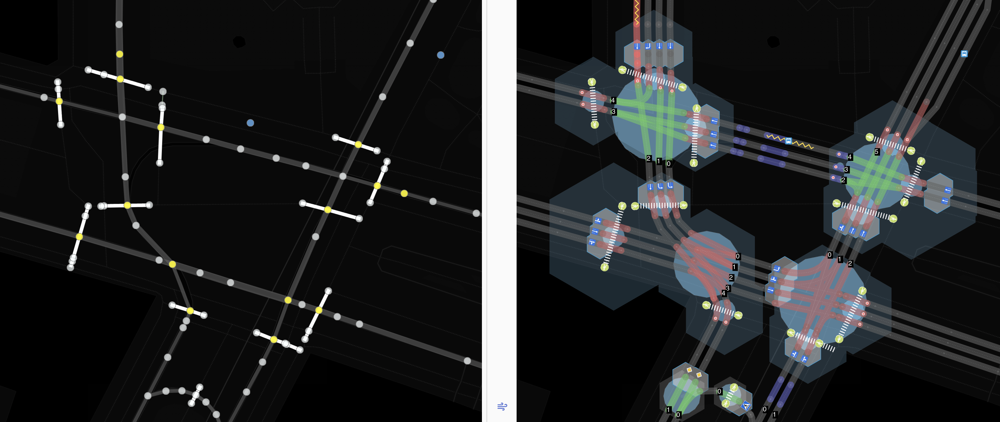
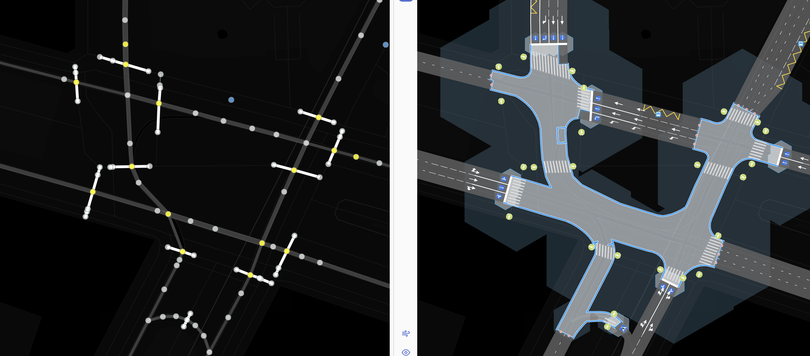
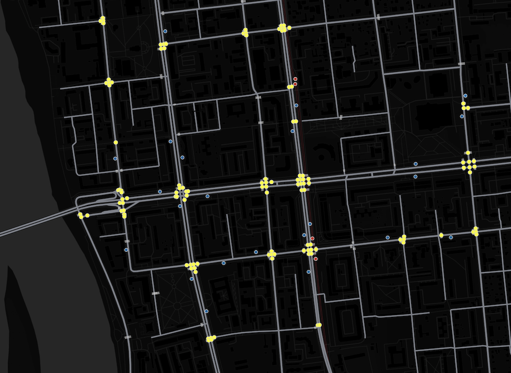
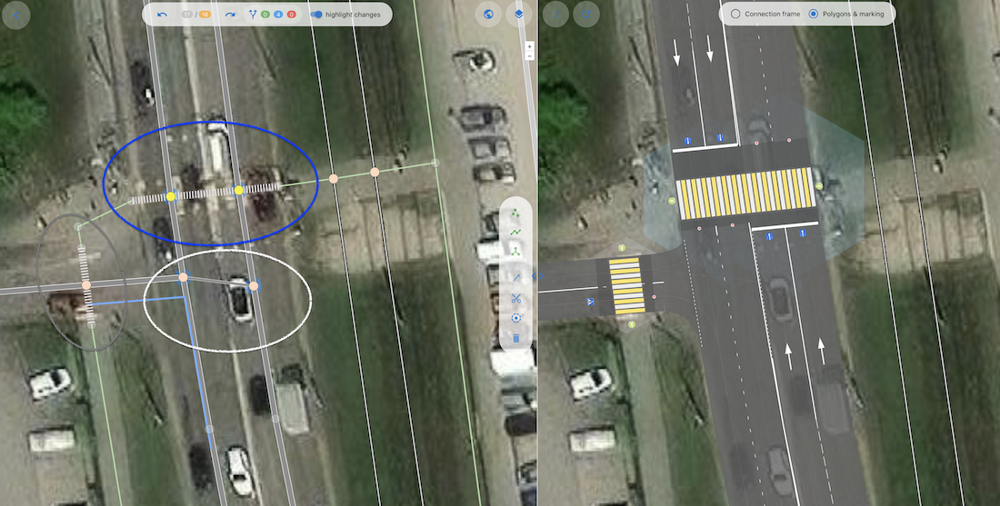

# junction:cluster:radius — tag for the functional zone of an intersection

The functional zone of an intersection is a geometric figure within which objects are subject to the influence of a given intersection or themselves influence it.
In this zone, other objects (parking lots, crossings, stop lines, and so on) may be displayed or interpreted differently than in the absence of this intersection.
To some extent, this concept relates to the concept of the functional zone of a junction, but for the simplest intersection.

### Syntax
```
node.tags {
   junction:cluster:radius: number[1..N]
}
```

### Application

This tag applies to objects of type `node` that are intersections.
The tag indicates the radius of a circle into which the functional zone for a given intersection can be inscribed.

### Advantages of this tag

The main motivation for introducing this tag was to provide the ability to group nodes of neighboring intersections into the generalizing
concept of **"Junction"**.

This goal can be achieved through various approaches:

1. Relation: `type:intersection, members[node1,...,nodeN, way1,..., wayM]`
2. An attribute of a node that serves as a generalization key (cluster name-identifier) `junction:cluster = name or id`
3. A radius that, when overlaying (union) circles, will give a common polygon for a certain set of nodes `junction:cluster = 5`

All these methods solve one task - **managed clustering of intersection nodes** into a more complex data structure.

The pros and cons of the first two approaches are obvious: the need to use relations, maintain referential integrity, and generate tags.

Let's consider the third method.

* Very geometric, reflects the area/linear characteristics of the intersection
* Does not require support for referential integrity (as in 1) and uniqueness control (as in 2)
* It's possible to find a dependency or correlation with other node properties (number of lanes)
* Simply a numerical value in meters
* Formally, no new object of type junction appears, but it can always be obtained by the simplest operation of buffer + union
* Corresponds to Occam's razor principle - we don't create new entities without necessity

Formally, the concept of **Junction** can be expressed as follows:
A Junction is a set of nodes (`node junction=yes|...`) connected to each other by edges (`way`), on which
traffic control means (markings, signs, other traffic control elements) do **NOT** provide for stopping vehicles.

In simple terms, a junction can be considered such a set of points and arcs where there are no specially organized stop lines inside.
It can also be said that a junction is an area figure (polygon) within which there is an indivisible conflict zone for vehicles and pedestrians.

Consider an example of a complex junction where there are 4 separate conflict zones.
In nodes where `junction:cluster:radius:` is not explicitly specified, it equals 12 meters.
On the left half are nodes and ways, on the right half is a junction model where the radius of each node is displayed as a hexagon.
All hexagons are grouped according to the overlay (union) criterion.



As a result, with such a combination of `junction:cluster:radius:` values, we get 4 "junctions", each
of which has its own conflict zone. This means that in reality, for each resulting "junction" there *must* be its own separate stop line to resolve conflicts.



The following illustration confirms that several intersections can be combined into a single object. Each intersection is marked with a blue circle,
(see tag [junction:radius](./node.tags.junction:radius.md)), where each cluster includes 3-4 way intersections (vehicle and pedestrian, with different radii).



Let's increase the `junction:cluster:radius:` values from twelve to thirty-two meters.
All intersections merged into one junction in the shape of a horseshoe. With such a combination of radii, this junction
resembles a ring (semi-ring), inside which road users do not have the right to stop.
However, this variant of radius arrangement is artificially incorrect, since pedestrian crossings still remain.



---

## Using the node attribute — point control of clustering

In addition to connecting intersections into a single junction, this tag is used to separate intersections that are located close enough but are not one junction. These are rare configurations, but since they occur, they need to be mapped accurately.

Let's compare the explicit indication of such a configuration using the cluster:radius tag and alternative approaches. For example, with the use of a proposed relation.

Let's look at a fairly large section of a typical map. Yellow dots indicate nodes where traffic signal regulation is indicated in one way or another. `highway: traffic_signals | crossing: traffic_signals`



If you look from a "bird's eye view" at how intersections are grouped in most cases (using traffic lights as an example),
it's clear that distinct clusters are formed, and in one way or another we could do this automatically.

But if we introduce relations explicitly, then **every** junction, despite its typicality, will have to be processed manually,
monitoring referential integrity and other aspects.

## Example of tag application in conjunction with other junction:* tags



At first glance, we have a banal T-shaped junction, but this impression is deceptive.

In reality, this is not a single junction, but a combination of three closely located intersections:
1. Controlled pedestrian crossing — marked in blue,
2. Uncontrolled pedestrian crossing — marked in gray,
3. Uncontrolled intersection - marked in white.

Vehicles moving north along the main road have the right to turn left onto the adjacent road or make a U-turn. At the same time, from the side of the secondary road, only a right turn is allowed. Thus, this intersection cannot be considered an uncontrolled junction. Such an assumption would lead to marking changes and incorrect operation of navigation services.
At the same time, the intersection is located close to the controlled pedestrian crossing. If it is not separated, the entire zone will be considered controlled, which again will lead to inaccurate markings on the map, and the junction data will become inapplicable for navigation purposes and traffic control automation.

Using OSMPIE tags for points in the white area elegantly solves this problem:

~~~
   junction = no  - explicitly not a junction (marking will correspond to regular linear marking on roads)
   junction:cluster:radius = 1  - so that it doesn't merge with the other two clusters (blue and gray)
   junction:radius = 7~8   - meters, since this is still an intersection and it has geometric characteristics
~~~

Note that for the intersection node in the gray area, it's also necessary to explicitly set a small clustering radius so that it doesn't merge with the blue node, since in reality these are two independent pedestrian crossings, moreover of different types (controlled and uncontrolled).

## Conclusions
 - Application of the cluster:radius tag for point-controlled clustering of intersection nodes into junctions significantly reduces labor costs for
 correct junction mapping. At the same time, we apply the tag explicitly and only in exceptional cases.
 - Combinations with other tags (for example, junction:radius, junction = yes|no| and others) allow accurate mapping of any combinations of objects encountered on real roads.
 - At the same time, semantics are created or preserved, since attributes in mapping accurately describe the functions of a road object or indicate its qualities. Thus, we follow the main goal of mapping: to accurately reflect in the model all the necessary information about reality.

## Recommended Articles

- [junction:radius](./node.tags.junction:radius.md)
- Gallery of interesting works - [featured](./examples/examples.md)
