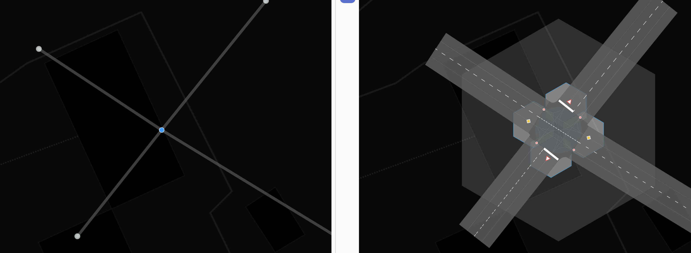
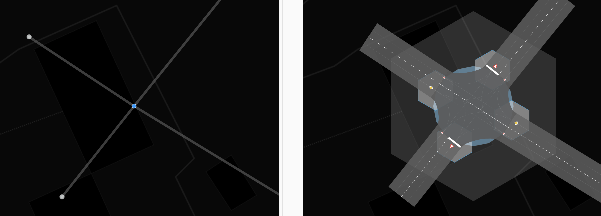
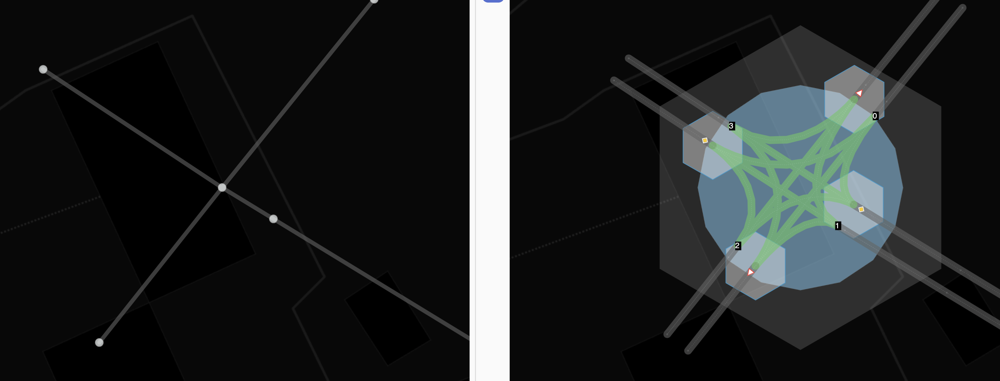
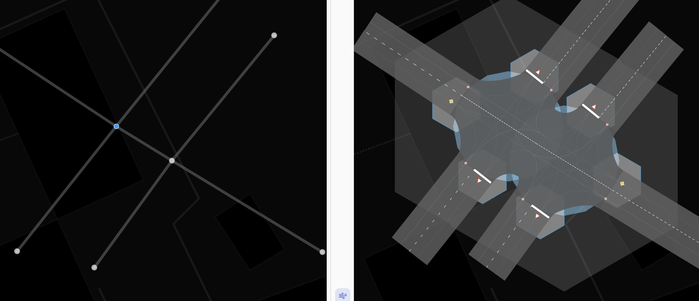
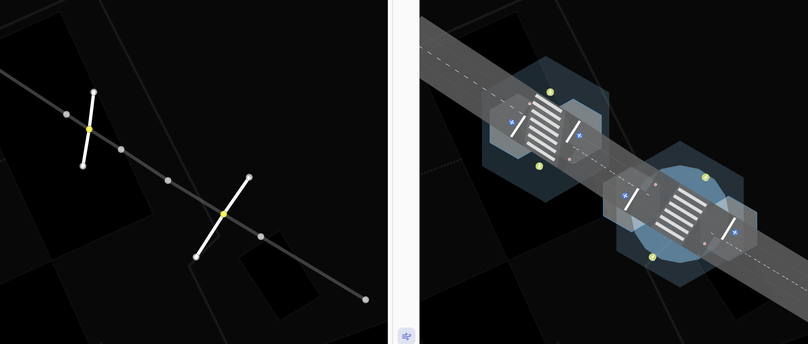
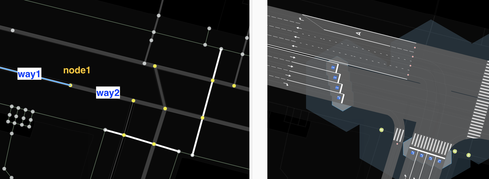
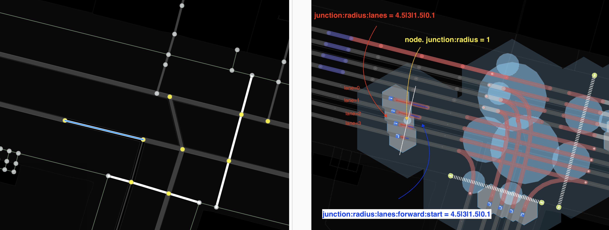

# junction:radius — tag for indicating the conflict zone at an intersection

A conflict zone is a geometric figure within which all possible intersections of traffic participant maneuvers through this intersection are located.
`junction:radius` — the radius of a circle into which the conflict zone is inscribed.

### Syntax
~~~
node.tags {
   junction:radius: number[1..N]
}

way.tags {
   junction:radius:lanes: number[1..N]|number[1..N]|...
   junction:radius:lanes(:forward|backward)(:start|end) number[1..N]|number[1..N]|...
}
~~~

### Application

This tag is applicable to objects of type `node` if they are intersections of ways.
In this case, the tag defines the radius of a circle into which the conflict zone for all lanes is inscribed.

This tag is applicable to objects of type way with a mandatory lanes suffix. Values override the radius
of the intersection conflict zone individually for each specified lane.

Let's consider several examples. In the figures below, the blue circle on the right side of the figure is a visualization
of the value of this tag.

**Example 1**

`junction:radius = 4`
The conflict zone is not described by a circle of the specified radius (width and number of lanes), the value is set incorrectly.

**Example 2**

`junction:radius = 8`
The indication is correct: stop lines and other entry points to the intersection are located on the circle.

**Example 3**

`junction:radius = 12`

If other objects (nodes or ways) exist within the specified radius, they affect possible maneuvers and thereby change the shape of the conflict zone.
At the same time, the radius continues to describe the circle into which the conflict zone is inscribed.

**Example 4**

`junction:radius = 8` for each of the nodes. It can be seen that nearby nodes affect the conflict zone.
The intersection shape becomes more complex. At the same time, U-turns between two parallel paths have topologically inaccurate curvature.

**Example 5**

Tags for the upper left pedestrian crossing node

~~~
junction:radius = 3
junction:shape = rectangle
highway = traffic_signals
~~~

Tags for the lower right pedestrian crossing node
~~~
junction:radius = 6
highway = traffic_signals
~~~

It is precisely the radius that determines how wide the conflict zone will be. Adjacent points (nodes) stop the influence of the
`junction:radius` tag value for the way to which they belong. If the radii of two adjacent `node[junction = yes]` intersect, the intermediate edge decreases
to an extremely small length and is positioned between these two nodes at a distance corresponding to the ratio of these adjacent radii.

### Fine-tuning for each lane

The forward and backward suffixes for this tag indicate the side of the way.
For one-way paths, the forward value is the default value.

The start and end suffixes indicate the direction of movement toward the intersection.
start indicates that the value will be applied to the node (intersection) from which
movement along this way begins.
end indicates that the values will be applied to the node to which movement along this way is directed.
end is the default value, i.e., if the suffix is not specified. This is done for association with the turn tag, since they are always specified for terminal nodes.

~~~
way.tags {
    oneway = yes
    lanes = 3
    junction:radius:lanes = ||2
    junction:radius:lanes:forward:end = ||2
}
~~~

The last two tags are equivalent and mean that the `junction:radius` value must be overridden for lane 3 at the point to which
this `way` is connected; the others will be used by default from the point, if specified.

**Attention!** If the way for which these tags are specified contains several nodes that can be considered `junction=*` (see article [junction](./node.tags.junction.md)),
they will be applied to each lane of each intersection.

For `junction:radius`, the center is the coordinates of the node, but if we move to the `:lanes` suffixes, the radius value will be counted
from the intersection of the lane with the conflicting `way` or (if there is none) from the perpendicular drawn from the node to this `way`.

**Example 6**

Let's consider the tags and their values that need to be specified to obtain the following picture: the stop line at the traffic light is marked in a staggered pattern.

For way1, highlighted in blue, let's specify the following tags and values:

~~~
way.id = way1
way.tags = {
    oneway = yes
    lanes = 4
    junction:radius:lanes = 4.5|3|1.5|0.1
}
~~~

For point Node1, where this way arrives, let's specify the following tags. We'll deliberately make the radius small and
specify the junction shape type, see [junction:shape](./node.tags.junction:shape.md).

~~~
node.id = node1
node.tags = {
    junction:shape = staggered
    junction:radius = 1
}
~~~

If you look in debug mode, you can see that the lengths of the connection segments in this micro-junction not only form a staggered pattern,
but are also unequal in length to each other. This is due to the fact that, for example, for way2 we also overrode the tag values for each lane.

~~~
way.id = way2
way.tags = {
    oneway = yes
    lanes = 4
    junction:radius:lanes:forward:start = 4.5|3|1.5|0.1
}
~~~

### Conclusion

The junction:radius tag defines the radius of a circle into which the conflict zone for a given intersection is inscribed. Outside this circle, traffic participant maneuvers do not intersect. Using suffixes for this tag, it is possible to map complex junctions quite accurately.

### Recommended Articles

 - [junction:cluster:radius](./node.tags.junction:cluster:radius.md)
 - [crossing:corner](./node.tags.crossing:corner.md)
