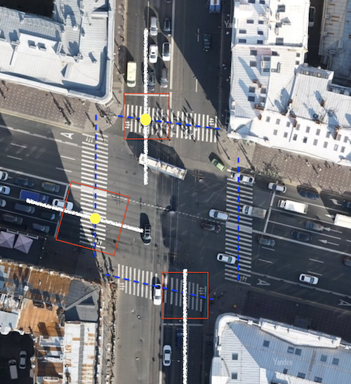
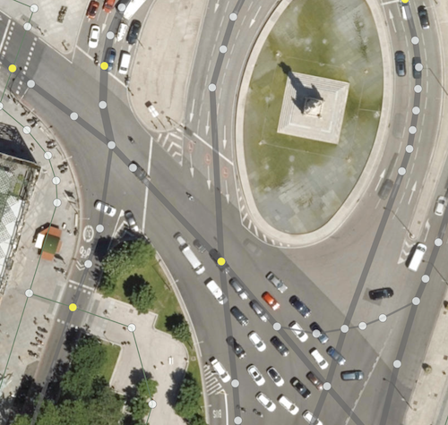
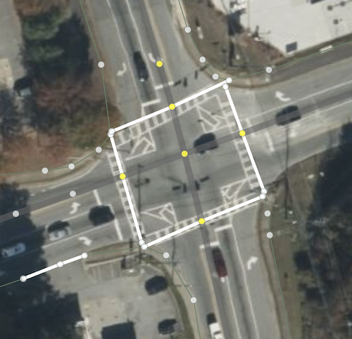
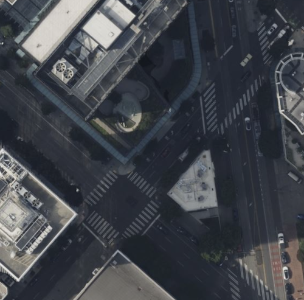
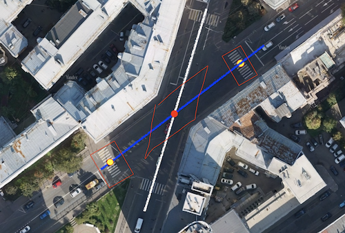

# junction:shape — tag for indicating the characteristic shape of the intersection of two paths

### Syntax
```
node.tags {
   junction:shape: rectangle|oblique|staggered
}
```

### Application

This tag applies only to objects of type `node` that are intersections of two or four ways.
Most often, the tag is applied to the most common intersections of two roads or one road with a pedestrian crossing. For intersections of three, five or more ways, the tag is not applicable.
The tag reflects the shape of the intersection and the relationships between stop lines (imaginary or real) of conflicting paths at this intersection.
This tag is not needed when mapping roads and pedestrian crossings using only way centerlines.
But as soon as we increase the requirements for image detail or achieve that area objects look like in reality, reproducing topologically accurate "zebras", stop lines and their relationships, this tag becomes necessary and should be specified explicitly.
(see the first and fourth examples at the end of the article)

### Reasons for Introduction

Two roads can intersect at different angles (see examples below), but the intersection angles sometimes do not reflect how cars, pedestrians and other road users will stop before this intersection, that is, how stop lines or conflict zone boundaries are located.
The actual shape of the junction is determined by the traffic organization design, that is, ultimately — by the designer's imagination. In such cases, it is impossible to calculate the junction shape and it must be specified explicitly.

### Values

- rectangle - stop lines of conflicting paths are located at approximately right angles to each other.
Stop line points for each `lanes` are laid out perpendicular to the centerline.
There is one stop line, a common line for all lanes (figures 1,4,5).

- oblique - stop lines of conflicting paths are at an angle significantly different from 90 degrees, usually from 30 to 70 degrees.
Stop line points for each `lanes` are laid out parallel to the path that conflicts with this way.
There is one stop line, a common line for all lanes (figures 2,4,5).

- staggered - in this case, the intersection angle of ways can be any; the fundamental difference
is that each lane has its own separate stop line at different distances from the node (figure 3,5).

### Examples

| 1 | 2 | 
| :------- | :------ |
|  |  | 
| Despite the fact that the pedestrian crossing goes at an angle to the street, in the yellow points the tag value will be `junction:shape = rectangle`. The angle between the stop line and the zebra stripes is approximately 90 degrees. | In the yellow points, the tag value will be `junction:shape = oblique`, since the stop lines are drawn parallel (or almost) to the intersected road, and the intersection angle significantly differs from perpendicular. | 

| 3 | 4 |
| :------- | :------ |
|  |  | 
| In this case, for most intersection points with pedestrian crossings, the value `staggered` can be used, since stop lines go at different distances from the pedestrian crossing. The distance itself is regulated by [junction:radius](./node.tags.junction:radius.md) using suffixes `:lanes`, `:start,:end` and `:forward,:backward` for bidirectional ways. | An excellent example in one place where the difference between `junction:shape = oblique` and `junction:shape = rectangle` is obvious. | 

| 5 | 6 |
| :------- | :------ |
|  | |
| In the yellow points, the tag value will be `junction:shape = rectangle`, in the red one the values `junction:shape = oblique` and `junction:shape = staggered` are used | | 

### Recommended Articles

- [junction:radius](./node.tags.junction:radius.md)
- [junction:cluster:radius](./node.tags.junction:cluster:radius.md)
