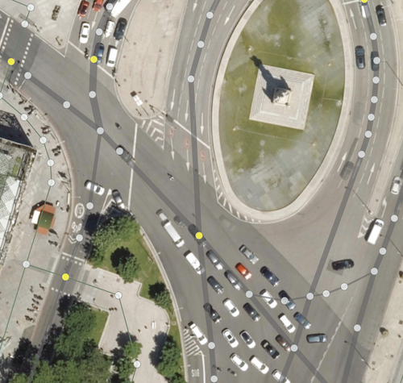
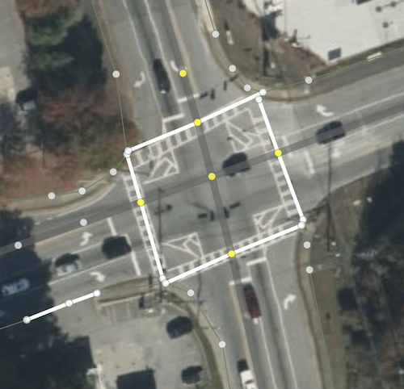
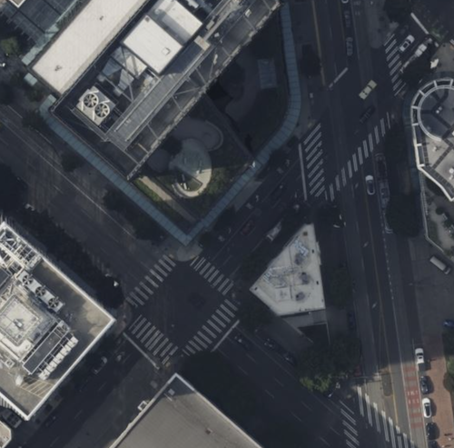
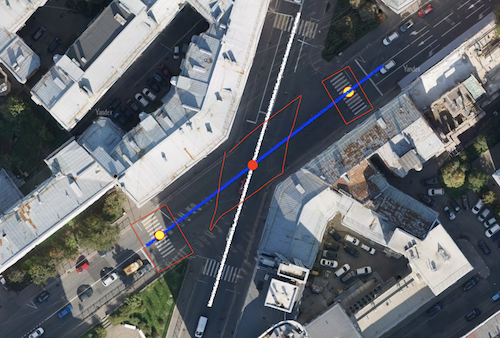

# junction:shape - Tag for Specifying Characteristic Intersection Geometry

## Syntax
```
node.tags {
   junction:shape: rectangle|oblique|staggered
}
```

## Applicable Objects
This tag applies exclusively to `node` objects that represent intersections of two or four ways. It is most commonly used for standard two-road intersections or single-road pedestrian crossing configurations.

The tag defines intersection geometry and relationships between imaginary or actual stop lines of conflicting paths at the intersection point.

## Implementation Rationale
Two roads may intersect at dramatically different angles (see examples below), yet intersection angles sometimes fail to accurately represent how vehicles, pedestrians, or other transportation modes will position themselves before crossing. The geometric configuration is determined by traffic organization design and engineering specifications.

## Value Specifications

### rectangle
Stop lines of conflicting paths are positioned approximately 90 degrees relative to each other. Stop line points for each lane are positioned perpendicular to the centerline. A single common stop line serves all lanes (Examples 1, 4, 5).

### oblique
Stop lines of conflicting paths are positioned at angles significantly less than 90 degrees (approximately 30-70 degrees). Stop line points for each lane are positioned parallel to the conflicting path. A single common stop line serves all lanes (Examples 2, 4, 5).

### staggered
An intermediate configuration between rectangle and oblique geometries. Intersection angles may vary, with the primary distinction being individual stop lines for each lane positioned at varying distances from the node (Examples 3, 5).

## Implementation Examples

| Example 1 | Example 2 |
|:----------|:----------|
|||
|Despite the pedestrian crossing's angular approach to the street, yellow nodes utilize `junction:shape = rectangle`. The angle between stop lines and zebra stripes approximates 90 degrees.|Yellow nodes utilize `junction:shape = oblique` as stop lines are drawn parallel (or nearly parallel) to the intersecting roadway.|

| Example 3 | Example 4 |
|:----------|:----------|
|||
|Most pedestrian crossing intersection points utilize `staggered` configuration due to stop lines positioned at varying distances from crossings. Distance regulation employs [junction:radius](./node.tags.junction:radius.md) with `:lanes`, `:start,:end`, and `:forward,:backward` suffixes for bidirectional ways.|Excellent single-location example demonstrating clear distinction between `junction:shape = oblique` and `junction:shape = rectangle` configurations.|

| Example 5 | Example 6 |
|:----------|:----------|
|||
|Yellow nodes utilize `junction:shape = rectangle` while red nodes employ `junction:shape = oblique` or `junction:shape = staggered`||

## Professional Application Context

While mapping pedestrian crossings and roadways using only centerline ways, this tag remains unnecessary. However, transition to detailed visualization or areal object representation reflecting real-world appearance (zebra crossings, stop lines, and their spatial relationships) makes this tag essential. Explicit specification becomes the only method to distinguish between otherwise ambiguous configurations (see Examples 1 and 4).

## Technical Integration

The `junction:shape` tag provides critical geometric information for advanced intersection modeling systems, enabling:

- **Precise Stop Line Positioning**: Accurate placement based on intersection geometry
- **Conflict Zone Definition**: Proper spatial relationship modeling between transportation modes  
- **Rendering Optimization**: Enhanced visual representation of complex intersection configurations
- **Traffic Engineering Compliance**: Alignment with professional traffic design standards

This tag represents a fundamental component in the evolution from simplified centerline mapping to comprehensive intersection modeling that accurately reflects real-world infrastructure geometry and operational characteristics.
