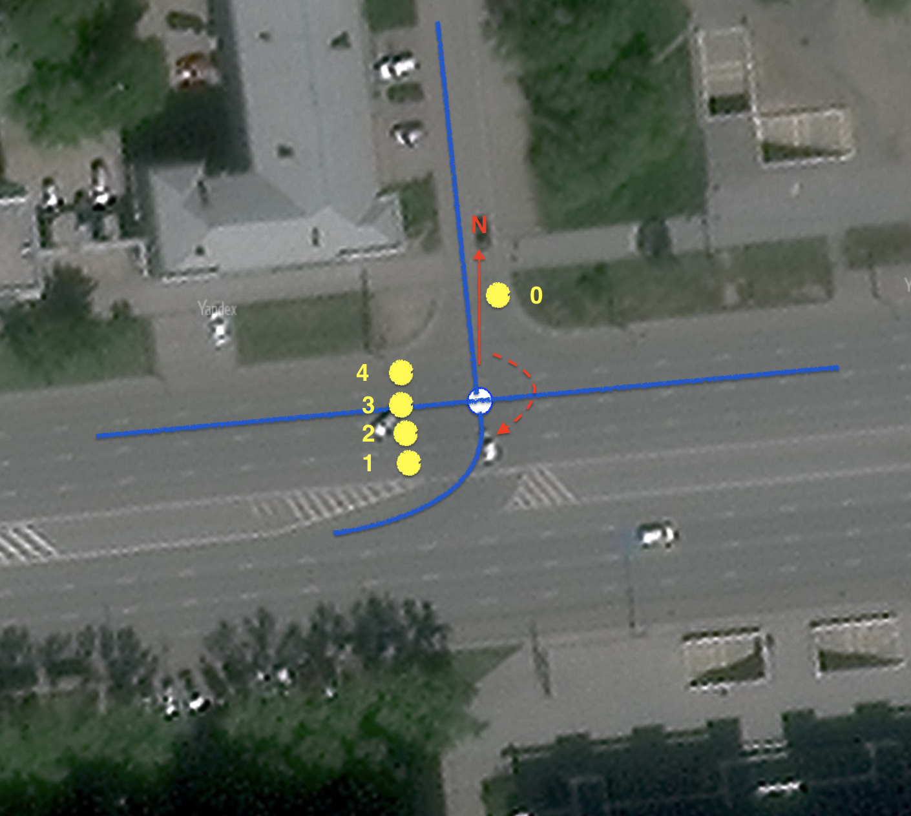
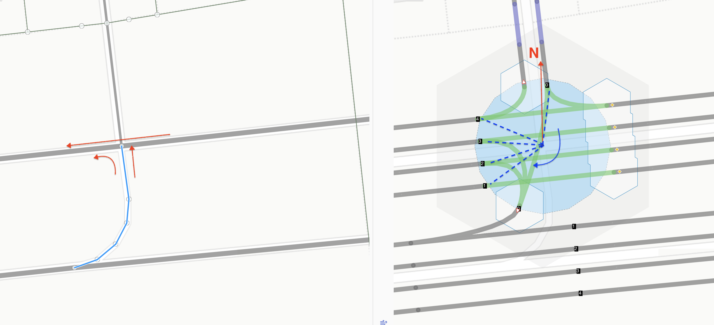
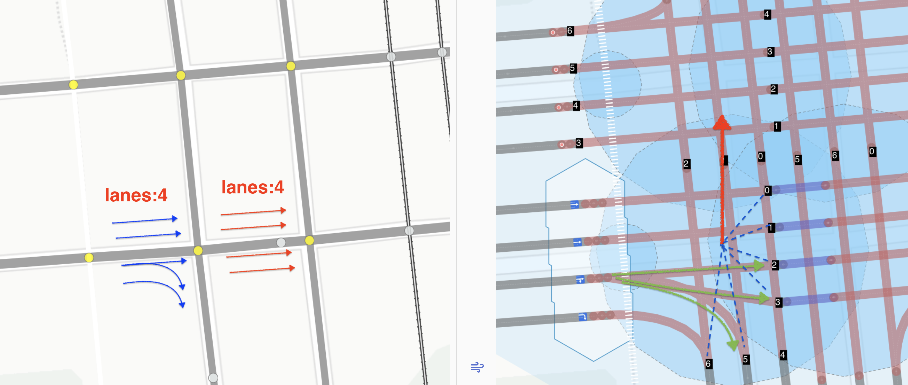
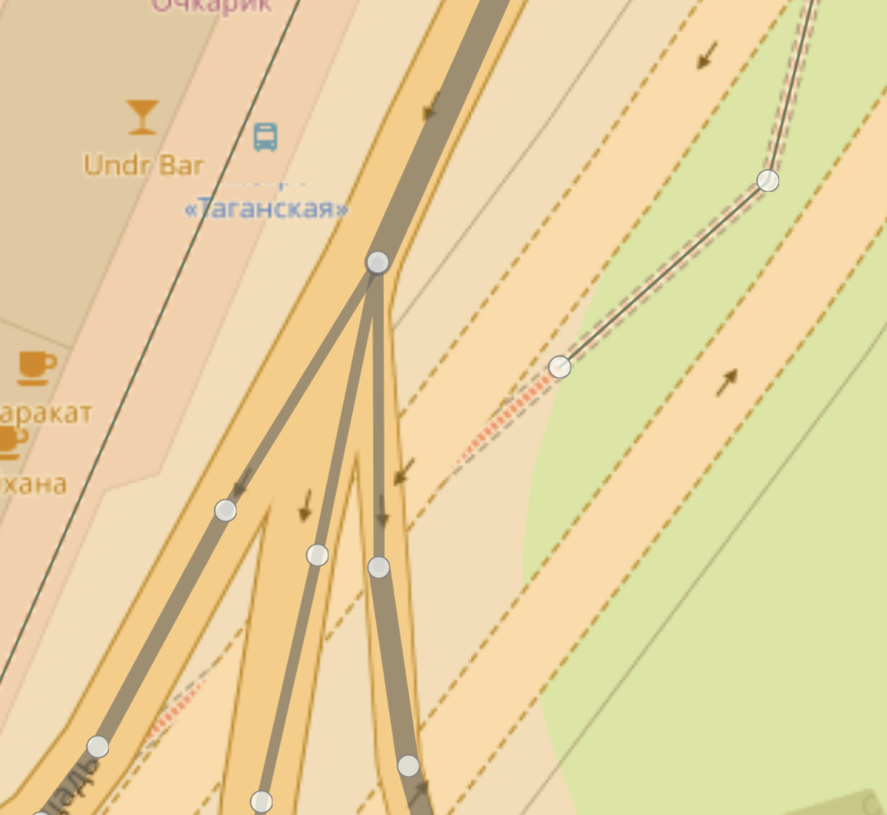
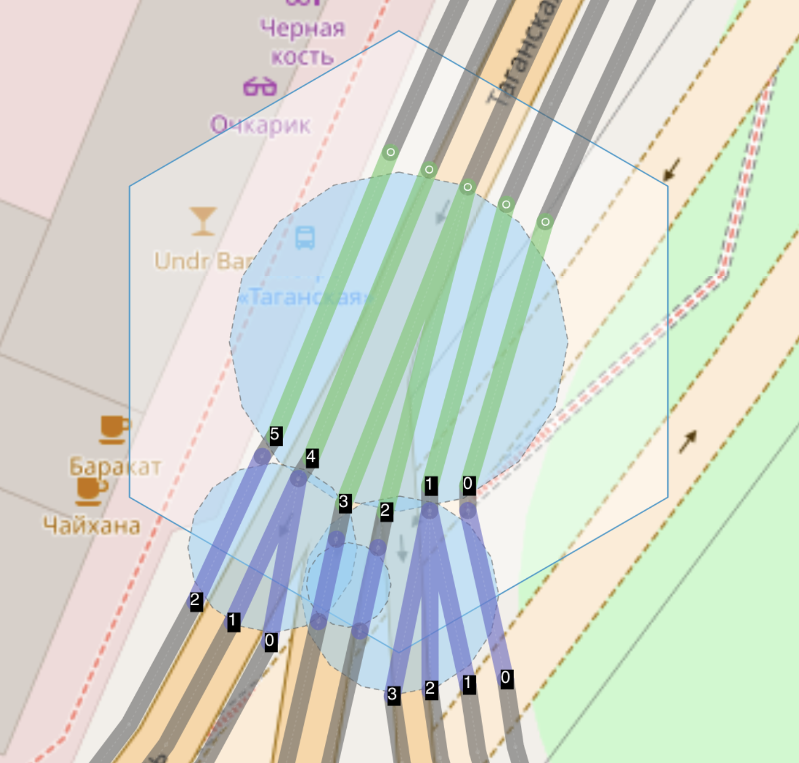
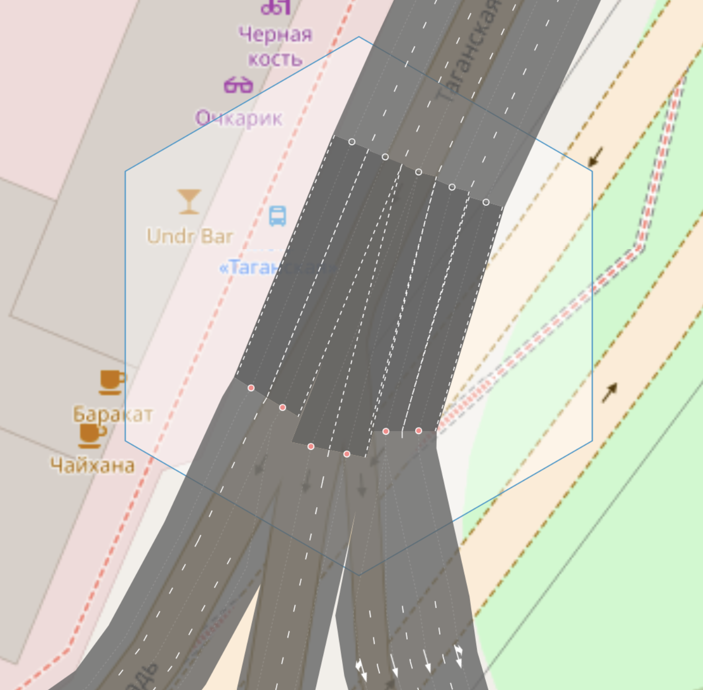
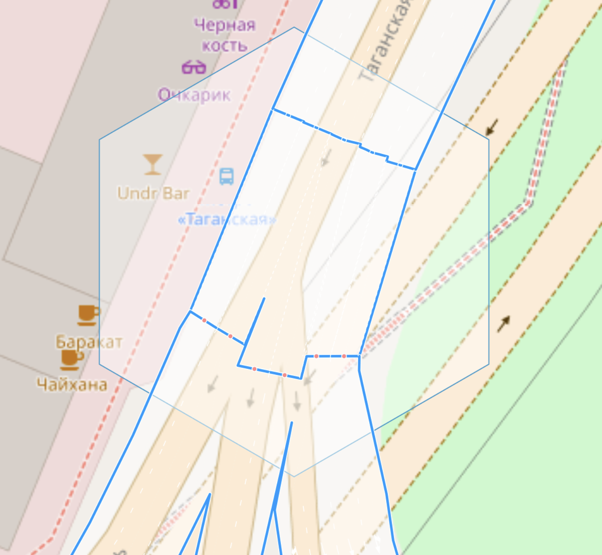

# connect – key for indicating lane connectivity at intersections

## Syntax
```
way.tags {
   connect(:lanes(:forward|backward)): number;number;...||
}
```

### Applicability

This tag applies only to objects of type `way` and can be extended with two suffixes: `:lanes` and `:forward|backward`.

### Tag Necessity and Usage Logic
In OSM, connectivity between lanes is established using relations ([relation:connectivity](https://wiki.openstreetmap.org/wiki/Relation:connectivity))

Main drawbacks of this method:

1. Creating all relations for each way is long, painstaking work.
2. The resulting set of relations may become outdated during junction editing, requiring constant monitoring of relation integrity.
3. For exits from one way in different directions (multiple destination ways), several relations may be needed, and they cannot be created as a single object.
4. Increased requirements for the editor and mapper's experience.

At the same time, the relation entity is not necessary. For example, with turns (`turn:lanes`), it was possible to do without relations.

To solve the problem of unambiguous input/editing of lane connectivity at a junction, a simple standard solution is needed, free from the listed drawbacks.

The existing approach with turns can be taken as a basis:

```md
way.tags:
    lanes:forward = 3
    turn:lanes:forward = through|through;right|right
```

Developing this logic, several tags with related content are set for an object of type `way`. Since we specify the turn direction **from** each lane, the number of lanes determines the number of sections into which the `turn:lanes:forward` tag value will be divided.

We also need to link to the receiving lane. For example, in this way:

```md
way.tags:
    lanes:forward = 3
    turn:lanes:forward = through|through;right|right
    connect:lanes:forward = 0|1;2|3
```

We cannot use numeric indices because lanes may belong to different `way` objects exiting from the intersection point. Therefore, it is necessary to specify the address of a specific way, and in the case of a bidirectional way, separate destination lanes `forward` from `backward`. For example:

```md
way.tags:
    lanes:forward = 3
    turn:lanes:forward = through|through;right|right
    connect:lanes:forward = {way1.id}:backward:0|{way2.id}:backward:1;{way3.id}:backward:2|{way3.id}:forward:0
```

This looks cumbersome and more complex than `relation[type=connectivity]`.
Can we avoid this complex addressing?
Yes, if we establish a global convention.

## Convention:

```
For all "way" objects that connect or intersect at a selected "node",
the following indexing principle applies.
For each of the lanes ("lane") of all "ways" exiting from this "node", the index is determined by the angle between the line
drawn from the "node" north (N), and the line going from the "node" to the starting point of the lane,
with the angle increasing clockwise.
```

In simple terms: imagine that the clock hand started its movement from the "north" position, and when it points to the beginning of a lane at the exit from the junction, we assign this lane the next number. Only those lanes are numbered through which traffic is carried out and which are accounted for in: `lanes`, `lanes:forward`, `lanes:backward` of the corresponding way.

The advantage of this approach is that with a constant number of lanes for all `way` of this node,
the order will be constant.

**Example:**

Let's consider this with a simple example, see Figure 1.
On the left is an intersection with a U-turn. On the ways diagram, the way for which lane connectivity is being set is highlighted in blue. Traffic directions are indicated by red arrows.

| Ground               | Ways & lanes |
| :---------------- | :------ |
| | |

On the right, lane connectivity is shown that needs to be attributed. A U-turn is only possible into the middle lanes of the highway. It is prohibited into the right lane, and a U-turn into the far left lane is not allowed by the vehicle's turning radius.

Let's draw a red line from the node upward to the north. Then we'll mark with a dashed line the direction from the node to the starting point of each of the outgoing lanes. Incoming lanes for this node don't interest us. The angle value between the red arrow and the dashed line determines the index (ordinal number) of the lane exiting from this node for addressing it.

```md
way.tags:
    lanes = 1
    oneway = yes
    turn:lanes = left;through
    connect:lanes:forward = 0;2;3
```

>**Note** that we implicitly introduced such a concept as intersection radius – the blue circle in the figure. See tag `junction:radius`
[junction:radius](./node.tags.junction:radius.md)

### Target Purpose
This tag is intended to be used for more precise mapping of connections at complex junctions
where the `turn:lanes` tag is insufficient. It can serve as an addition to the `turn:lanes` tag to clarify maneuvers only for
specific lanes. For example, here the connection is explicitly specified only for the third lane, the rest is determined
in the `turn:lanes` tag.

```md
way.tags:
    lanes = 3
    oneway = yes
    turn:lanes = left|through|slight_right;right
    connect:lanes:forward = ||4;5
```

In the future, for automated processing tools or editing programs, a converter of the
`connect:lanes` tag to `relation[type=connectivity]` and vice versa may be implemented.

**Let's consider another example:**



One of the intersections of a complex junction. 4 lanes with maneuvers indicated by blue arrows (on the left) arrive at a path of 4 lanes. Obviously, if additional indications (slight_right) are not used, but only the specified turns are used, then the entrance of the far right lane (3) will remain without a connection. Explicitly adding `slight_right` distorts the lane movement sign, which misleads the driver, so its use is unacceptable.

```md
way.tags:
    lanes = 4
    oneway = yes
    //turn:lanes = through|through|through;slight_right;right|right <<-- wrong
    turn:lanes = through|through|through;right|right
    connect:lanes:forward = ||2;3;5|
```

**Fork Example**

The benefit of this tag is obvious for junctions with a large number of wide roadways and smooth forks onto two or more roads. Let's consider the tag application using the example of Taganskaya Square in Moscow.

| OSM Ways               | lanes connectivity |
| :---------------- | :------ |
| | |

A "crow's foot" type fork with an increase in lanes from two to three lanes for the left way and to four for the right one. We use turn tags as they reflect lane movement signs established by traffic rules. But mapping all routes using only these tags is difficult and sometimes impossible.

```
way.tags:
    lanes = 5
    highway = primary,
    oneway = yes,
    connect:lanes = 0|1|2;3|4|5,
    turn:lanes = left|left|through;right|right|right
```

In such cases, `turn:lanes` values are difficult to correctly correlate with maneuver geometry.

If we decided to use the `relation[type=connectivity]` tag, we would have to build an extremely cumbersome construction, since for the first point alone, a minimum of 3 would have to be created.

**Application Results:**

Such an approach combined with `placement` and `junction:radius`, `junction:shape` and other tags will allow more accurate rendering of road and intersection polygons, reflecting lane connectivity and maneuvers for navigation. Often this is important on wide highways and their nodes.

| Road view               | Road & intersection polygons |
| :---------------- | :------ |
| | |

## Recommended Articles

- Tag [junction:shape](./node.tags.junction:shape.md)
- Tag [junction:radius](./node.tags.junction:radius.md)
- Tag [junction:cluster:radius](./node.tags.junction:cluster:radius.md)
- Tag [crossing:corner](./node.tags.crossing:corner.md)
