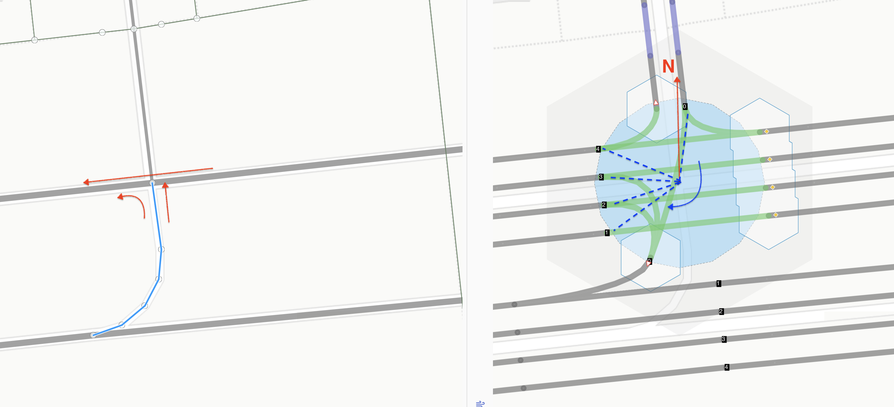
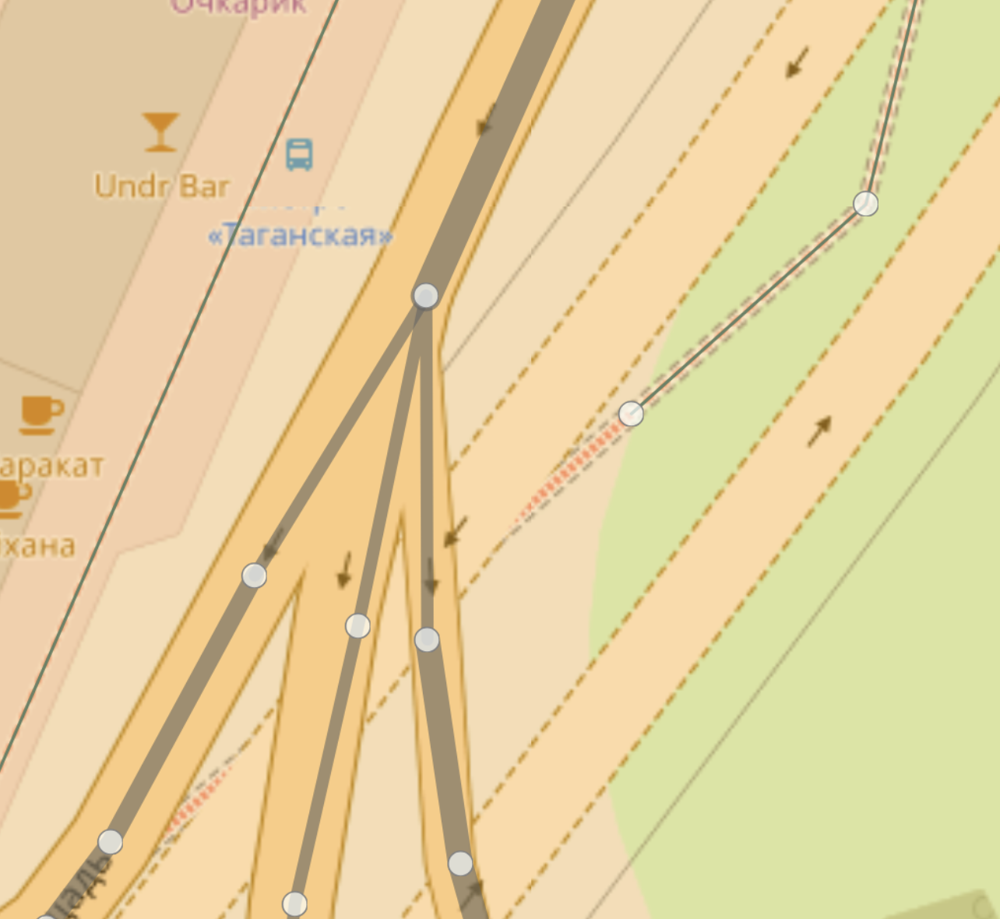
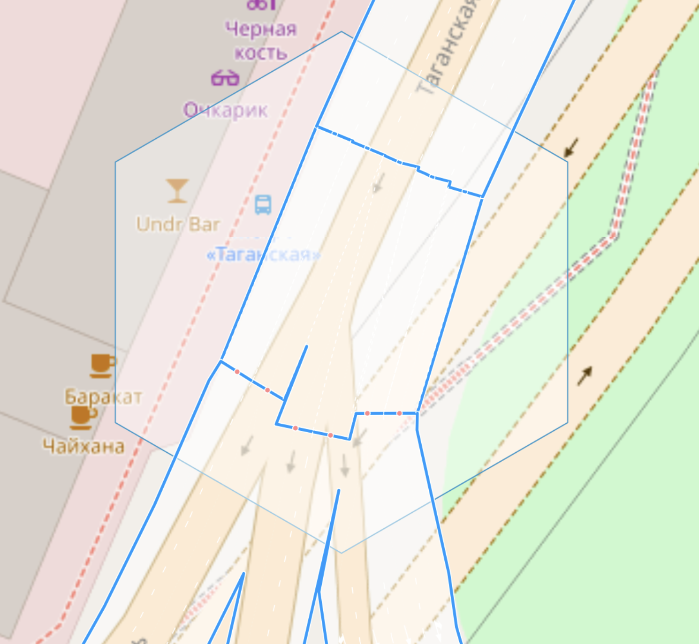

# connect - key for specifying lane connectivity at intersections

## Syntax
```
way.tags {
   connect(:lanes(:forward|backward)): number;number;...||
}
```

### Applies to objects

This tag applies only to objects of type `way` and can be extended with two widely used suffixes: `:lanes` and `:forward|backward`

### Reasons for introduction
Currently, OSM has a method for precisely specifying lane connectivity using relations: [relation:connectivity](https://wiki.openstreetmap.org/wiki/Relation:connectivity)

The main disadvantages of this method are:

1. It is very cumbersome to create a relation or even several for one way (from)
2. Relations are very fragile and easily broken, requiring constant integrity checks
3. For exits from one way in different directions (multiple destination ways), multiple relations may be needed - it cannot be done with a single object
4. Increased requirements for the editor and mapper experience
5. Introduced entity violates Occam's razor; turns (`turn:lanes`) were implemented without relations.

To solve the problem of unambiguous input/editing of lane connectivity at intersections, a simpler solution is needed, preferably a standard one.

The existing approach with turns can be taken as a basis:

```md
way.tags:
    lanes:forward = 3
    turn:lanes:forward = through|through;right|right
```

Excellent, everyone understands it and it is widely used. For an object of type `way`, several tags with connected content are set. The number of lanes determines the number of sections into which the value of the `turn:lanes:forward` tag will be split. **From** each lane, we specify the turn direction.

Can we inherit this approach but specify something that will address the target lane?

For example, like this:

```md
way.tags:
    lanes:forward = 3
    turn:lanes:forward = through|through;right|right
    connect:lanes:forward = 0|1;2|3
```

The simplest solution in this situation is to use numerical indices. However, lanes can belong to different `way` objects that exit the intersection point. Therefore, it is necessary to somehow address them as well.
Furthermore, a `way` can be two-way, so destination lanes on the `forward` side must be separated from those on the `backward` side.

```md
way.tags:
    lanes:forward = 3
    turn:lanes:forward = through|through;right|right
    connect:lanes:forward = {way1.id}:backward:0|{way2.id}:backward:1;{way3.id}:backward:2|{way3.id}:forward:0
```

This looks terribly confusing and is probably even more complex than `relation[type=connectivity]`.
Can we avoid all this complex addressing?

Yes, by establishing one global agreement.

## Agreement:

```
For all connected/intersecting `way` objects at a single `node`, 
a common index (order) for all outgoing lanes from this `node` for all `way`s 
is determined by the angle between the line with coordinates from the `node` to the starting point of the lane,
and the line drawn from the `node` to the north (N) in a clockwise direction.

```

In simple terms, clockwise from the 12 o'clock position, the starting points of lanes after exiting the intersection are numbered in order around the `node` of this intersection. Only lanes used for movement and accounted for in the `lanes`, `lanes:forward`, `lanes:backward` tags of the respective ways are numbered.

**Example:**

Let's consider this with a simple example, see Figure 1.
On the left is an intersection with a U-turn, and the way for which we will specify lane connectivity is highlighted in blue. Directions of movement are indicated by red arrows.

| Ground               | Ways & lanes |
| :---------------- | :------ |
| | |

On the right, the lane connectivity we want to attribute is shown. Let's assume a U-turn cannot be made from the extreme left lane (vehicle turning radius) but only from the middle lanes onto the highway.

Draw a line from the node upwards to the north and also to each point of only the outgoing lanes. Incoming lanes for this node are not of interest to us.
The value of the angle between the red arrow and the dashed line will determine the index or serial number of the lane exiting this node for addressing it.

The advantage of this approach is that with a constant number of lanes for all `way`s of this node, the order will be constant. Let's look at an example of what the tag would look like for this case.

```md
way.tags:
    lanes = 1
    oneway = yes
    turn:lanes = left;through
    connect:lanes:forward = 0;2;3
```

>**Note:** We have implicitly introduced the concept of an intersection radius - the blue circle in the figure. See the tag `junction:radius` [junction:radius](./node.tags.junction:radius.md)

### Purpose
This tag is intended for more accurate mapping of connections at intersections, at complex junctions where the `turn:lanes` tag is insufficient. It can complement the `turn:lanes` tag to clarify maneuvers only for specific lanes. For example, here the connection is explicitly specified only for the third lane; the rest is determined by the `turn:lanes` tag.

```md
way.tags:
    lanes = 3
    oneway = yes
    turn:lanes = left|through|slight_right;right
    connect:lanes:forward = ||4;5
```

In the future, for automated processing tools or editing software, it will probably be possible to implement a converter from the `connect:lanes` tag to `relation[type=connectivity]` and vice versa - this seems a relatively simple task.

**Let's consider another example:**


One of the intersections of a complex junction. 4 lanes with maneuvers indicated by blue arrows (left). It leads into a way also with 4 lanes. Obviously, if you do not use additional instructions (slight_right) and use only the indicated turns, then the entrance to the extreme right lane (3) will be without a connection. Explicitly adding `slight_right` distorts the lane driving sign - misleads the driver - so indicating it is impossible.

```md
way.tags:
    lanes = 4
    oneway = yes
    //turn:lanes = through|through|through;slight_right;right|right <<-- wrong
    turn:lanes = through|through|through;right|right
    connect:lanes:forward = ||2;3;5|
```

**Fork Example:**

This tag will be extremely useful at intersections with wide carriageways (many lanes) and the presence of smooth forks into two or more roads. Consider the example of Taganskaya Square in Moscow.

| OSM Ways               | lanes connectivity |
| :---------------- | :------ |
| | |

A "chicken foot" type fork, immediately followed by an increase in the number of lanes, from two to three or four for different ways. Solving this with only turn tags is extremely difficult. Although they cannot be abandoned either, as they reflect the lane driving signs established by traffic rules (if they are present on/above the road).

```
way.tags:
    lanes = 5
    highway = primary,
    oneway = yes,
    connect:lanes = 0|1|2;3|4|5,
    turn:lanes = left|left|through;right|right|right
```

It is difficult to correctly correlate the values of `turn:lanes` with the geometry of the maneuver in such cases. If we want to use `relation[type=connectivity]`, then for the first point we would have to create at least 3 of them.

**Application Results:**

This approach, combined with tags like `placement`, `junction:radius`, `junction:shape`, and others, will allow for more accurate reflection of lane connectivity and maneuvers for navigation and will enable rendering road and intersection polygons, which can be important on wide highways and their nodes.

| Road view               | Road & intersection polygons |
| :---------------- | :------ |
| | |