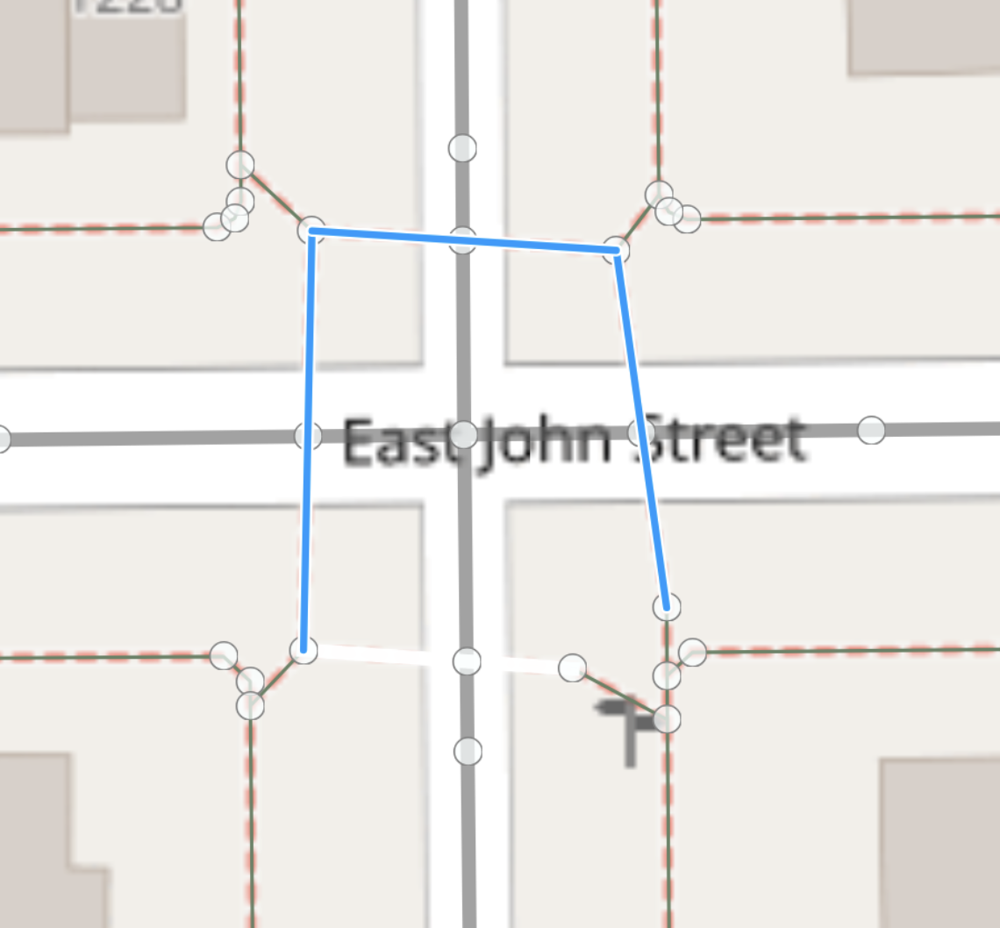
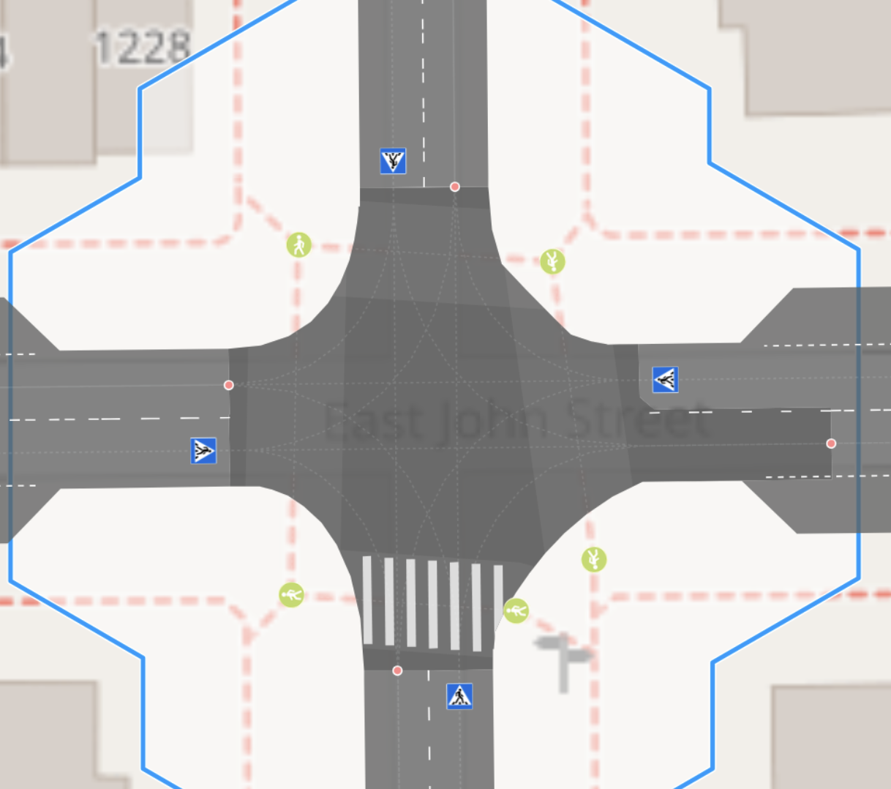
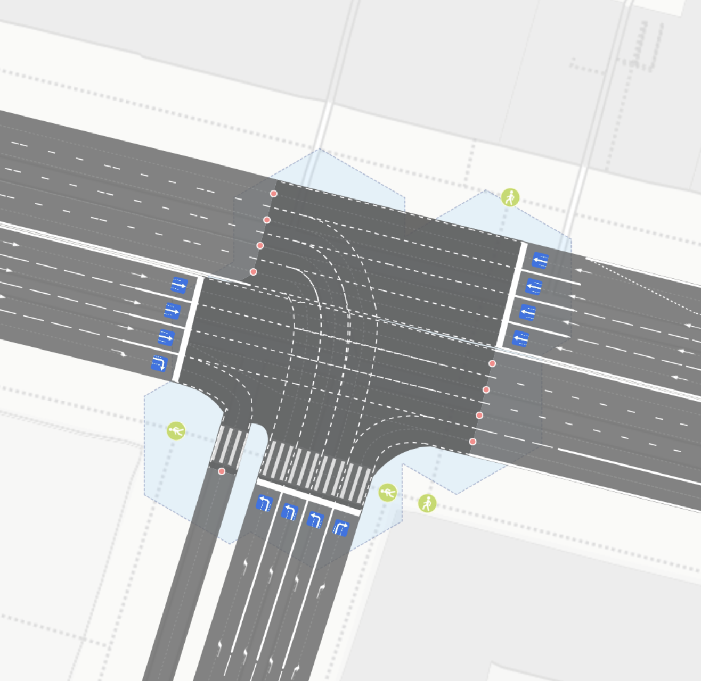
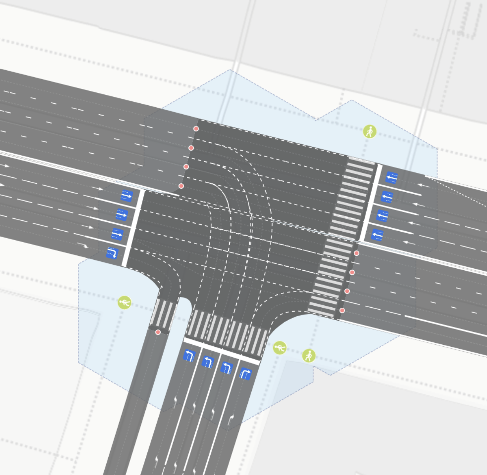

## Ошибки при рендере пешеходных переходов
Пешеходный переход может не отобразится по следующим причинам
1. Точки начала и окончания перехода должны лежать внутри полигона кластера, если это не так 
передвинте точки внутрь или увеличте размер `junction:cluster:radius` для соответсвующих nodes
2. Way перехода разбит точкой посередине - это может мешать построению пешеходного маршрута старайтесь делать
  один way один переход через проезжуюу часть.
3. Два или более (way) перехода через разные дороги перекрестка имеют общую точку или это вообще один way вокруг всего 
   перекрестка. Рендер не умеет отделять такие ситуации(ошибки) автоматически. Необходимо разбить все пути и сделать
   чтобы у них не было общих точек, так как в большинстве случаев это ошибка картирования - пешеходные переходы 
   не пересекаются на тротуарах

|A|B|  
| :------ | :---------------- |  
|||
|1|2|

|A|B|  
| :------ | :---------------- |  
|||
|1|2|
