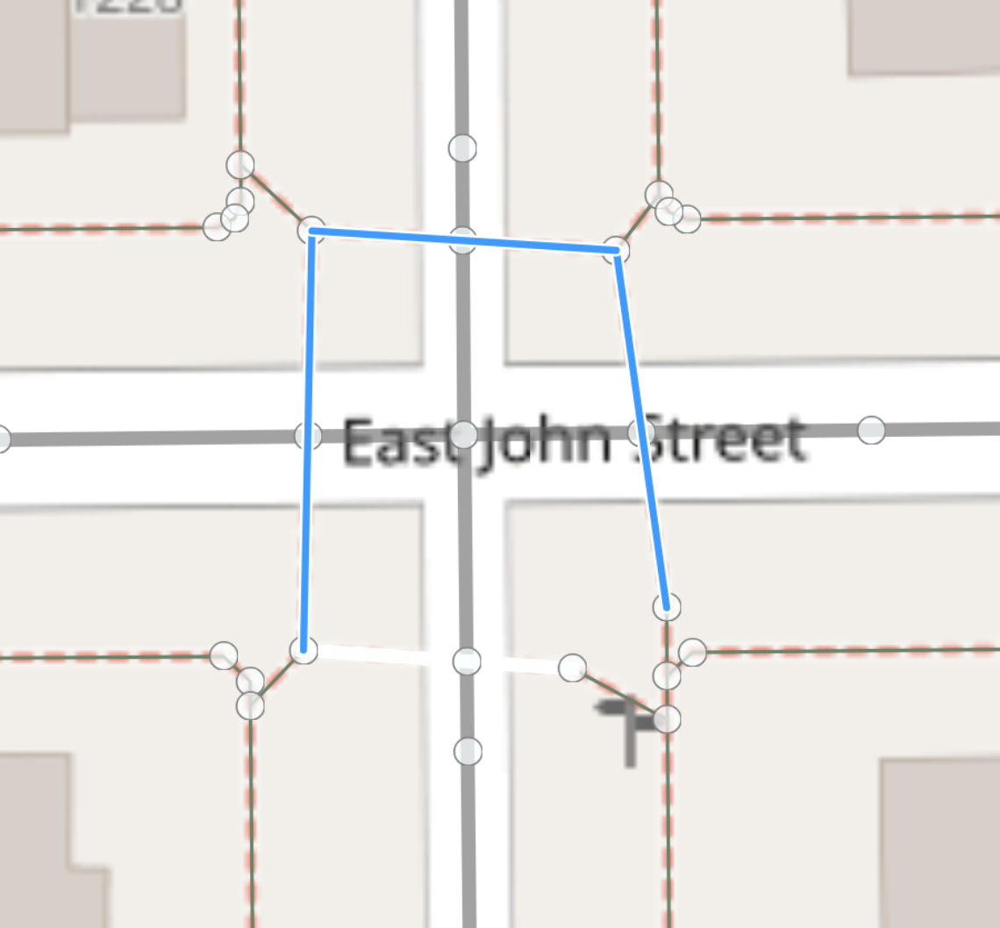
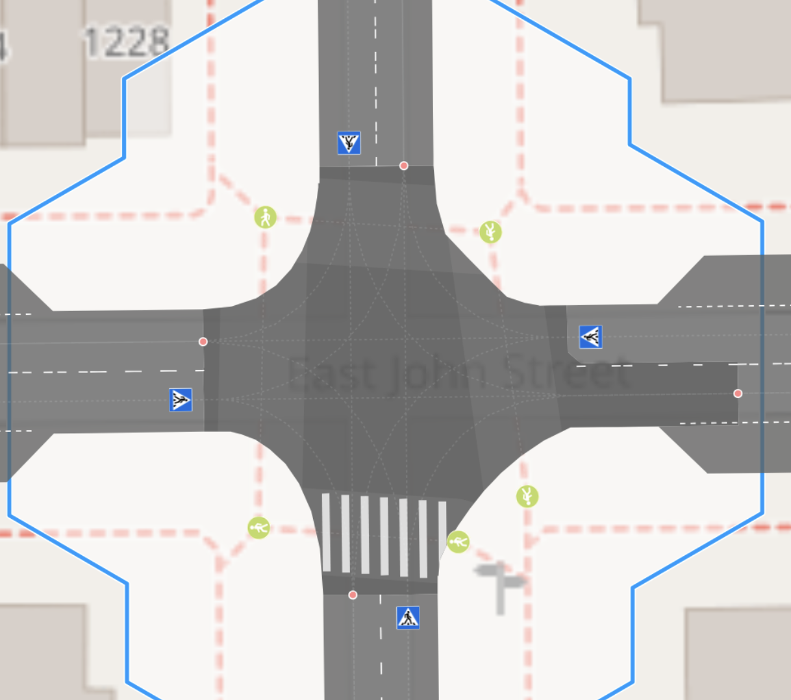
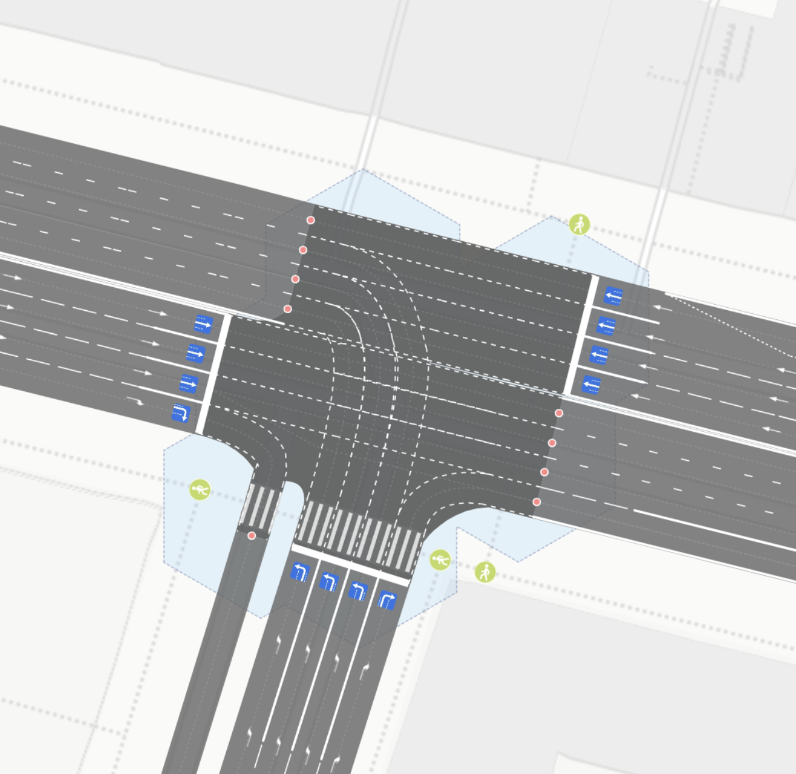
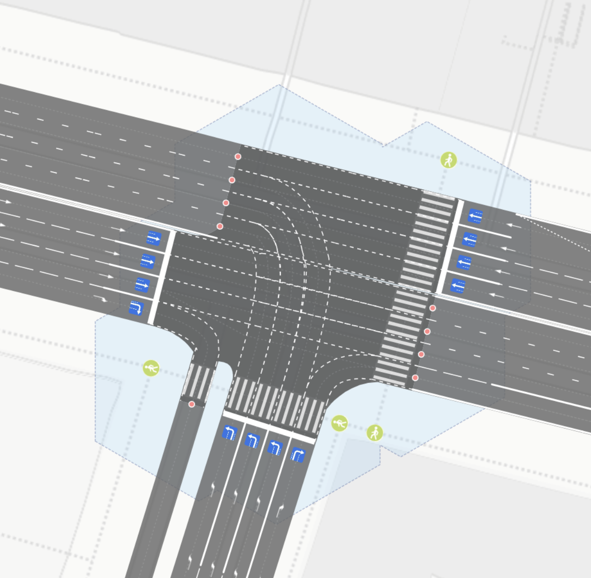

## Ошибки при рендере пешеходных переходов
Если пешеходный переход не отобразился при рендере, проверьте следующие моменты:
1. Точки начала и окончания перехода должны лежать внутри полигона кластера. Если это не так, 
передвиньте указанные точки внутрь полигона или увеличьте его размер (`junction:cluster:radius`) для соответсвующих nodes.
2. Если way перехода разбит точкой, это может мешать построению пешеходного маршрута и рендерингу перехода. Старайтесь отражать один переход через одну проезжуюу часть при помощи одного way. 
3. В соответствии с этим же правилом не стоит отражать два или более переходов через разные дороги перекрестка при помощи одного way. К сожалению, нередко встречаются перекрестки, где пешеходный переход отображен единым круговым way через все проезжие части. Рендер не умеет определять и исправлять такие построения автоматически. Возникает ошибка, вследствие которой пешеходные переходы не отображаются. К такой же ошибке приводит общая точка у двух way смежных пешеходных переходов.

Таким образом, чтобы все пешеходные переходы не перекрестке отобразились корректно, необходимо построить каждый переход через каждую проезжую часть при помощи отдельного way, проверить, что внутри этого way нет точек, что смежные way не имеют общих точек, и что точки входа и выхода каждого перехода находятся внутри полигона кластера.

|A|B|  
| :------ | :---------------- |  
|||
|1|2|

|A|B|  
| :------ | :---------------- |  
|||
|1|2|
