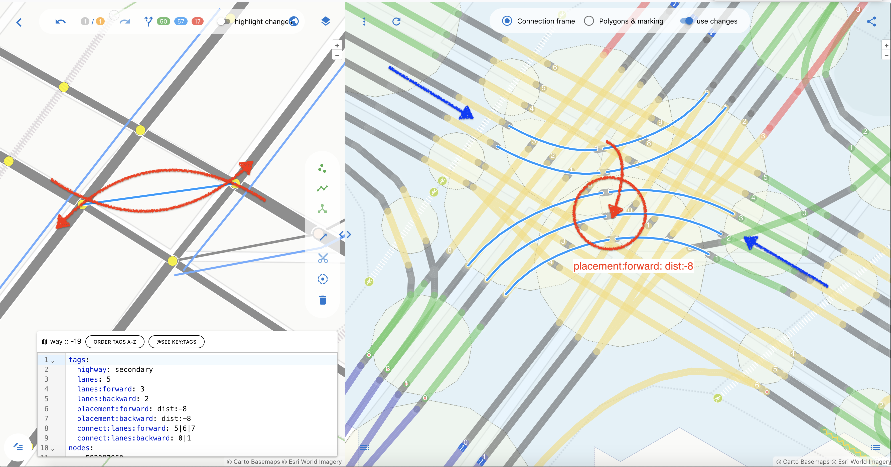

## Примеры использования placement=* в OSMPIE

Перед тем как начать

Тэг `placement` является дефакто используемым в OSM и он полностью применяется для рендера.
И очень полезен для маппинга полос, так как действительно позволяет исправить ту ложь, которая
вносится осевыми линиями, для дорог с переменным числом полос или на развилках.

**Советуем** внимательно ознакомится с положениями и применениями этого очень важного тэга, 
особенно со значением `placement=transition`.  [Placement](https://wiki.openstreetmap.org/wiki/Proposal:Placement)

Однако, для точного мапинга, значения этого тега имеют некоторый недостаток, они адресуются к
краям или центру какой либо полосы, что сильно ограничивает его применение.

---

В osmpie мы предлагаем два небольших расширения для этого способа задания смещения осевой линии.

- . введение значеиния `dist:[number]`, например
```
placement = dist:2.5  // ось смещена вправо на 2.5 метра по направлению движения для односторониих путей
placement = dist:-2.5 // то же самое но влево.
```

- . предложение ввести суфиксы forward и backward и учет их отдельно друг от друга - раздвоение осевой
```
placement:forward = dist:-5
placement:backward = dist:-5
```
---

Давайте рассмотрим несколько примеров, где применение подобных тэгов помогает легко отражать реальность на карте.


### Раздвоение осевой (позитивный сдвиг - обе направо)

```
placement:forward = dist:1.5
placement:backward = dist:1.5
```

Иногда возникают обстоятельства, когда нужно разъединить осевую одного way, с двумя направлениями движения.
Да это понятно, что есть бордюр или газон, то надо новый way, но зачастую это краска и средней полосы там нет, а идет буфферная разметка.
И отражение тэга ` lanes:both_ways: 1` подобным образом это несколько вводит в заблуждение ... 

```
  lanes: 5
  lanes:backward: 2
  lanes:both_ways: 1  <<--- lie ?
  lanes:forward: 2
  
```

| Двойная осевая             | Общая осевая + lanes:both_ways: 1 | 
| :---------------- | :------ | 
| | |
| добавляя положительное смещение 1.5 метра дважды для forward и backward направления, мы точно позиционируем свою осевую для каждой из половин, не привнося лишних сущностей например(выдуманный) `marking = buffer + buffer:width = 3.5`. Так ка наличие буффера это следствие, а не причина ситуации. Маркировка буффера может осуществляться отдельно - дополнительным тэгом              | Для этого отрезка way такого не требуется, так как есть   `lanes:both_ways: 1` и это правда  | 

посмотреть живой пример  чейджсета [placement with 2 centerline](https://osmpie.org/app/editor?bakeId=3f865538-017f-4fd8-92db-0240111ac257&pos=37.570287&pos=55.718356&zoom=19.37&tile=Esri+World
)

### placement = transition

В данном случае действуем строго по методичке. [Placement](https://wiki.openstreetmap.org/wiki/Proposal:Placement).
Этот тег применяется для коротких way с двумя node которые по факту не находятся на осевой дороги, потому что являются частью пересечения или развилки.
Правильное тегирование р расрезка этих кусочков, поможет рендеру OSMPIE изображать перекрестки совершенными (perfect)


|  Sausage roads            | Ramps | 
| :---------------- | :------ | 
| | |
| В США и  Канаде очень широко распространен способ устройства дорог и картирования, когда проезжие части разделены и потом снова объеденины.             | Небольшие отростки на перекрестках, кольцах, развилках и слияних - указывайте placment=transition это заметно улучшает геометрию при рендере | 

посмотреть живой пример  чейджсета, где много используется [placement=transition](https://osmpie.org/app/editor?bakeId=c285c907-bce5-4ac6-99ee-2915854006d9&pos=73.378755&pos=54.972586&zoom=19.83&tile=Esri+World)


### Смена стороны движения (негативный сдвиг - обе налево)

Очень распространенная ситуация, левые повороты на перекрестке - расходятся правыми бортами.


Рисовать отдельно два объекта way  не имеет смысла, это все сильно усложняет, + опять же нет разделенных проезжих частей.
Поэтому нам нужен способ переместить полосы движения накрест(навстречу друг другу). И опять же placement для этого отлично подходит.
Ровно так же как мы их раздвигали в разные стороны можем подвинуть и в обратные. 

```
placement:forward = dist:-8
placement:backward = dist:-8
```


| Добавляем тэг  placement для двух сторон              | Результат переноса | 
| :---------------- | :------ | 
| | |
| "механика" переноса  левой части дороги правее и наоборот           | Результат, траектории движения правильные - не имеют взаимного пересечения | 

посмотреть живой пример  чейджсета [placement with 2 left turn](https://osmpie.org/app/editor?bakeId=3f865538-017f-4fd8-92db-0240111ac257&pos=37.570287&pos=55.718356&zoom=19.37&tile=Esri+World)