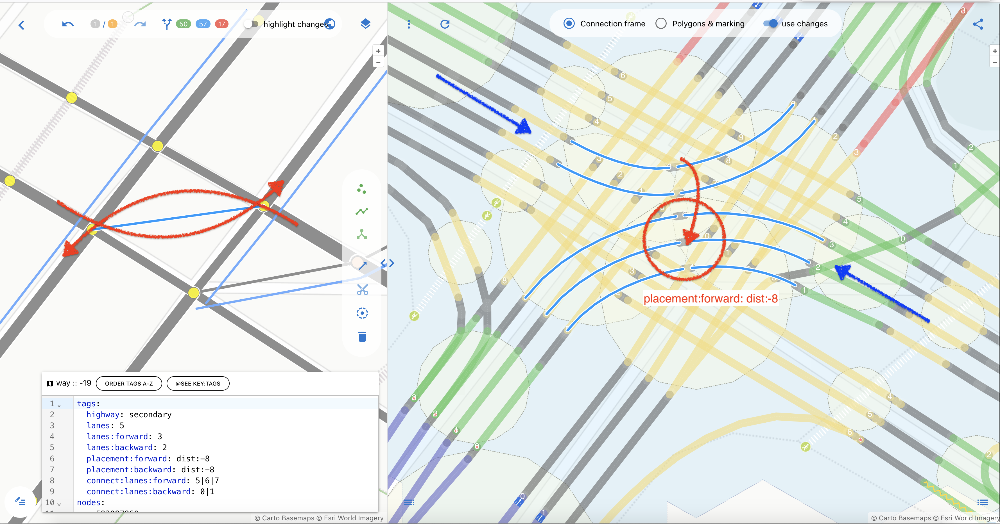

# Примеры использования placement=* в OSMPIE

## Введение

Тег `placement` давно предложен в OSM и используется для рендера OSMPIE с рядом дополнений.
Данная статья описывает некоторые случаи и особенности применения данного тега со стандартными и расширенными суффиксами.

**Советуем** внимательно ознакомиться с положениями и применениями этого важного тега (особенно со значением `placement=transition`) [placement](https://wiki.openstreetmap.org/wiki/Proposal:Placement).

## Мотивация расширения тега

По умолчанию при рендеренге осевая линия отображается ровно по центру дороги. Для участков дорог, где меняется число полос, на развилках или слиянии дорог это свойство осевой линии приводит к искажениям при отображении разметки полос.

Использование тега placement со значением transition частично позволяет решить проблему картирования разметки в таких ситуациях, но это значение всегда адресуется к середине полосы или к одному из её краёв, что делает невозможным точное картирование в сложных конфигурациях.

## Расширение тега

В osmpie мы предлагаем два небольших расширения для такого способа задать смещение осевой линии.

- введение значения `dist:[number]`.

Пример:
```
placement = dist:2.5  // ось смещена вправо на 2.5 метра по направлению движения для односторонних путей
placement = dist:-2.5 // то же самое, но влево.
```

- введение суффиксов forward и backward, учитывающих смещение по отдельности, чтобы картировать раздвоение осевой.

Пример:
```
placement:forward = dist:-5
placement:backward = dist:-5
```

### Примеры

Давайте рассмотрим несколько примеров, где применение подобных тегов помогает удобно и достоверно отражать реальность на карте.

### Раздвоение осевой (позитивный сдвиг — обе направо)

```
placement:forward = dist:1.5
placement:backward = dist:1.5
```

Иногда возникают обстоятельства, когда нужно разъединить осевую одного двунаправленного way.
В случае наличия физического разделителя (газон или островок безопасности с бордюром) необходимо создавать новый way. Рассмотрим вариант, где между полосами встречного движения нанесена только буферная разметка.

Применение тега `lanes:both_ways:1` в подобной конфигурации приведёт к ложному отражению на карте реверсивной полосы вместо буферной зоны в середине дороги. 

```
  lanes: 5
  lanes:backward: 2
  lanes:both_ways: 1  <<--- lie ?
  lanes:forward: 2  
```
Для этой ситуации достаточно изобразить отдельно осевую линию для каждого направления движения. Две независимые друг от друга осевые линии, привязанные к разным полосам, образуют отмеченную разметкой буферную зону. Наличие буферной разметки — это следствие поведения двух осевых, а не причина ситуации. И мы отражаем это на карте, не привнося лишних сущностей. В случае необходимости буферную зону можно маркировать отдельно дополнительным тегом (например, для зоны шириной 3,5 метра — `marking = buffer + buffer:width = 3.5`).

| Двойная осевая             | Общая осевая + lanes:both_ways: 1 | 
| :---------------- | :------ | 
| | |
| Добавляя положительное смещение 1.5 метра отдельно для forward и backward направления, мы точно позиционируем свою осевую для каждой из половин, создавая между ними буферную зону. | Для этого отрезка way такого не требуется, так как здесь в середине дороги находится не буферная зона, а полоса, которую необходимо задать тегом `lanes:both_ways: 1`. | 

Реальный пример подобного changeset [placement with 2 centerline](https://osmpie.org/app/editor?bakeId=3f865538-017f-4fd8-92db-0240111ac257&pos=37.570287&pos=55.718356&zoom=19.37&tile=Esri+World
)

### Значение placement = transition

Использование тега placement со значением transition описано в статье [Placement](https://wiki.openstreetmap.org/wiki/Proposal:Placement).
Участки дороги, где меняется число полос, организованы развилка или слияние, картируются короткими way с двумя node. Такие node не находятся на середине way. Для достоверного картирования необходимо правильно вырезать такие отрезки дороги, применить теги и указать положение осевой линии.


|  Sausage roads            | Ramps | 
| :---------------- | :------ | 
| | |
| В США и Канаде очень широко распространён способ устройства дорог, когда проезжие части разделены и потом снова объединены.             | Placement=transition заметно улучшает геометрию при рендере небольших "отростков" на перекрёстках, кольцах, развилках и слияниях | 

Реальный пример подобного changeset [placement=transition](https://osmpie.org/app/editor?bakeId=c285c907-bce5-4ac6-99ee-2915854006d9&pos=73.378755&pos=54.972586&zoom=19.83&tile=Esri+World)


### Смена стороны движения (негативный сдвиг — обе налево)

Как оптимально картировать распространённую ситуацию, когда транспортные средства, совершающие левые повороты на перекрёстке, расходятся правыми бортами?


Рисовать отдельно два объекта way — противоречит реальности, поскольку здесь нет разделённых проезжих частей.
Поэтому нам нужен способ переместить полосы движения так, чтобы они "смотрели друг на друга" не левыми, а правыми сторонами. Для этого подходит тег placement. Подобно тому, как с его помощью полосы раздвигаются для образования буферной зоны, их можно "придвинуть" друг к другу и, двигая дальше, поменять их взаимное расположение на зеркальное — для этого мы используем отрицательные значения dist.

```
placement:forward = dist:-8
placement:backward = dist:-8
```


| Добавляем тег placement для двух сторон              | Результат переноса | 
| :---------------- | :------ | 
| | |
| "механика" переноса левой части дороги правее и наоборот           | Результат: траектории движения достоверные, не имеют взаимного пересечения | 

Реальный пример подобного changeset [placement with 2 left turn](https://osmpie.org/app/editor?bakeId=3f865538-017f-4fd8-92db-0240111ac257&pos=37.570287&pos=55.718356&zoom=19.37&tile=Esri+World)

## Вывод

Тег placement с предлагаемыми значением dist и суффиксами forward и backward позволяют удобно картировать участки дороги, где меняется количество полос, развилки или слияния дорог, буферные зоны, участки перекрёстка, где транспортные средства совершают левые повороты, расходясь правыми бортами, и подобные случаи. Рендер OSMPIE достоверно воспроизведёт участки, картированные с использованием этого тега.

## Рекомендуемые статьи

- [Как "приготовить" идеальный перекрёсток](../perfect.junction.md)  
- [Тег connect:lanes](../way.tags.connect:lanes.md)  
- [Тег junction:shape](../node.tags.junction:shape.md)
