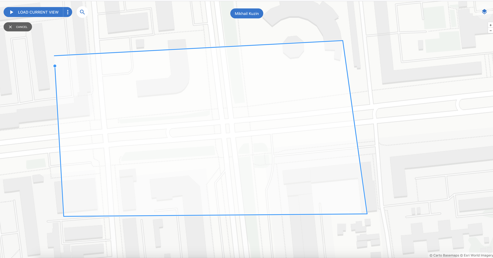
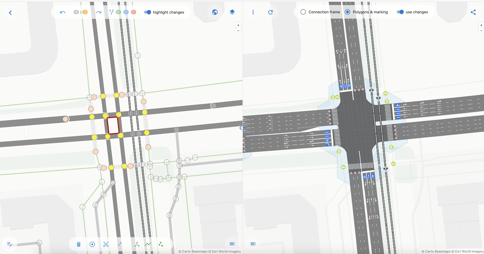
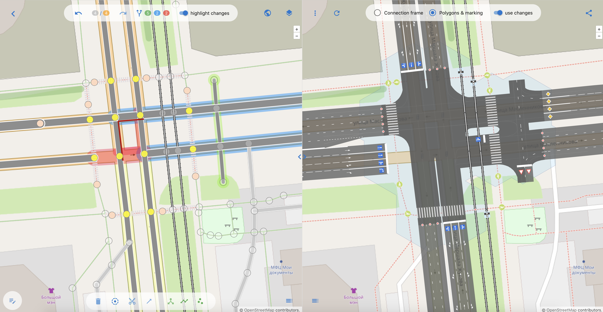

## 1. Начало работы с редактором OSMPIE

Окно для начала работы

Чтобы начать работу с OSMPIE, вы должны войти через OpenStreetMap — это быстро, безопасно и не требует создания отдельного аккаунта.

**Как авторизоваться?**

Нажмите кнопку **«Please, login in OSM to start»** вверху экрана.
Если у вас уже есть аккаунт OpenStreetMap:
1. Введите логин и пароль.
2. Подтвердите доступ к базовым данным профиля (сервис запрашивает только публичную информацию).

Если у вас нет аккаунта OSM:
1. Нажмите «Зарегистрироваться» в окне авторизации.
2. Заполните форму: email, имя пользователя и пароль.
3. Подтвердите email и вернитесь к входу в OSMPIE

Почему именно OSM?

1. Единый аккаунт — не нужно запоминать новые логины.
2. Безопасность — авторизация проходит на официальном сайте OSM, мы не знаем и не храним ваш пароль.

После успешной авторизации вы будете возвращены на главный экран и сможете продолжиьт работу.

**Если ОСМ недоступно/блокируют в РФ**
 
1. Воспользуейтесь инструкцией [https://t.me/ruosm/850833](https://t.me/ruosm/850833)
2. VPN вероятно поможет
3. Фикс для FireFox самый простой и прекрасно работает

---

## 2. Выбор места (перекрестка) для редактирования

С помощью зума карты, приблизьте к тому перекрестку, котрый вы хотите редактировать. 
Слева есть кнопка открывающая форму поиска места по ключевым словам, например "Невский проспект", "Тюмень", и т.д.

При достаточном приближении кнопка  **"Load current view"** будет разблокирована, так же можно воспользоваться 
кнопкой **"Draw to load"**, чтобы обвести область боле точно!

OSMPIE сделает запрос к [Overpass API](https://wiki.openstreetmap.org/wiki/Overpass_API) для получения данных и 
откроет главный экран для редактирования.

---

## 3. Редактор OSMPIE

Основное окно редактора разделено на две части, в левой можно добавлять, передвигать и изменять
объекты дорог ways, nodes и relations. В правой части рендером  OSMPIE будет отрисована модель дороги
с учетом внесенных пользователем изменений.

**Внимание** рендер происходит не автоматически, для обновления правой части необходимо нажать кнопку **"Refresh view + Save changes"** 
в левой верхней части правой половины редактора.

**Смелее вперед!**

Смело пробуйте изменить местоположение точки, удалить дорогу или добавить новую и поглядите, что из этого вышло.
Это безопасно, каждый шаг(или все сразу) можно откатить назад. Данные изменяются локально в вашем браузере и не могут 
повредить OSM. 
  

