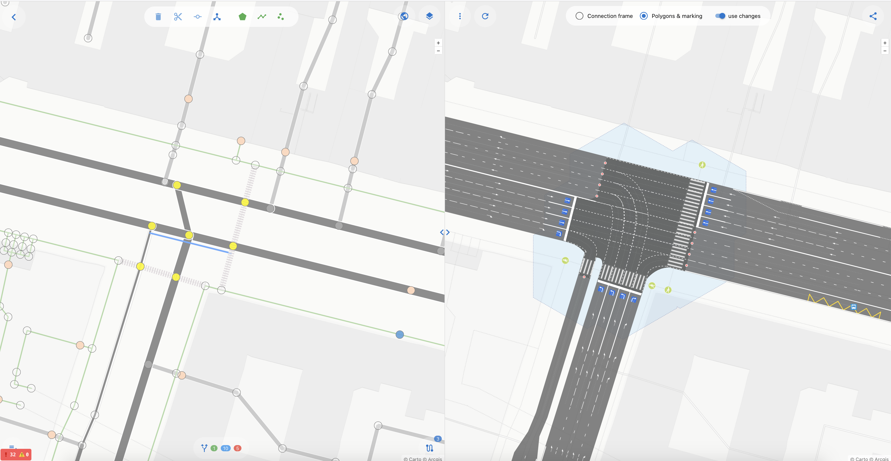
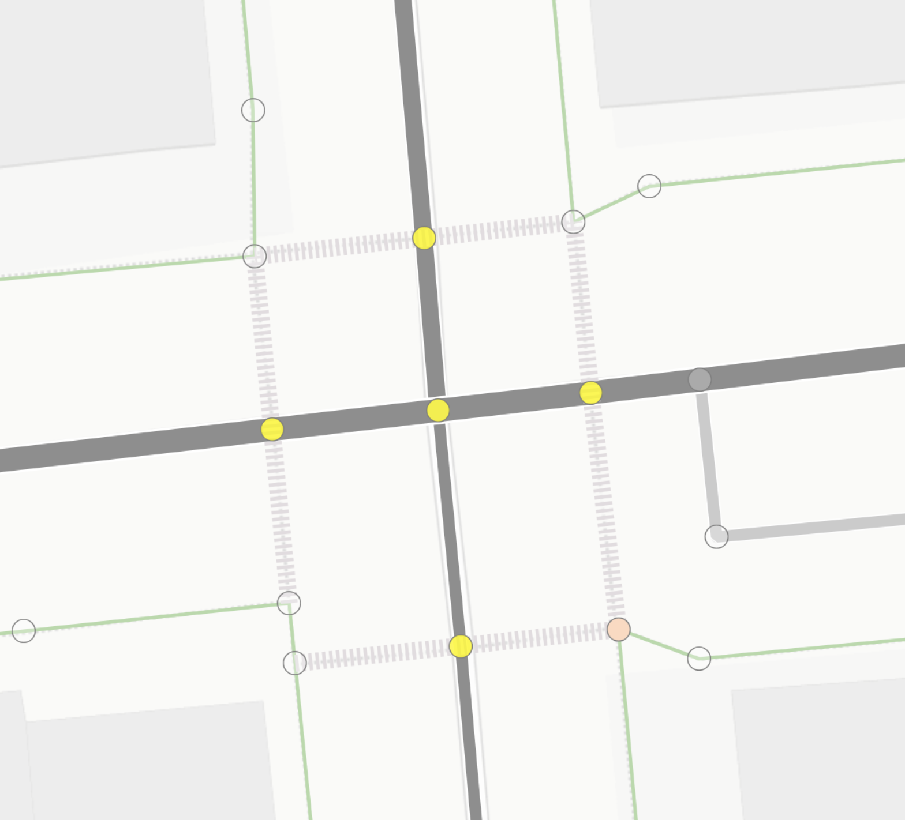

#Содержание

1. Начинаем
2. [Как замапить идеальный перекресток ](./perfect.junction.md)
3. Предложение новых тэгов
    - [connect:lanes](./way.tags.connect:lanes.md)
    - [junction:shape](./node.tags.junction:shape.md)
    - [junction:radius](./node.tags.junction:radius.md)
    - [junction:cluster:radius](./node.tags.junction:cluster:radius.md)
    - [crossing:corner](./node.tags.crossing:corner.md) 
4. Часто задаваемые вопросы
5. Какой тэг на что влияет
6. Типичные ошибки и почему они происходят
    - [Пропала разметка пешеходного перехода](./examples/crossing-error.md)


##С чего начнем?

**OSMPIE** - OSM Perfect Intersection's Editor 

На больших увеличениях, глазу гораздо приятнее смотреть на нечто, что больше похоже на дорогу,
чем просто на оранжевые и желтые полоски. На карте мы часто видим рядом такие объекты как [дерево](https://wiki.openstreetmap.org/wiki/Tag:natural%3Dtree), 
[парковка велосипедов](https://wiki.openstreetmap.org/wiki/Tag:amenity%3Dbicycle_parking), 
[пониженный бордюр](https://wiki.openstreetmap.org/wiki/Key:kerb) на переходе,[люк](https://wiki.openstreetmap.org/wiki/Key:manhole),
[скамейка](https://wiki.openstreetmap.org/wiki/Tag:amenity%3Dbench). И при этом такой сложный объект, 
как дорога или перекресток - это просто одна-две цветных линии. Давайте это как-то исправим уже?

OSMPIE состоит из двух главных компонентов. 
1) Это рендер движок дорог, который превращает объекты дорог OSM (атрибутированные way,nodes,relations)
 в новое множество геообъектов топологически и геометрически связанных между собой и исходными  OSM объектами. 
2) Это специализированный редактор/вьювер для быстрого и удобного картирования дорог и перекрестков в OSM.





**Начало:**

Имея многолетний опыт построения и работы с моделями 
дорожных сетей мы понимали, что  одна из главнейших задача реализовать функцию развертки графа и генерации новых связей
которые бы отражали непротиворечивую топологию сети относительно исходной и картине "на земле".

>В начале топология - затем геометрия.

Первой задачей было построение графа дорожной сети, где для каждой полосы движения будет своя осевая. 
И во вторую очередь необходимо было решить проблему связности на пересечениях.
И только тогда можно приступать к геометрическим преобразованиям и построениям.


**Мотивация**

Картирование дорог и в особенности сложных перекрестков непростая задача. И требует от
картографа очень развитого воображения, существующие инструменты конечно очень помогают в визуализации.
Но наша цель - идеальный перекресток, _(точнее его модель(отражение))._ 


**Что такое "перекресток" ?**

1. Перекресток с точки зрения его функциональной модели должен обладать и связывать между собой
следующий набор объектов:
    - Стоп линия или точка входа в перекресток (stopline - синия точка - знак 5.15) 
    - Подход - группа стоп линий с одонго направления (approach)
    - Точка выхода  (exitpoint - красная точка)
    - Путь от входа к выходу (route - фиолетовая линия)
    - Конфликтные точки (conflict point - черная точка), как результат пересечения множества маршрутов

2. Перекресток обладает двойной природой - площадной и графовой, [геометрией](https://en.wikipedia.org/wiki/Geometry) и [топологией](https://en.wikipedia.org/wiki/Topology).
3. Перекресток это множество пересечений - кластер пересечений
4. Каждое пересечение можно характеризовать двумя радиусами, которые являются мостом между графовой и площадной природой перекрестка:
    - Радиус пересечения - площадь зоны конфликта
    - Радиус кластеризации пересечения - площадь влияния пересечения на другие
   
5. Перекресток это место где мерами ОДД не предусмотрено остановка транспортных средств, только движение по полосам/направлениям.

| Объекты OSM  | Осевые линии полос и соединений |  
| :------ | :---------------- | 
|||
|(node,way,relation)|(points,edges, connections)|

|  Площадь перекрестка   | Точки и маршруты   | 
| :------ | :------ | 
|||
|`area:highway=* + junction=yes` ?| множество маневров в виде линий-маршрутов и их пересечения|

**ОК, что нужно делать?**
Открывайте любой редактор и вносите тэги ОСМ для дорог, но будьте аккуратны с relation. 

Официальные тэги и proposal в OSM на 90-95% процентов достаточны, чтобы обеспечить возможности
для картирования и рендера дорог. В ходе работы над OSMPIE мы выявили и определили минимальный
набор самых простых тэгов и несколько расширений к существующим, которые позволят довести
цифру до 100%.

**Какие тэги нужно добавлять?**

Официальные

```
highway
crossing
lanes:*
turn:lanes
width
width:lanes
psv:lanes
placement
parking:{side}:*
cycleway:{side}
bus_bay
tram

... и другие
```

Новые
```
connect:lanes
junction:shape
junction:radius
junction:cluster:radius
crossing:corner
```

Рендер osmpie может выполнять функции визуального валидатора - если вам не нравится 
изображение справа, и перекресток не выглядит идеально, или оно не сильно похоже на то, 
что вы видите на спутниковом снимке - значит скорее всего нужно добавить еще тэгов или 
исправить старые.


**Что я получу, какой профит?**

- Ввод и разметка тэгов дорог и перекрестков происходит значительно легче-точнее-удобнее, когд у вас есть [WYSIWYG](https://ru.wikipedia.org/wiki/WYSIWYG)
- Вы можете загрузить [*.osc](https://wiki.openstreetmap.org/wiki/OsmChange) сделанный в любом другом редакторе
- А так же сохранить предполагаемые вами изменения и открыть в JOSM или другом редакторе для дальнейших правок.
- Поделиться ссылкой с другими людьми для обсуждения правок ДО... того как все сломать, для особо сложных или запутанных случаев
- Визуально видеть все изменения на карте
- Поделиться или сохранить все объекты, которые генерирует osmpie в GeoJson или даже сразу открыть их в `geojson.io` и скачать как shape, csv, kml ...
- Возможность сделать мир OSM чуточку(а может и значительно) лучше, меньшими усилиями.


**Какие данные на входе?**
- Запрос к overpass API, который возвращает большинство объектов `highway=*`, так или иначе связанных с дорогами. 
Все эти объекты отражаются в левой части редактора и доступны для изменения(тэги, геометрия). 

**Какие данные на выходе?**
- Граф полос дорог, парковок трамвайных путей и велодорог - точки и дуги. 
  Граф топологически соответствующий направлениям движения исходных OSM way 
  и геометрически соответствующий осевым полос.
- Особенно отделены функциональные точки перекрестка - стоп линии(точки входа), точки выхода и конфлктные точки - для каждого вида участников
  взаимоотношений на каждом пересечении.
- Кластеризацию точек и дуг графа в такие объекты как перекресток и подход
- Площадные объекты: (мульти)полигон перекрестка, полигон дороги - см [area:highway](https://wiki.openstreetmap.org/wiki/Key:area:highway)
- Объекты дорожной разметки в виде полигонов, линий и точек связанные с тем или иным ребром графа.


**Заключение**

Да сам рендер не идеален и тоже может выдавать некоторые ошибки, однако его задача в точности отразить то что ему 
указали через схемы тэгирования объектов OSM. Ну и немного приукрасить - скруглив уголки и сгенерировав разметку.

В первой публичной версии osmpie дорожная разметка не управляема и генерируется по максимуму и может не отражать некоторых местных особенностей нанасения.
Например парковочных мест или пешеходных переходов. И ее рендер осуществляется, чтобы дать понять о существовании 
того или иного объекта, полосы и ее размерах. Однако мы надеемся это быстро исправить в самую первую очередь.

