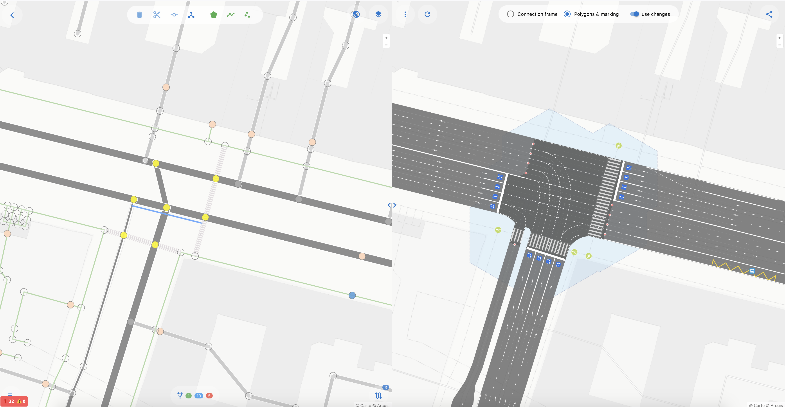
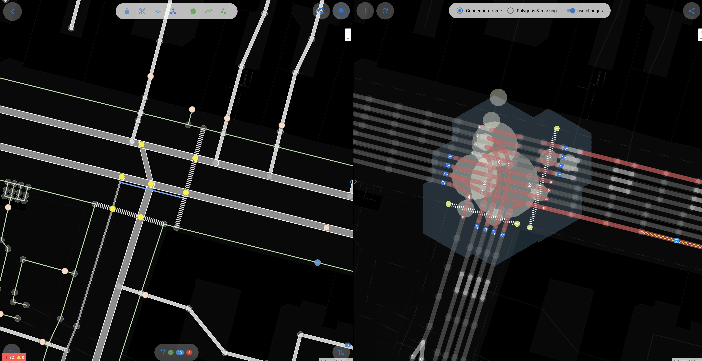
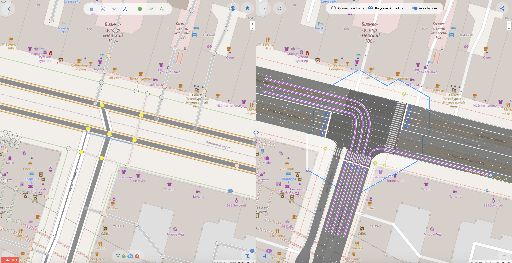
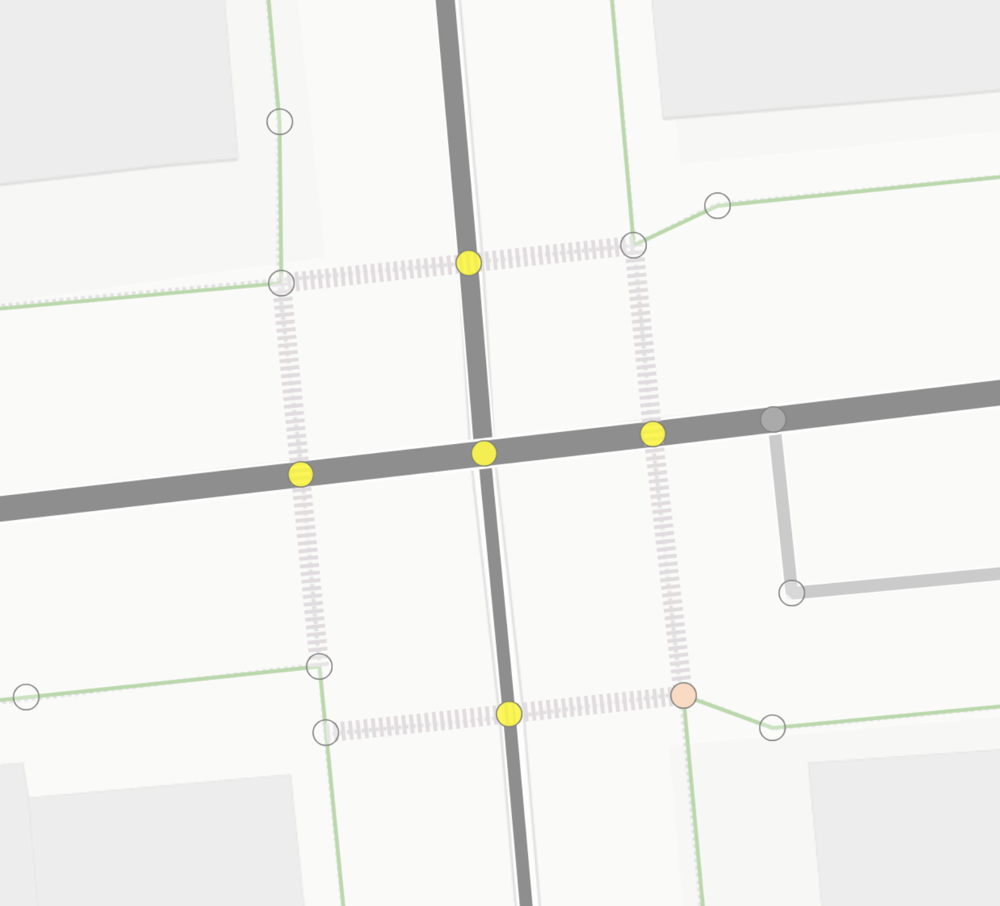
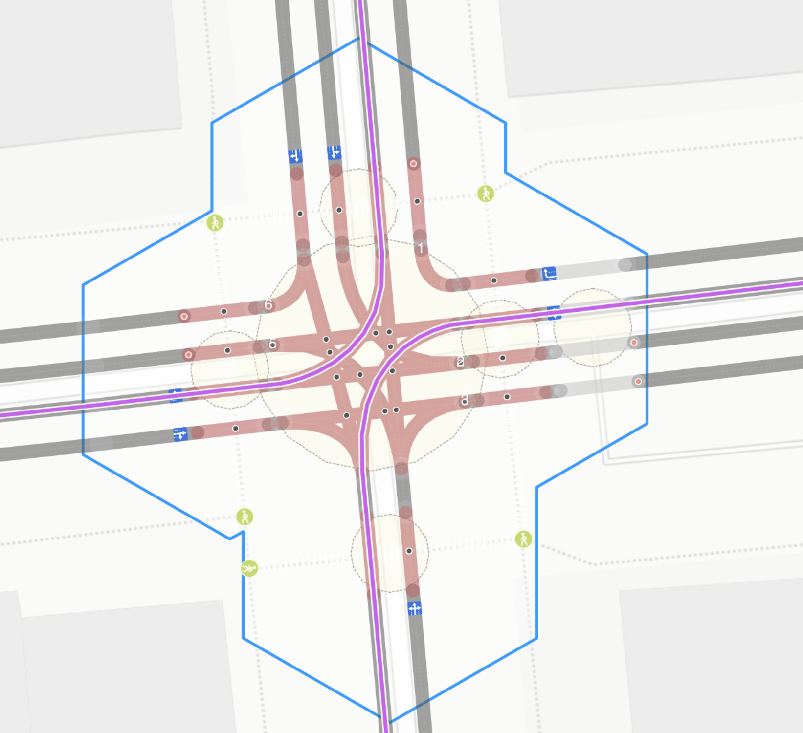
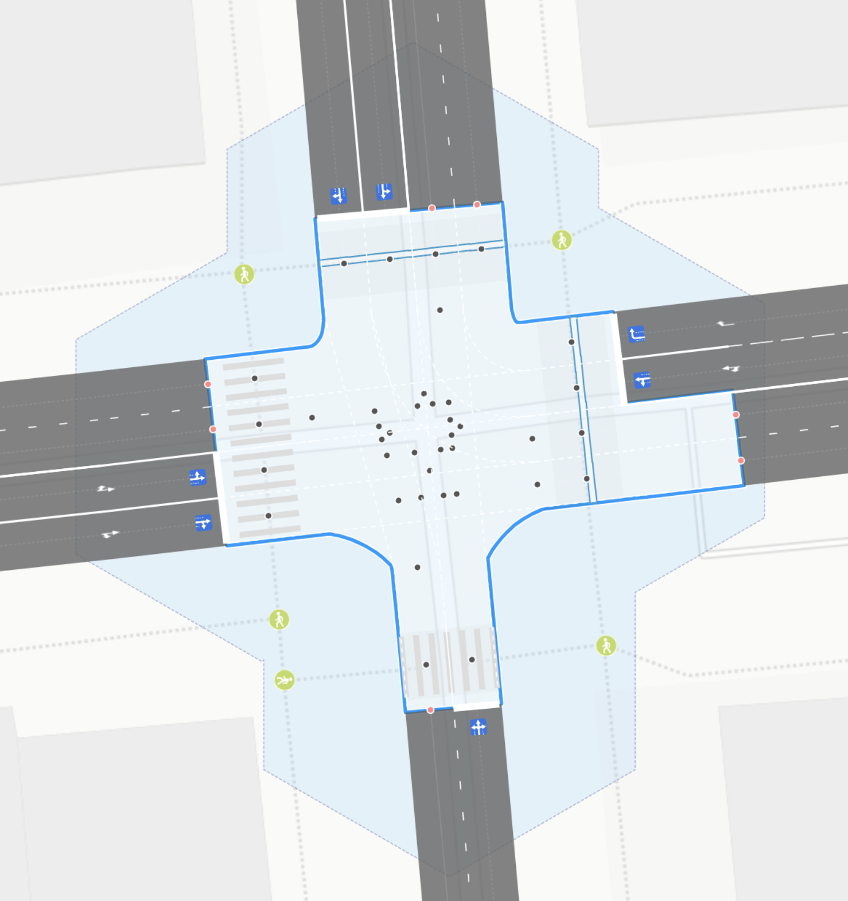
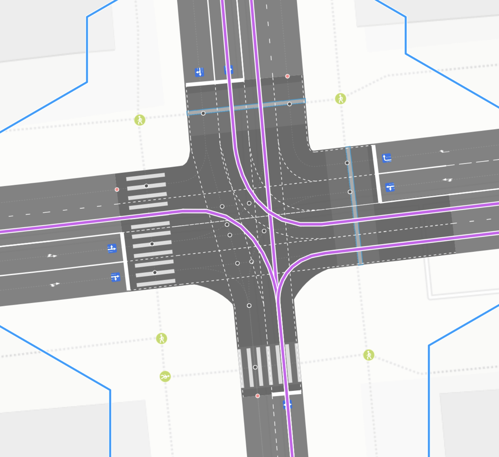

## OSMPIE — Редактор идеальных перекрёстков OpenStreetMap

В **OpenStreetMap** на максимальном увеличении встречаются тщательно прорисованные [деревья](https://wiki.openstreetmap.org/wiki/Tag:natural%3Dtree), [велопарковки](https://wiki.openstreetmap.org/wiki/Tag:amenity%3Dbicycle_parking), [пониженные бордюры](https://wiki.openstreetmap.org/wiki/Key:kerb) на переходах, [люки](https://wiki.openstreetmap.org/wiki/Key:manhole) и [скамейки](https://wiki.openstreetmap.org/wiki/Tag:amenity%3Dbench). При этом такой сложный объект, как перекрёсток, зачастую упрощен до пары цветных линий. Такая недостоверность делает невозможным решение прикладных задач, связанных с дорожной инфраструктурой. Чтобы восстановить реальную топологию перекрестка, требуются невероятные терпение и изворотливость.

**OSMPIE** создан для решения этой проблемы!

## Архитектура системы OSMPIE

PIE состоит из двух ключевых компонентов:

**Движок рендеринга дорог** — обрабатывает объекты OSM (`way`, `node`, `relation`) и создаёт топологически и геометрически связанную систему новых геообъектов. Результат — детализированная модель с полосами движения, стоп-линиями, зонами конфликтов и разметкой.

**Специализированный редактор-просмотрщик** — инструмент для быстрого и удобного картирования дорог и перекрёстков в OSM. Поддерживает WYSIWYG-редактирование: изменили тег — мгновенно увидели, как обновилась геометрия.

## Практическая значимость проекта

**Точная модель дороги**

OSMPIE - это больше, чем рендер-движок площадных объектов дороги. В его основе лежит построение точной топологической и объектной модели большинства элементов дорожной сети. Он обобщает множество точек в логике перекрестка, создавая объекты (точки вход и выхода из перекрестка, конфликтные точки, подходы), необходимые для инженерных  расчетов на перекрестке и управления дорожным движением

**Продвинутая навигация**

Расширенное объектное моделирование и улучшенное качество визуализации обеспечивают более точную навигацию на дорогах, поскольку предоставляет не только базовые данные о количестве полос и дорожных знаках, но и исчерпывающую информацию о моделях поворотов, геометрии перекрестков, дорожной разметке и других подробных элементах инфраструктуры.

**Обогащение OSM**

Объекты, полученные в результате рендеринга OSMPIE (например, полигоны дорог, area:highway, area:highway=* + junction=yes , знаки разметки, уточненные тэги поворотов turn:lanes для way[highway], полигоны и разметка пешеходных переходов и многое другое) можно сохранять в ОСМ.

**Инженерные расчеты, моделирование, v2x**

Объекты и данные полученные в результате рендеринга, могут быть использованы в широком спектре технологий ADAS MAP, MAPem V2X, 3D визуализаций дороги, проектировании объектов дорожного движения, микро моделирования и разработки светофорных программ управления.

!!!ссылки на поясняющие сайты(sumo, aimsun, tom tom, bosh)

**Аналитика данных**

Сколько перекрёстков в вашем городе? Сколько из них регулируемых и нерегулируемых? Насколько сложны перекрёстки? OSM не предоставляет данных, позволяющих получить точные ответы на эти вопросы. OSMPIE упрощает поиск ответов на эти и более сложные запросы. OSMPIE представляет перекрёстки как отдельные объекты со всеми необходимыми взаимосвязями, такими как количество конфликтных точек или пересечений с трамвайными линиями.



## Зачем это мне? В чем профит?

- Используйте osmpie для правильного и точного картирования дорог в ОСМ, osmpie будет выступать в роли помощника и валидатора
- Отправьте ссылку коллеге на проверку до применения changeset или для совместных обсуждений.
- Скачайте все результаты рендера в GeoJson  или загрузите в ваш GIS(QGIS например), можете прямо по  API или прямой ссылке. Для вашей исследовательской работы или личных проектов. Помните про ODBL.
- Вы можете получить как топологическую модель полос с дополнительными атрибутами каждой полосы, точки и соединения так и финальную - площадную с разметкой.
- Наполните OSM актуальными и точными данными. Пусть карта будет отражать реальность во всех необходимых деталях.

## Удобный функциональный интерфейс

- **Визуальная валидация тегов** — если что-то неправильно, это сразу видно
- **Коллективная работа** — возможность поделиться ссылкой на правки для рецензирования перед загрузкой в OSM  
- **Экспорт данных** — простое преобразование в форматы ГИС (GeoJSON и другие)

Результат — меньше догадок и длинных обсуждений в чатах, больше точных данных на карте. 

## Теоретические основы и технические вызовы

Многолетний опыт работы с моделями дорожных сетей научил нас простой истине: если вы хотите, чтобы картинка на экране отражала реальность «на местности», нужно начинать с логики, а не с внешнего вида. Сначала **топология**, затем **геометрия**.

Основной технической задачей стала реализация функции **развёртывания графа** и генерации новых связей, сохраняющих топологическую согласованность как с исходными данными OSM, так и с реальной топологией.

### Поэтапная методология картирования

1. **Первый этап — построение графа.** Каждая полоса движения получает собственную центральную линию. Это обеспечивает основу для точной топологической модели сети.

2. **Второй этап — связность перекрёстков.** На этой стадии обеспечивается корректное соединение полос на пересечениях, чтобы логика транспортных потоков была согласованной.

3. **Третий этап — геометрия.** Только после завершения топологии переходим к геометрическим преобразованиям: прорисовке форм перекрёстков, полос, разметки и других деталей.


---

## Философия проектирования и мотивация

**Наш подход** – сначала топология, затем геометрия

Существующие инструменты помогают с визуализацией, но не предотвращают ситуацию, когда карта выглядит красиво, но лишь приблизительно отражает реальность. Такая модель не пригодна для решения прикладных задач.

**Наша цель** — создать в OSM *идеальный перекрёсток*. Это логически согласованная модель перекрестка, содержащая весь необходимый набор данных и гарантирующая, что каждый элемент на карте не только визуально привлекателен, но и **топологически корректен**.


---

## Функциональная модель перекрёстка

### Что представляет собой «перекрёсток»?

С точки зрения функционального моделирования, перекрёсток должен включать и взаимосвязывать следующий набор базовых объектов:

- **Стоп-линия или точка входа**: Точное местоположение, где транспортные средства въезжают на перекрёсток (stopline — синяя точка — соответствует дорожному знаку 5.15)
- **Подход**: Координированная группа стоп-линий с одного направления подъезда
- **Точка выхода**: Обозначенное место, где транспортные средства покидают перекрёсток (exitpoint — красная точка)
- **Маршрут**: Определённый путь, соединяющий точки входа и выхода (route — фиолетовая линия)
- **Точки конфликта**: Критические места пересечения нескольких маршрутов, создающие потенциальные конфликты транспортных средств (conflict point — чёрная точка)

### Фундаментальные характеристики перекрёстков

1. **Двойственная природа**: Перекрёстки обладают как площадными (ареальными), так и графовыми свойствами, воплощая [геометрические](https://ru.wikipedia.org/wiki/Геометрия) и [топологические](https://ru.wikipedia.org/wiki/Топология) характеристики.

2. **Кластерная композиция**: Перекрёсток представляет кластер множественных индивидуальных точек пересечения, а не единичную сущность.

3. **Характеризация на основе радиусов**: Каждое пересечение характеризуется двумя критическими радиусами, связывающими графовую и ареальную природу перекрёстков:
   - **Радиус перекрёстка**: Определяет область зоны конфликта
   - **Радиус кластеризации**: Определяет зону влияния одного перекрёстка на другие

4. **Зона движения**: Перекрёстки представляют области, где правила дорожного движения запрещают остановку транспортных средств, разрешая только непрерывное движение по обозначенным полосам и направлениям.

### Сравнение визуального представления

| Объекты OSM | Центральные линии полос и соединения |
|:------------|:------------------------------------|
|||
|(node, way, relation)|(точки, повороты, соединения)|

| Область перекрёстка | Точки и маршруты |
|:-------------------|:-----------------|
|||
|`area:highway=* + junction=yes` ?|Множество маршрутов представлено в виде линий и их пересечений|


---

## Как пользоваться OSMPIE?

### Требуемые действия

Пользователи должны использовать любой стандартный редактор для ввода OSM-тегов дорог, проявляя особую осторожность с объектами-отношениями. Официальные теги OSM и предложения обеспечивают 90-95% функциональности, необходимой для комплексного картирования и рендеринга дорог.

В ходе разработки OSMPIE мы определили минимальный набор простых тегов вместе с несколькими расширениями существующих схем, достигающими 100% покрытия функциональности.

### Необходимые теги

**Официальные теги OSM:**
```
highway
crossing
lanes:*
turn:lanes
width
width:lanes
psv:lanes
placement
parking:{side}:*
cycleway:{side}
bus_bay
tram
... и дополнительные стандартные теги
```

**Новые расширенные теги:**
```
connect:lanes
junction:shape
junction:radius
junction:cluster:radius
crossing:corner
```

---

### Спецификации входных данных

**Исходные данные**: Запросы Overpass API, возвращающие комплексные объекты `highway=*` и связанные элементы дорожной инфраструктуры. Все объекты отображаются в левой панели редактора и остаются доступными для модификации (теги и геометрия).

### Продукты выходных данных

**Генерируемые компоненты**:
- **Структура графа полос**: Полный граф дорожных полос, парковочных зон, трамвайных путей и велодорожек в виде точек и дуг, топологически соответствующих направлениям движения исходных OSM way и геометрически выровненных с центральными линиями полос
- **Функциональные точки перекрёстков**: Специализированная идентификация стоп-линий (точки входа), точек выхода и точек конфликта для каждой категории участников перекрёстка
- **Кластеризация объектов**: Систематическая группировка точек и дуг графа в логические объекты, такие как перекрёстки и подходы
- **Ареальные объекты**: Мульти-полигональные представления перекрёстков и дорожные полигоны (см. [area:highway](https://wiki.openstreetmap.org/wiki/Key:area:highway))
- **Объекты дорожной разметки**: Комплексные элементы дорожной разметки в виде полигонов, линий и точек, связанных с соответствующими рёбрами графа

---
### Возможности визуальной валидации

Рендерер OSMPIE функционирует как сложный визуальный валидатор. Если отрендеренный результат выглядит несовершенным или не похож на спутниковые снимки, необходимо добавить теги или исправить существующие атрибуты.


## Ограничения текущей версии

Первый публичный релиз OSMPIE содержит не настраиваемую генерацию дорожной разметки, которая обеспечивает максимальное покрытие, но может не отражать специфические местные конвенции разметки, такие как парковочные места или пешеходные переходы. Рендерер разметки работает для указания существования объекта, наличия полосы и размерных характеристик. Мы приоритизируем быстрое решение этих ограничений в ближайших будущих обновлениях.

## Заключение

OSMPIE представляет парадигмальный сдвиг к профессиональному моделированию перекрёстков в экосистеме OpenStreetMap, заполняя пробел между упрощёнными линейными представлениями и сложной реальностью современной дорожной инфраструктуры. Через систематическое применение расширенных схем тегирования и сложных алгоритмов рендеринга, OSMPIE позволяет картографам создавать точные, визуально убедительные представления, служащие как эстетическим, так и функциональным требованиям.

## Рекомендуемые статьи

1. [Как начать работать c OSMPIE ](./getting-started.md)
2. [Порядок работы, описание окон и форм](./workflow.and.forms.md)
