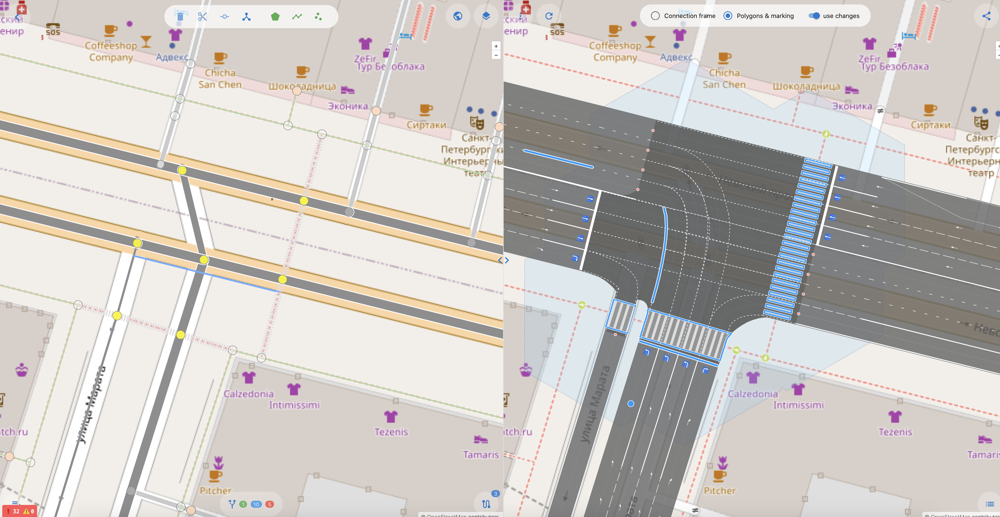

## OSMPIE — OSM Perfect Intersections Editor

В больших масштабах карт часто хочется видеть не «желто-оранжевые ленточки», а настоящие дороги: с полосами, разметкой, геометрией перекрёстков -  как в жизни. В OpenStreetMap мы можем встретить тщательно прорисованные [деревья](https://wiki.openstreetmap.org/wiki/Tag:natural%3Dtree), [велосипедные парковки](https://wiki.openstreetmap.org/wiki/Tag:amenity%3Dbicycle_parking), [скамейки](https://wiki.openstreetmap.org/wiki/Tag:amenity%3Dbench), [пониженные бордюры](https://wiki.openstreetmap.org/wiki/Key:kerb)  — и при этом такой сложный объект, как **перекрёсток**, часто сведён к паре цветных линий.  
OSMPIE призван это исправить!  

### Из чего состоит OSMPIE
- **Рендер-движок дорог** — берёт объекты OSM (`way`, `node`, `relation`), строит топологически и геометрически связанный набор новых геообъектов. Результат — не просто линии, а детальная модель с полосами движения, стоп-линиями, зонами конфликта и разметкой.  
- **Специализированный редактор/вьювер** — инструмент для быстрого и удобного картирования дорог и перекрёстков в OSM. Поддерживает WYSIWYG-редактирование: меняешь теги — сразу видишь, как меняется геометрия.  

### Почему это важно
Картирование дорог — не для слабонервных. Нужно внимание к деталям и умение работать с тегами, в том числе неофициальными или экспериментальными. **OSMPIE помогает**:
- проверяет теги визуально — если что-то не так, видно сразу;  
- даёт возможность делиться ссылкой на изменения для обсуждения до загрузки в OSM;  
- упрощает экспорт данных в GIS-форматы (GeoJSON и др.).  

В итоге — меньше угадываний и переписок в чатах, больше точных данных на карте.  
И, конечно, немного удовольствия от процесса: приятно, когда перекрёсток в OSM выглядит как перекрёсток, а не как «цветной крестик из двух линий».  


---


**Предпосылки и вызовы:**

Имея многолетний опыт построения и работы с моделями 
дорожных сетей мы понимали, что  одна из главнейших задача реализовать функцию развертки графа и генерации новых связей
которые бы отражали непротиворечивую топологию сети относительно исходной и картине "на земле".

>В начале топология - затем геометрия.

Первой задачей было построение графа дорожной сети, где для каждой полосы движения будет своя осевая. 
И во вторую очередь необходимо было решить проблему связности на пересечениях.
И только тогда можно приступать к геометрическим преобразованиям и построениям.

## Предпосылки и вызовы

Многолетний опыт работы с моделями дорожных сетей подсказал нам простую истину: если хотим, чтобы картинка на экране соответствовала реальной ситуации «на земле», начинать нужно не с красоты, а с логики. Сначала — **топология**, потом — **геометрия**.

Главный вызов был в том, чтобы реализовать функцию **развёртки графа** дорожной сети и генерации новых связей, которые формируют непротиворечивую топологию относительно исходных данных OSM и реального мира.

1. **Этап первый — построение графа.** Для каждой полосы движения создаётся собственная осевая линия. Это даёт основу для точной топологической модели сети.
2. **Этап второй — связность пересечений.** Здесь решаются задачи корректного соединения полос на перекрёстках, чтобы логика движения была непротиворечивой.
3. **Этап третий — геометрия.** Только после того, как топология готова, можно переходить к геометрическим преобразованиям: рисовать форму перекрёстков, полосы, разметку и прочие детали.

Подход «сначала структура, потом картинка» позволяет избежать массы ошибок, когда всё вроде бы красиво, но по факту — ездить по такой карте было бы затруднительно.


---

## Мотивация

Картирование дорог, а особенно сложных перекрёстков, — задача не из лёгких. Здесь от картографа требуется не только знание тегов OSM, но и развитое пространственное воображение. Да, существующие инструменты помогают в визуализации, но зачастую они показывают лишь «приблизительно похоже».

**Наша цель** — создать *идеальный перекрёсток* (точнее, его точную и логичную модель), чтобы каждый элемент на карте был не просто красивым, но и **топологически корректным**.


---

**Что такое "перекресток" ?**

1. Перекресток с точки зрения его функциональной модели должен обладать и связывать между собой
следующий набор объектов:
    - Стоп линия или точка входа в перекресток (stopline - синия точка - знак 5.15) 
    - Подход - группа стоп линий с одонго направления (approach)
    - Точка выхода  (exitpoint - красная точка)
    - Путь от входа к выходу (route - фиолетовая линия)
    - Конфликтные точки (conflict point - черная точка), как результат пересечения множества маршрутов

2. Перекресток обладает двойной природой - площадной и графовой, [геометрией](https://en.wikipedia.org/wiki/Geometry) и [топологией](https://en.wikipedia.org/wiki/Topology).
3. Перекресток это множество пересечений - кластер пересечений
4. Каждое пересечение можно характеризовать двумя радиусами, которые являются мостом между графовой и площадной природой перекрестка:
    - Радиус пересечения - площадь зоны конфликта
    - Радиус кластеризации пересечения - площадь влияния пересечения на другие
   
5. Перекресток это место где мерами ОДД не предусмотрено остановка транспортных средств, только движение по полосам/направлениям.

| Объекты OSM  | Осевые линии полос и соединений |  
| :------ | :---------------- | 
|||
|(node,way,relation)|(points,edges, connections)|

|  Площадь перекрестка   | Точки и маршруты   | 
| :------ | :------ | 
|||
|`area:highway=* + junction=yes` ?| множество маневров в виде линий-маршрутов и их пересечения|

---

**ОК, что нужно делать?**

Открывайте любой редактор и вносите тэги ОСМ для дорог, но будьте аккуратны с relation. 

Официальные тэги и proposal в OSM на 90-95% процентов достаточны, чтобы обеспечить возможности
для картирования и рендера дорог. В ходе работы над OSMPIE мы выявили и определили минимальный
набор самых простых тэгов и несколько расширений к существующим, которые позволят довести
цифру до 100%.

**Какие тэги нужно добавлять?**

Официальные

```
highway
crossing
lanes:*
turn:lanes
width
width:lanes
psv:lanes
placement
parking:{side}:*
cycleway:{side}
bus_bay
tram

... и другие
```

Новые
```
connect:lanes
junction:shape
junction:radius
junction:cluster:radius
crossing:corner
```

Рендер osmpie может выполнять функции визуального валидатора - если вам не нравится 
изображение справа, и перекресток не выглядит идеально, или оно не сильно похоже на то, 
что вы видите на спутниковом снимке - значит скорее всего нужно добавить еще тэгов или 
исправить старые.

---

**Что я получу, какой профит?**

- Ввод и разметка тэгов дорог и перекрестков происходит значительно легче-точнее-удобнее, когд у вас есть [WYSIWYG](https://ru.wikipedia.org/wiki/WYSIWYG)
- Вы можете загрузить [*.osc](https://wiki.openstreetmap.org/wiki/OsmChange) сделанный в любом другом редакторе
- А так же сохранить предполагаемые вами изменения и открыть в JOSM или другом редакторе для дальнейших правок.
- Поделиться ссылкой с другими людьми для обсуждения правок ДО... того как все сломать, для особо сложных или запутанных случаев
- Визуально видеть все изменения на карте
- Поделиться или сохранить все объекты, которые генерирует osmpie в GeoJson или даже сразу открыть их в `geojson.io` и скачать как shape, csv, kml ...
- Возможность сделать мир OSM чуточку(а может и значительно) лучше, меньшими усилиями.


**Какие данные на входе?**
- Запрос к overpass API, который возвращает большинство объектов `highway=*`, так или иначе связанных с дорогами. 
Все эти объекты отражаются в левой части редактора и доступны для изменения(тэги, геометрия). 

**Какие данные на выходе?**
- Граф полос дорог, парковок трамвайных путей и велодорог - точки и дуги. 
  Граф топологически соответствующий направлениям движения исходных OSM way 
  и геометрически соответствующий осевым полос.
- Особенно отделены функциональные точки перекрестка - стоп линии(точки входа), точки выхода и конфлктные точки - для каждого вида участников
  взаимоотношений на каждом пересечении.
- Кластеризацию точек и дуг графа в такие объекты как перекресток и подход
- Площадные объекты: (мульти)полигон перекрестка, полигон дороги - см [area:highway](https://wiki.openstreetmap.org/wiki/Key:area:highway)
- Объекты дорожной разметки в виде полигонов, линий и точек связанные с тем или иным ребром графа.



---

**Заключение**

Да сам рендер не идеален и тоже может выдавать некоторые ошибки, однако его задача в точности отразить то что ему 
указали через схемы тэгирования объектов OSM. Ну и немного приукрасить - скруглив уголки и сгенерировав разметку.

В первой публичной версии osmpie дорожная разметка не управляема и генерируется по максимуму и может не отражать некоторых местных особенностей нанасения.
Например парковочных мест или пешеходных переходов. И ее рендер осуществляется, чтобы дать понять о существовании 
того или иного объекта, полосы и ее размерах. Однако мы надеемся это быстро исправить в самую первую очередь.

