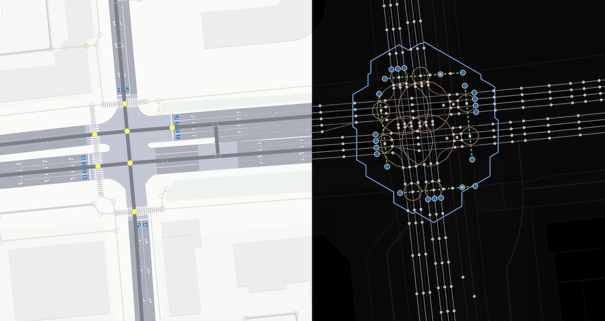

# Сущностное сходство тегов width и junction:radius в OpenStreetMap

Данная статья является ответом на вопрос к статье [junction:radius](./node.tags.junction:radius.md)
~~~
С наскоку трудно понять, что такое зона конфликта, и зачем это наносить?
~~~

## Введение

При картировании в OpenStreetMap мы описываем геометрические характеристики топологически сложных объектов. Мы вынуждены упрощать эти объекты, но наше описание должно сохранить те характеристики, которые необходимы для решения практических задач. Также объекты должны выглядеть на карте правдоподобно. Тег `width` для линейных объектов (way) и предлагаемый тег `junction:radius` для точечных пересечений (node) **представляют один и тот же принцип** упрощения сложных геометрических форм через условные параметры.

## Единый принцип: от реального полигона к условному параметру

### Суть подхода

И `width`, и `junction:radius` решают одну и ту же задачу: как описать сложный полигон одним числом. В обоих случаях мы:

1. **Признаём**, что реальный объект — это сложный полигон произвольной формы
2. **Упрощаем** его мысленно до простой геометрической фигуры
3. **Описываем** одним параметром эту воображаемую фигуру
4. **Соотносим** этот параметр с реальной формой объекта

Разница лишь в том, какую условную фигуру мы выбираем для упрощения.

## Концепция тега width: упрощение до прямоугольника

Для понимания контекста использования width рекомендуем ознакомиться со статьями на OSMwiki:

- [https://wiki.openstreetmap.org/wiki/Key:width](https://wiki.openstreetmap.org/wiki/Key:width)
- [https://wiki.openstreetmap.org/wiki/Street_parking](https://wiki.openstreetmap.org/wiki/Street_parking)

Примеры из документации позволяют сфокусировать наше внимание на нашем тезисе о схожести width и junction:radius.

~~~
width:lanes=1.5|2.5|2.5
~~~

~~~
parking:side:width for the width=* of the parking space: In many places, depending on the orientation of the vehicles 
and the local norms, parking lanes have a default width that doesn't need to be mapped 
explicitly, but there may be variations from this like very narrow or very wide parking spaces.
~~~

### Принцип работы width

Когда мы ставим `width=3.5` на дорогу, мы **не утверждаем**, что дорога — это прямоугольник шириной 3.5 метра. Мы говорим: "Этот сложный полигон дороги **соотносится** с прямоугольником шириной 3.5 метра".

Это работает потому, что наше линейное мышление интуитивно понимает концепцию "ширины" для протяжённых объектов.

## Концепция тега junction:radius: упрощение до окружности

Обратимся к документации о junction:

- [https://wiki.openstreetmap.org/wiki/Tag:junction=yes](https://wiki.openstreetmap.org/wiki/Tag:junction%3Dyes)

Тег junction применим к node для точечного обозначения пересечения и к way с `area=yes` для полигонального описания:

~~~
Draw a closed way tagged with area=yes around the junction area as found on the ground,
and add the junction=yes tag.
~~~

### Принцип работы junction:radius

Тег `junction:radius` работает **точно по той же логике**, что и `width`:

Когда мы ставим `junction:radius=8` на перекрёсток, мы **не утверждаем**, что зона конфликта — это идеальная окружность радиусом 8 метров. Мы говорим: "Этот сложный полигон зоны конфликта **соотносится** с окружностью радиусом 8 метров".

Просто радиус менее интуитивен для нашего линейного мышления, чем ширина.

### Сравнение подходов к junction

| Подход | Описание | Применение |
|--------|----------|------------|
| `junction=yes` на node | Точечное обозначение пересечения | Простые перекрёстки без детализации геометрии |
| `junction:radius=X` на node | Радиус условной окружности зоны конфликта | Перекрёстки, где важна геометрия для построения |
| `junction=yes` + `area=yes` на way | Полигональное описание | Сложные развязки с максимальной детализацией |

Проанализируем примеры:

| node[junction = yes] | node[junction:radius = 8] | way[junction=yes + area=yes] | 
| :------------------- | :------------------------ | :--------------------------- |
|  |  |  | 
| Простое указание наличия пересечения | Условный радиус для описания геометрии зоны конфликта — тот же принцип, что width для дорог | Детальное полигональное картирование |

### Определение junction:radius

**junction:radius** — радиус условной окружности, **соотносящейся** с реальным полигоном зоны конфликта, в которой взаимодействуют участники движения.

## Зачем нужен junction:radius?

### Проблема построения перекрёстков

В OpenStreetMap перекрёсток имеет **двойную природу**:
- **Графовую** (точка соединения линий в топологической сети)
- **Площадную** (реальная зона конфликта на местности)

Без информации о геометрии зоны конфликта невозможно правильно построить перекрёсток на карте. Радиус — это **основная гармоника**, ключевой параметр, который быстрее всего приближает нас к правильной форме перекрёстка.

### Аналогия с width

Точно так же, как ширина соединяет линейную природу way с его реальной площадью на местности, радиус соединяет точечную природу node с реальной площадью зоны конфликта.

## Практические рекомендации

### Когда применять каждый подход

**junction=yes** (без радиуса):
- Простые перекрёстки, где топология не критична
- Случаи, когда топологической информации от пересекающихся way хватает, чтобы воспроизвести перекрёсток с достаточной достоверностью 

**junction:radius=X**:
- Перекрёстки, где важна правильная геометрия для отрисовки
- Случаи, когда автоматический расчёт радиуса даёт неточный результат
- Сложные пересечения с нестандартной геометрией зоны конфликта

**Полигональный junction**:
- Крупные развязки со сложной формой
- Случаи, где требуется максимальная точность

### Автоматический расчёт vs явное указание

**Для width и junction:radius принцип одинаков:**
- Во многих случаях параметр можно рассчитать автоматически из других данных
- Явное указание необходимо при отклонениях от стандартных формул
- Цель — максимальное соответствие реальности

### Существующие практики

Использование радиусов для описания площадных объектов через точечные не ново в OSM. Например, проект картирования парковок в Берлине:

- [Парковки в Берлине](https://github.com/SupaplexOSM/street_parking.py?tab=readme-ov-file)

| Линейный подход | Точечный подход с радиусом |
| :-------------- | :------------------------- |
|  |  |

## Заключение

`Width` и `junction:radius` это один и тот же принцип упрощения реальности при картировании, примененный к разным типам объектов.

1. **Единая философия**: оба тега описывают сложные полигоны через условные параметры
2. **Равная легитимность**: если мы принимаем width для дорог, то должны принять radius для пересечений
3. **Практическая необходимость**: radius критически важен для правильного построения перекрёстков
4. **Дополнительность**: width решает проблему ширины дорог, radius — проблему площади пересечений

Тег `junction:radius` ещё не включён в официальную документацию OSM, но он основан на тех же принципах, что и давно используемый `width`. Это естественное развитие идеологии упрощённого описания сложных геометрических объектов.

См. подробную статью про [junction:radius](./node.tags.junction:radius.md).
