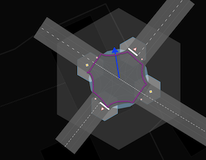

### О сходстве понятия ширины way и junction:radius для node

~~~
Вопрос: Вот так с наскоку трудно понять, что такое зона конфликта, 
чем отличается пример 2 от 3 и зачем вообще это наносить, 
если честно?
~~~

Вопрос «зачем это мапить?» очень широкий, и на него нельзя дать однозначный ответ, сначала не поискав ответ на вопрос «зачем мапить вообще?». Но оставить его без разъяснений мы тоже не можем.

## Ответ нам даст сам OSM.

Но прежде тогда **необходимо** ознакомиться с рядом статей на вики:

- [https://wiki.openstreetmap.org/wiki/Key:width](https://wiki.openstreetmap.org/wiki/Key:width)
- [https://wiki.openstreetmap.org/wiki/Street_parking](https://wiki.openstreetmap.org/wiki/Street_parking)

Вот некоторые выдержки из них для удержания фокуса:

~~~
width:lanes=1.5|2.5|2.5
~~~

~~~
parking:side:width for the width=* of the parking space: In many places, depending on the orientation of the vehicles 
and the local norms, parking lanes have a default width that doesn't need to be mapped 
explicitly, but there may be variations from this like very narrow or very wide parking spaces.
~~~

Исходя из вышесказанного и наблюдений за реальностью, можно понять, что тег `width` на самом деле — иллюзия или упрощение.  
Форма дороги (полосы, парковки и много чего ещё) — это полигон, и у него не может быть `width`, если мы не начинаем считать его прямоугольником (рассмотрим, что way — прямая из двух точек).  
Однако это не мешает вносить эти данные, как на примере ширины проезжей части, так и на примере ширины полос или даже парковки.

Если говорить более формально, то мы вносим значение некой величины, которая может быть **соотнесена**  
(сделаю акцент на этом слове) с шириной (читай — с площадью), если мы рассматриваем часть дороги как прямоугольник.

То есть мы упростили форму объекта со сложного полигона до прямоугольника и соотнесли атрибут way именно с этим воображаемым прямоугольником, а точнее — с одной из его сторон.

### Теперь рассмотрим статью из вики про junction:

- [https://wiki.openstreetmap.org/wiki/Tag:junction=yes](https://wiki.openstreetmap.org/wiki/Tag:junction%3Dyes)

Тег junction применим к node, чтобы обозначить точку пересечения, и к way, чтобы обозначить полигон пересечения (или перекрёстка), если добавить ещё `area=yes`.

~~~
Draw a closed way tagged with area=yes around the junction area as found on the ground,
and add the junction=yes tag.
~~~

Рассмотрим эти рисунки поближе, но с небольшой вставкой:

| node[junction = yes] | node[junction:radius = 8] | way[junction=yes + area=yes] | 
| :------------------- | :------------------------ | :--------------------------- |
|  |  |  | 
| У нас есть ключ `junction = yes` для точки, как аналог `parking:side:lane` или `yes` | радиус может быть таким же простым и понятным атрибутом, как и width для way в деле упрощения площадных представлений об объекте | и есть для полигона | 

**junction:radius** в этом случае является прямой и точной аналогией тега `width:*` для way.  
Отличие лишь в том, что в данном случае мы упрощаем полигон «в своей голове» не до прямоугольника, а до круга, и это происходит не так гладко, как с дорогой и шириной.

~~~
`junction:radius` — радиус окружности, ***соотносящийся*** с (полигоном) зоны конфликта, 
в котором участвуют транспортные средства и/или пешеходы.
~~~

См. статью про [junction:radius](./node.tags.junction:radius.md).

Точно так же, как и для ширины парковок, радиус пересечения зачастую не требует явного задания, потому что достаточно точно может быть выведен из ширины и количества полос участников пересечения. Однако это не всегда так, и встречаются моменты, где требуется явное задание этого тега с целью более точного соответствия действительности.

## Ссылки
Сама идея использования радиусов, для определения или эстимейта тех или иных геометрических характеристик или форм сильно не нова, 
ее уже применяли в OSM.

- [Парковки в Берлине](https://github.com/SupaplexOSM/street_parking.py?tab=readme-ov-file)

| . | . | 
| :------------------- | :------------------------ | 
|  |  |  

...

