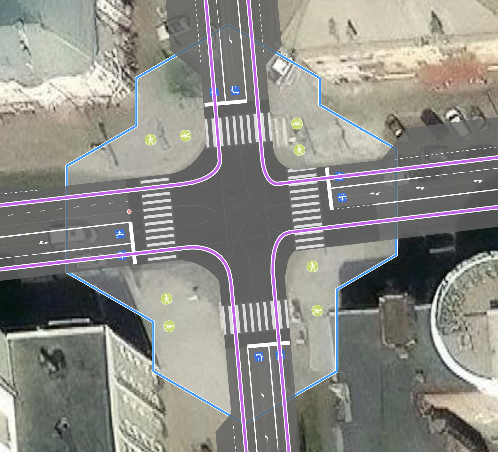

# crossing:corner - тэг обозначения пешеходного перехода, близко расположенного к проезжей части перекрестка

### Синтаксис
~~~
node.tags {
   crossing:corner: yes|no
}
~~~
 
### Применяется для объектов

Когда этот тэг применяется  для объектов типа  `node`, эта эта точка должна являться `highway: crossing`. 

Обозначает пешеходный переход на перекрестке, который очень близко проходит к проезжей части пересечения,
фактически от угла к углу тротуара, на перекрестке. 
Автомобиль заходит (или выходит) в этот конфликт с пешеходами под углом .

То есть, если переход находится в зоне перекрестка но конфликт автомобилей поворачивающих на право
и пешеходов идет под углом примерно 90 градусов, то применять тег не надо.

На обычных пешеходных переходах, тэг также не применим - не имеет смысла.

| crossing:corner = yes | crossing:corner = no | 
| :------- | :------ |
||| 
| При повороте на право | конфликт автомобилей и пешеходов под углом примерно 90 | 

Главной мотивацией введения данного тэга было обеспечить возможность отличать пешеходне переходы,
которые проходят просто через проезжую часть или те которые конфликтуют с правым поворотом для автомобильной дороги.

В рендере OSMPIE пересечение пешеходных и авомобильных путей всегда рассматривается, как пересечение
`junction: controlled|uncontrolled` и поэтому имеет свой радиус. Для пешеходных переходов он по умолчнию считается равным 3.

Это сделано из соображения, что самый распространенный пешеходный переход имеет ширину 4 метра + 1 метр (с каждой стороны) = 6 м - ширина зоны конфликта
Пешеходов и Автомобилей (все эти параметры могут быть изменены тегами width junction:radius)

[junction:radius](./node.tags.junction:radius.md)

### Отличие в отображении
Для примера можно рассмотреть обычный компактный перекресток. Где в левой части для каждой точки пешеходного перехода указан тэг ` crossing:corner = yes `, 
а для правой нет.

| crossing:corner = yes | crossing:corner = no | 
| :------- | :------ |
||| 
| Форма пересечения становится более гладкой и правильной, траектория автомобиля пересекает траекторию пешехода под тупым углом | Углы перекрестка более резкие, кривизна траектории автомобиля не реальная, слишком маленький радиус| 

Применение этого тэга позволит более точно отражать форму перекрестка и структуру взаимодействия на нем всех участников.