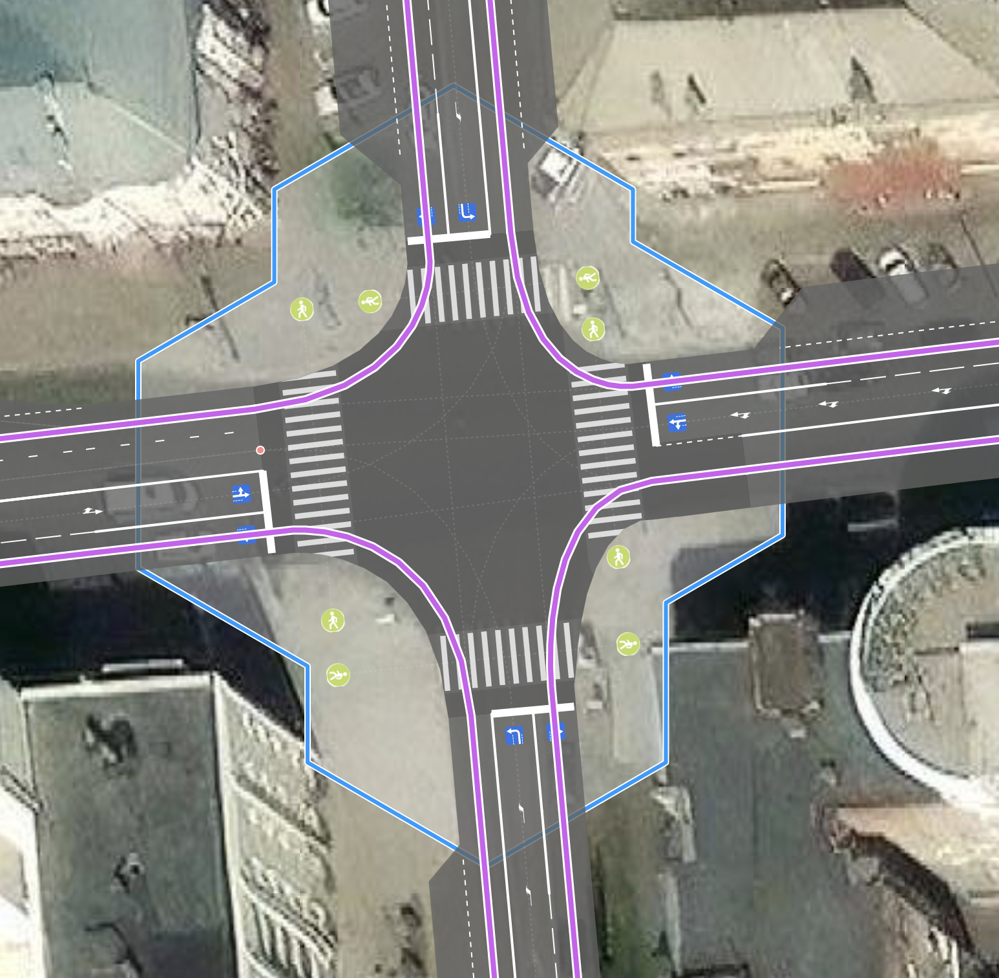

# crossing:corner — тег для обозначения пешеходного перехода, расположенного близко к проезжей части перекрёстка

### Синтаксис
~~~
node.tags {
   crossing:corner: yes|no
}
~~~

### Применение к объектам

Когда этот тег применяется к объектам типа `node`, эта точка должна быть отмечена как `highway = crossing`.

Обозначает пешеходный переход на перекрёстке, который проходит очень близко к проезжей части пересечения — фактически от угла к углу тротуара на перекрёстке.  
Автомобиль въезжает (или выезжает) в зону конфликта с пешеходами под острым углом.

То есть, если переход находится в зоне перекрёстка, но конфликт между поворачивающими направо автомобилями и пешеходами происходит под углом примерно 90 градусов, тег применять не следует.

На обычных пешеходных переходах тег также не применяется — это не имеет смысла.

| crossing:corner = yes | crossing:corner = no | 
| :--------------------- | :-------------------- |
|  |  | 
| При повороте направо | Конфликт автомобилей и пешеходов под углом примерно 90° | 

Основной мотивацией введения данного тега была возможность отличать пешеходные переходы, которые проходят просто через проезжую часть, от тех, что конфликтуют с правоповоротным движением.

В рендере OSMPIE пересечение пешеходных и автомобильных путей всегда рассматривается как пересечение типа `junction: controlled|uncontrolled` и поэтому имеет свой радиус. Для пешеходных переходов по умолчанию он равен 3.

Это сделано из соображений, что самый распространённый пешеходный переход имеет ширину 4 метра + 1 метр (с каждой стороны) = 6 м — ширина зоны конфликта пешеходов и автомобилей (все эти параметры могут быть изменены тегами `width` и `junction:radius`).

[junction:radius](./node.tags.junction:radius.md)

### Отличие в отображении
Для примера можно рассмотреть обычный компактный перекрёсток. В левой части для каждой точки пешеходного перехода указан тег `crossing:corner = yes`, а в правой — нет.

| crossing:corner = yes | crossing:corner = no | 
| :--------------------- | :-------------------- |
|  |  | 
| Форма пересечения становится более гладкой и правильной, траектория автомобиля пересекает траекторию пешехода под тупым углом | Углы перекрёстка более резкие, кривизна траектории автомобиля нереальная, слишком маленький радиус | 

Применение этого тега позволяет точнее отражать форму перекрёстка и структуру взаимодействия на нём всех участников движения.