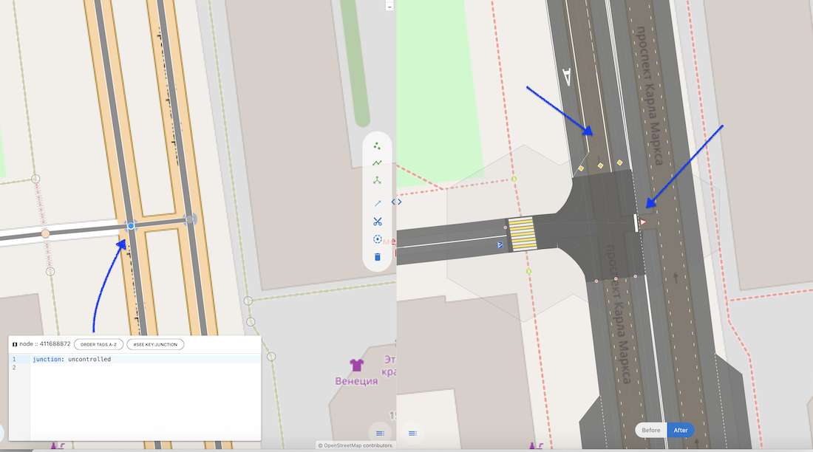
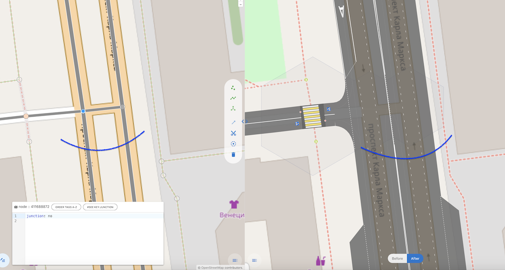
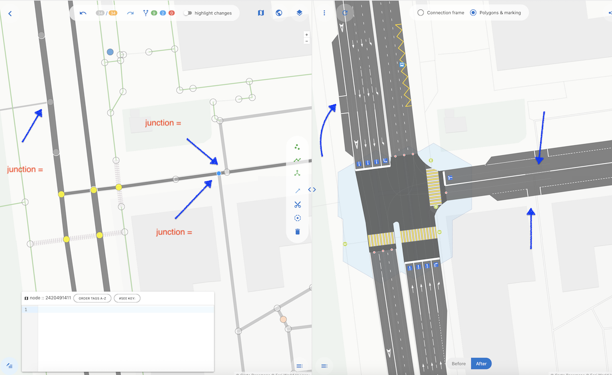
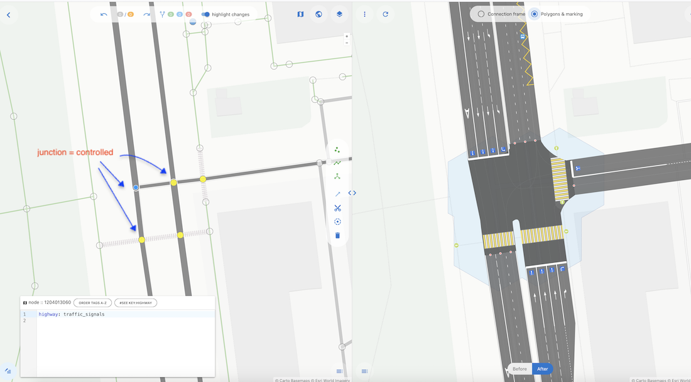
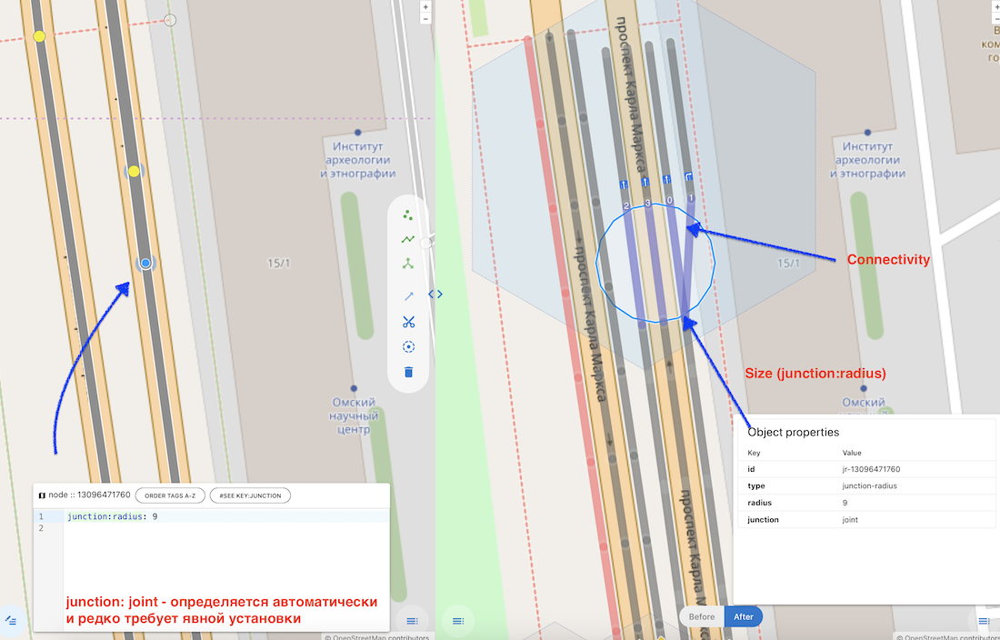

# Пересечения и перекрёстки. Классификация и описание.

## Введение

Статья определяет формальные критерии классификации узловых элементов транспортной сети, связанных с пересечениями и перекрёстками, а также устанавливает единые стандарты их атрибутирования. Цель описываемых тегов – повышение качества картографирования и оптимизация обработки данных.

## Текущее состояние системы тегирования

Существующая система описания пересечений в OpenStreetMap характеризуется фрагментарностью 
и отсутствием единого методологического подхода. Базовые теги `junction=yes` и `junction=uncontrolled`, 
определённые в [Key:junction](https://wiki.openstreetmap.org/wiki/Key:junction), 
обеспечивают лишь элементарную функциональность и не позволяют детально классифицировать сложные 
транспортные узлы. В результате перекрёсток может выглядеть на карте вполне органично, 
но семантически не достоверно.

## Основные признаки пересечений

- `Участники` - в пересечении участвуют 2 и более `way`, имеющих общую точку.
- `Размер` - в реальности пересечение — это область, где возможен конфликт транспортных средств (и других участников дорожного движения), двигающихся по разным дорогам. При картировании мы описываем пересечение при помощи некой геометрической фигуры, которая соотносится с реальными линейными размерами места. Размер этой фигуры (обычно, линейный размер, определяющий её площадь) является неотъемлемым атрибутом пересечения. В большинстве случаев рендер автоматически определяет размер пересечения, но в отдельных случаях его необходимо задать явно, чтобы отразить все существенные особенности пересечения.
- `Связность` - на каждом way, участвующем в пересечении, появляются точки входа в пересечение и выхода из него. Необходимо указать (атрибутировать) их связи друг с другом. См [connect:lanes](./way.tags.connect:lanes.md), [relation[type=connectivity]](https://wiki.openstreetmap.org/wiki/Relation:connectivity)
- `Конфликтная точка` (или "точка конфликта") - необязательный, но часто встречающийся признак, определяющий факт конфликта одних связей с другими, а также местоположение этого конфликта.

Существует ещё один признак пересечений, который относится не к конкретному пересечению, а к нескольким пересечениям. Сложный объект, являющийся конечным множеством пересечений, объединённых логикой дорожного движения, называется "перекрёсток".

---
### Размер
Для моделирования области пересечения в OSMPIE окружность. Её радиус ([junction:radius](./node.tags.junction:radius.md)), является параметром,
определяющим зону взаимодействия (потенциального конфликта) участников движения.

### Кластеризация (объединение пересечений в перекрёсток)
Процесс кластеризации регулируется параметром [junction:cluster:radius](./node.tags.junction:cluster:radius.md), 
определяющим максимальное расстояние между пересечениями для их объединения в единый перекрёсток.

---

## Расширенная система классификации пересечений, Синтаксис тега junction

```osm
node
    junction = yes|no|controlled|uncontrolled|inout|joint 
```

## 0. junction 

- ***Ставится.*** На пересечении автомобильных путей и пешеходных путей
- ***Не ставится.*** На пересечении автомобильных путей и трамваев, автомобильных путей и велосипедных дорожек

## 1. junction = uncontrolled, junction = yes
Пересечение без активных систем регулирования, порядок дорожного движения определяется правилами приоритета.
Перекрёстки с таким(и) пересечениями, как правило, действительно являются нерегулируемыми перекрёстками, 
с соответствующими знаками и разметкой с каждого подхода ("главная дорога", "уступи дорогу", "стоп" и т.д.)



***Особенность рендера:*** 
1. Создаём отдельный объект "перекрёсток", внутри которого нет разметки,
2. Разметка на пересекающихся дорогах на подходах к перекрёстку определяет приоритет. На главной дороге разметка непрерывная, 
на второстепенной рисуется объект "стоп линия" и/или "уступи дорогу".

## 2. junction = no
Пересечение без активных систем регулирования, порядок дорожного движения определяется правилами приоритета и знаками. Пересечения такого типа, зачастую не считаются перекрёстками по ПДД, и обычно являются выездами на основную магистраль. При этом неверно маркировать второстепенный way как service, поскольку примыкающая дорога является обычным way (secondary, tertiary или residential), а не выездом с парковки или технической зоны.



***Особенность рендера:*** 
Специальный отдельный объект перекрёсток не создаётся, вместо этого продолжается линейная разметка основной дороги. 
На второстепенных дорогах подходы отделяются дополнительной прерывистой разметкой.

## 3. junction = inout
Пересечение с участием сервисных путей, обеспечивающих доступ к прилегающим территориям, или [highway=service](https://wiki.openstreetmap.org/wiki/Tag:highway%3Dservice).
Очень похоже на пересечение предыдущего типа, но выделено в отдельный класс из-за фокуса на way[highway=service]. 



***Особенность рендера:*** 
Специальный отдельный объект перекрёсток не создаётся, вместо этого продолжается линейная разметка основной дороги. 
На второстепенных дорогах подходы отделяются дополнительной прерывистой разметкой. Разделитель, парковки и автобусные полосы 
могут прерываться прерывистой разметкой в таких пересечениях.

Этот тип пересечения выведен отдельно, поскольку, когда такие точки пересечения не имеют тегов, service ways могут фильтроваться при рендере и не отображаться. При этом информация о пересечении с сервисной дорогой требуется для разметки парковок и других деталей, которые важны на основной дороге,
даже если сервисная дорога не отображается. Чтобы карта отражала эту важную информацию, необходимо явно маркировать пересечение данным тегом.

## 4. junction = controlled
Наличие светофорного регулирования. Пересечение, на котором дорожное движение регулируется активными системами.



***Особенность рендера:*** 
Создаётся отдельный объект перекрёсток, внутри которого нет линейной разметки, а на подходах присутствует специфическая для данного типа перекрёстков разметка. На каждой дороге отмечается стоп линия. После неё каждая полоса определяется тремя видами линий (сплошная, прерывистая длинный штрих(3/1), прерывистая короткий штрих (1/3)) с нанесением знаков манёвров на полосу.

## 5. junction = joint
Соединение двух путей в единой точке, представляющее переход между сегментами дороги с изменением количества полос. 
Если сумма полос в соединяющихся путях равна количеству путей в следующем сегменте дороги, такое соединение не требует маркировки.
При различии в количестве полос движения между смежными сегментами возникают манёвры перестроения, характеризующиеся:
- Пространственной протяжённостью ([cluster:radius](./node.tags.junction:cluster:radius.md))
- Топологической связностью ([connect:lanes](./way.tags.connect:lanes.md))
- Специфическими параметрами безопасности движения



**Семантическое обоснование**:
Точки такого вида тоже причислены к junction потому, что обладают 3 из 4 характеристик пересечения (в joint могут отсутствовать конфликты).
Учёт этих параметров, а особенно пространственной протяжённости, позволяет строить правильные полигоны дорог.

***Особенность рендера:*** 
Продолжается обычная линейная разметка дороги, при изменении количества полос (расширения или сужения) наносятся специфические прерывистые линии.

## Заключение

Явная классификация существенно упрощает фильтрацию и поиск объектов:

```sql
SELECT * FROM nodes WHERE tags->'junction' = 'controlled';
```
вместо сложных рекурсивных запросов с анализом связанных объектов.

Представленная система классификации пересечений обеспечивает более систематизированный подход к описанию транспортных узлов 
и создаёт основу для разработки более эффективных навигационных систем, 
инструментов анализа транспортных потоков и средств планирования дорожно-транспортной инфраструктуры.
Предлагаемая система полностью совместима с существующими тегами OpenStreetMap и может быть внедрена без нарушения работы существующих приложений.

## Рекомендуемые статьи

- [Глоссарий тегов OSMPIE](./osmpie.tags.glossary.md)
- [junction:shape](./node.tags.junction:shape.md)
- [junction:radius](./node.tags.junction:radius.md)
- [junction:cluster:radius](./node.tags.junction:cluster:radius.md)
- [Как понять что такое зона конфликта, зачем нужен radius ?](./junction:radius.vs.width.md)
