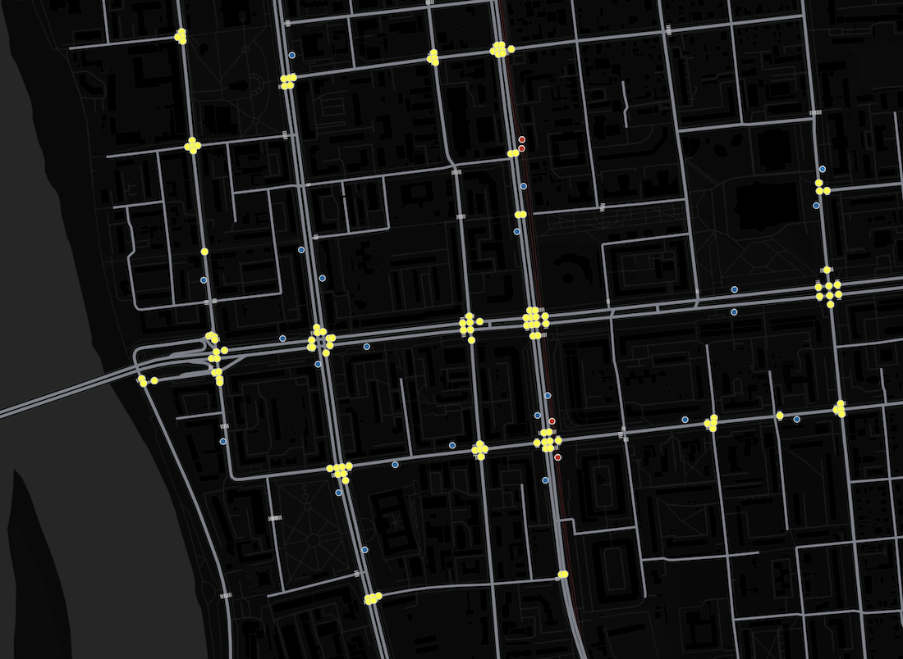
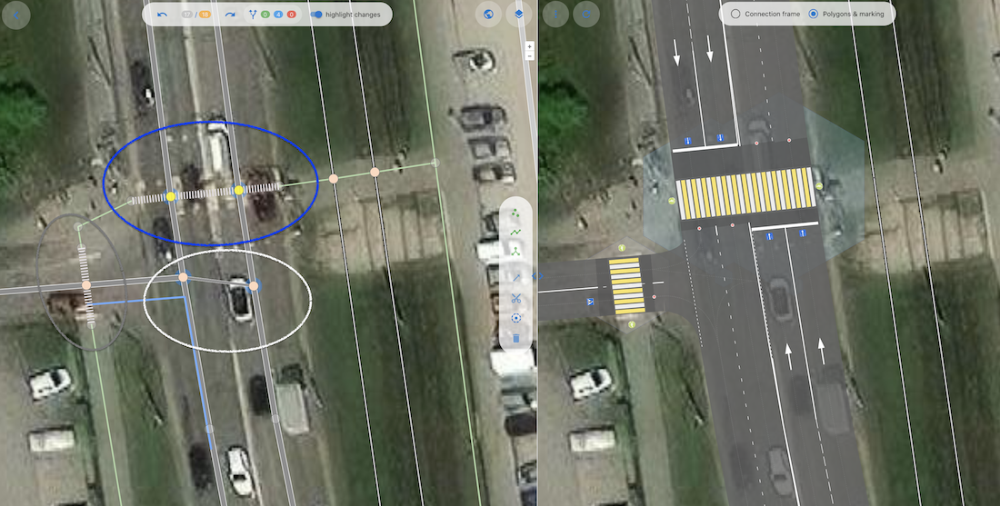

# junction:cluster:radius — тег для функциональной зоны пересечения.

Функциональная зона пересечения — это геометрическая фигура, находящиеся внутри которой объекты подвержены влиянию данного пересечения или сами влияют на него.
В данной зоне другие объекты (парковки, переходы, стоп-линии и так далее) могут отображаться или интерпретироваться иначе, нежели в отсутствии данного пересечения.
В какой-то степени это понятие соотносится с понятием функциональной зоны перекрестка, только для простейшего пересечения.

### Синтаксис
```
node.tags {
   junction:cluster:radius: number[1..N]
}
```

### Применение

Данный тег применяется для объектов типа `node`, являющихся пересечением.
Тег указывает радиус окружности, в которую может быть вписана функциональная зона для данного пересечения.
 
### Преимущества данного тега

Главной мотивацией введения этого тега было обеспечить возможность группировки нод соседних пересечений в обобщающее
понятие **"Перекресток"**. 

Данная цель может быть достигнута различными подходами:

1. Relation: `type:intersection, members[node1,...,nodeN, way1,..., wayM]`
2. Атрибут у ноды, который является ключом обобщения (имя-идентификатор кластера) `junction:cluster = name or id`
3. Радиус, который при наложении (union) окружностей даст общий полигон для некоторого множества нод `junction:cluster = 5`

Все эти способы решают одну задачу - **управляемая кластеризация нод пересечений** в некую более сложную структуру данных.

Плюсы и минусы первых двух подходов очевидны: необходимость использовать relation, сохранить ссылочная целостность, генерировать тег.

Рассмотрим третий способ.

* Очень геометричный, отражает площадные/линейные характеристики пересечения
* Не требует поддержки ссылочной целостности (как в 1) и контроля уникальности (как в 2)
* Можно найти зависимость или корреляцию с другими свойствами ноды (число полос)
* Просто числовое значение в метрах
* Формально нового объекта типа перекресток не появляется, но он всегда может быть получен простейшей операцией buffer + union
* Соответствует принципу бритвы Оккама - не плодим новых сущностей без необходимости

Формально понятие **Перекресток** можно попытаться выразить так:
Перекресток — это такое множество узлов (`node junction=yes|...`), связанных между собой ребрами (`way`), на которых
средствами ОДД (разметкой, знаками иными элементами ОДД) **НЕ** предусмотрена остановка транспортных средств.

Говоря простым языком, перекрестком можно считать такое множество точек и дуг, где внутри нет специально организованных стоп-линий.
Также можно сказать, что перекресток — это площадная фигура (полигон), внутри которой существует неделимая зона конфликта транспортных средств и пешеходов.

Рассмотрим пример сложного перекрестка, где есть 4 отдельных зоны конфликта.
В нодах, где `junction:cluster:radius:` не указан явно, он равен 12 метрам.
На левой половине — ноды и вэйи, на правой половине — модель перекрестка, где радиус каждой ноды отображен в виде гексагона. 
Все гексагоны объединены в группы по признаку наложения (union).


В итоге, с такой комбинацией значений `junction:cluster:radius:` мы получаем 4 "перекрестка", у каждого
из которых есть своя зона конфликта. Это означает, что в реальности для каждого полученного "перекрестка" *должна* быть своя отдельная стоп-линии для разрешения конфликтов.


Следующая иллюстрация подтверждает, что несколько пересечений могут объединяться в единый объект. Каждое пересечение обозначено голубым кругом,
(см. тег [junction:radius](./node.tags.junction:radius.md)), где в каждый кластер входит 3—4 пересечения ways (автомобильных и пешеходных, с разными радиусами).


Увеличим значения `junction:cluster:radius:` с двенадцати до тридцати двух метров.
Все пересечения объединились в один перекресток в форме подковы. При такой комбинации радиусов этот перекресток
напоминает кольцо (полукольцо), внутри которого участники движения не имеют права останавливаться.
Однако, этот вариант расстановки радиусов искусственно-неверный, так как пешеходные переходы все равно остались.


---

## Еще один пример применения тега, в связке с другими тегами junction:* 

Помимо соединения пересечений в единый перекресток данный тег применяется для разделения пересечений, которые расположены достаточно близко, но при этом не являются одним перекрестком. Это редкие кофигурации, но поскольку они встречаются, их требуется картировать достоверно. 

Сравним явное указание на такую конфигурацию с помощью тега cluster:radius и альтернативные подходы. Например, с применением предполагаемого relation.

Посмотрим на достаточно большой участок типичной карты.



Обычно перекрестки образуют явные кластеры, что указывает на возможность автоматизации картирования.
Но если мы будем вводить relation эксплицитно, то каждый перекресток, несмотря на его типичность, придется обрабатывать вручную, следя за ссылочной целостностью и другими аспектами, что является неэффективным использованием времени квалифицированных специалистов.

Некоторые конфигурации могут стать головоломками, не каждая из которых имеет решение без использования предлагаемого тега.



На первый взгляд перед нами банальный Т-образный перекресток, но это впечатление обманчиво.

В реальности это не единый перекросток, а комбинация из трёх несвязанных пересечений:
1. Регулируемый пешеходный переход — отмечен синим,
2. Нерегулируемй пешеходный переход — отмечен серым,
3. Нерегулируемое пересечение - отмечено белым.

Транспортные средства, двигающиеся по главной дороге на север, имеют право повернуть налево на прилегающую дорогу или развернуться. При этом со сторостепенной дороги разрешен только поворот направо. Таким образом, данное пересечение нельзя считать нерегулируемым перекрестком. Такое допущение привело бы к изменению разметки и неверной работе служб навигации.
При этом пересечение расположено близко к регулируеммому пешеходному переходу. Если его не отделить, то вся зона будет считаться регулируемой, что опять же приведет к недостоверной разметке на карте, а данные перекрестка станут неприменимыми для целей навигации и автоматизации управления дорожным движением.

Использование тегов OSMPIE для точек в белой области позволяет элегантно решить эту задачу: 

~~~
   junction = no  - явно это не перекресток (разметка будеет соответсвовать обчной лнейон разметке на дорогах)
   junction:cluster:radius = 1  - чтобы он не склеился с другими двумя кластерами (синним и серым)
   junction:radius = 7~8   - метров, так как это все равно пересечение и оно имеет геометрические характеристики
~~~

Обратите внимание, что для ноды персечения в серой области тоже надо явно задать небольшой радиус кластеризации, чтобы она не объединилась с синей нодой, поскольку в реальности это два независимых пешеходных перехода, к тому же разного типа (controlled и uncontrolled).

## Выводы
 - Применение тега cluster:radius для точечно управляемой кластеризации нод пересечений в перекрестки значительно сокращает трудозатраты на
 правильное картирование перекрестков. При этом мы применяем тег явно и только в исключительных случаях.
 - Комбинации с другими тегами (например, junction:radius, junction = yes|no| и другие) позволяют достоверно картировать любые комбинации объектов, встречающиеся на реальной дороге.
 - При этом создается или сохраняется семантика, поскольку атрибуты при картировании точно описывают функции дорожного объекта или указывают на его качества. Тем самым мы следуем главной цели картирования: достоверно отразить в модели всю необходимую информацию о реальности.

## Рекомендуемые статьи

- [junction:radius](./node.tags.junction:radius.md)
- Галлерея интересных работ - [избранное](./examples/examples.md) 
