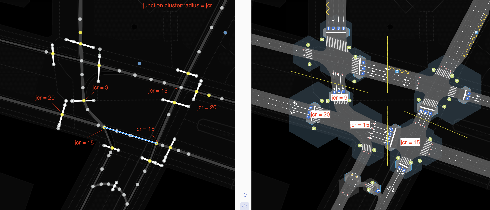
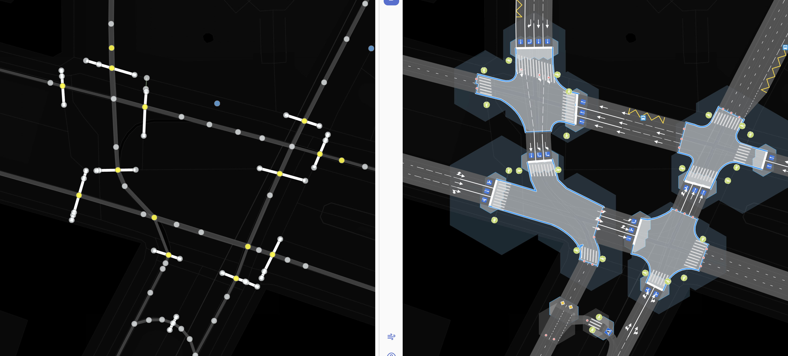
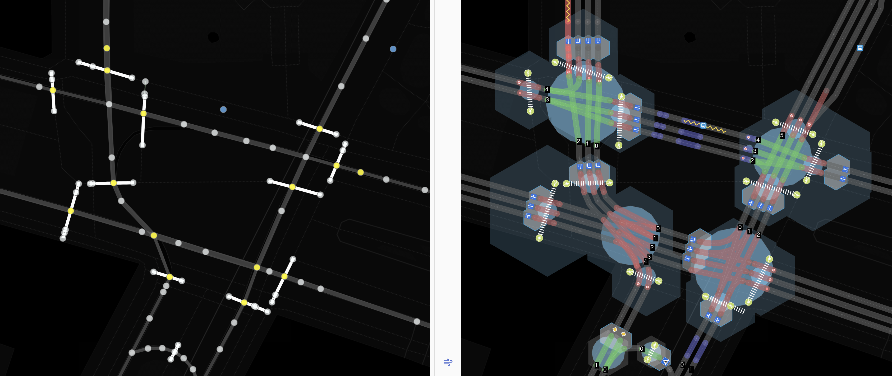
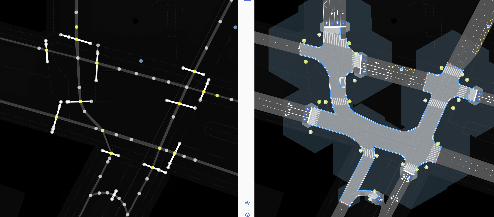

#junction:cluster:radius - тэг для указания максимально возможного радиуса влияния/отношения пересечения на окружающие объекты

###Синтаксис
~~~
node.tags {
   junction:cluster:radius: number[1..N]
}
~~~
 
###Применяется для объектов

Когда этот тэг применяется  для объектов типа  `node`, эта эта точка должна являться пересечением. 
Тэг указывает радиус окружности в которую может быть вписана функциональная зона для данного пересечения.
Это означает, что в данной зоне другие объекты (парковки, переходы, стоп-линии и так далее) могут отображаться или интерпретироваться
как-то иначе. В какой-то степени это понятие соотносится с понятием функциональная зона перекрестка, только в данном случае - простейшего пересечения.

Главной мотивацией введения данного тэга было обеспечить возможность группировки нод соседних пересечений в обобщающее
понятие **"Перекресток"**. Для этого у нас есть несколько различный вариантов, как это может быть сделано:

1. Relation: `type:intersection, members[node1,...,nodeN, way1,..., wayM]`
2. Атрибут у ноды который является ключом обобщения(имя-идентификатор кластера) `junction:cluster = name or id`
3. Радиус, который при наложении(union) окружностей даст общий полигон для некоторого множества нод `junction:cluster = 5`

Плюсы и минусы первых двух подходов очевидны. Опять relation, ссылочная целостность, генерация тэга.
Все эти способы решают одну задачу - управляемая кластеризация нод пересечений в некую более сложную структуру данных.

Рассмотрим 3 способ.

* Очень геометричный, отражает площадные/линейные характеристики пересчения
* Не требует поддержки ссылочной целостности( как в 1) и контроля уникальности, для 2
* Можно найти зависимость или корреляцию с другими свойствами ноды (число полос)
* Просто числовое значение в метрах
* Формально нового объекта типа перекресток не появляется, но он всегда может быть получен простейшей операцией buffer + union
* То есть принцип бритвы Окамма - не плодим новых сущностей без необходимости

Формально понятие **Перекресток** можно попытаться выразить так:
Перекресток это такое множество узлов(`node junction=yes|...`), связанных между собой ребрами(`way`), что на тех ребрах
средствами ОДД(разметкой, знаками иными элементами ОДД) НЕ предусмотрена остановка транспортных средств. 

Говоря простым языком перекрестком можно считать то множество точек и дуг, где внутри нет специально организованных стоп линий.
Еще по другому можно сказать что это некоторая площадь - полигон, внутри которой существует неделимая зона конфликта транспортных средств и пешеходов

Рассмотрим пример, сложный перекресток где есть 4 отдельных зоны конфликта.
В нода где `junction:cluster:radius:` не указан явно, он равен  12 метрам.
На левой половине, ноды и вэйи, на правой половине модель перекрестка, где радиус каждогй ноды
отображен в виде гексагона. Все гексагоны объеденены в группы по признаку наложения(union)

В итоге, с такой комбинацией значений `junction:cluster:radius:` мы имеем 4 "Перекрестка" у каждого
из которых есть своя зона конфликта и получается, что *должны* быть свои отдельные стоп линии для его разрешения.

Чтобы не возникало сомнений, что это может быть одно, а не несколько пересеченй добавлю картинку с топологией сети, где каждое пересечение обозначено голубым кругом,
см тэг [junction:radius](./node.tags.junction:radius.md) в каждый кластер входит 3-4 пересечения вэйев (автомобильных и пешеходных разных радиусов)

Теперь если мы увеличим значения `junction:cluster:radius:`  где было указано 12 метров укажем 23 метра. 
Перекресток остался только 1, причем в форме подковы, при такой комбинации радиусов, этот перекресток
будет напоминать кольцо(полу кольцо), где те кто двигаются внутри не могут/должны останавливаться.
Этот вариант расстановки радиусов искусственно-неверный, так как пешеходные переходы все равно остались.

