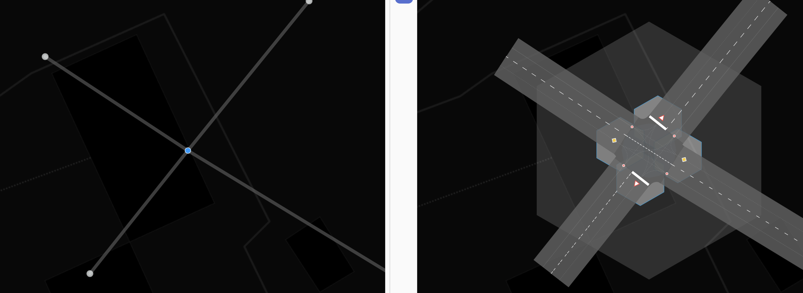
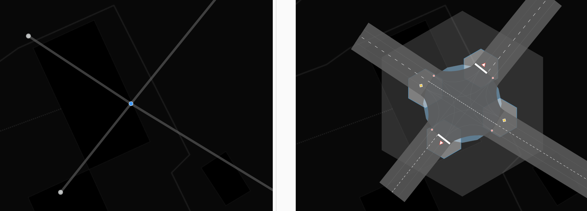
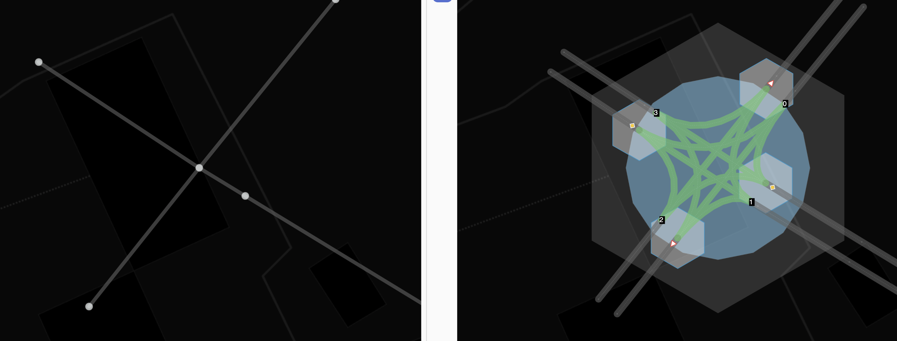
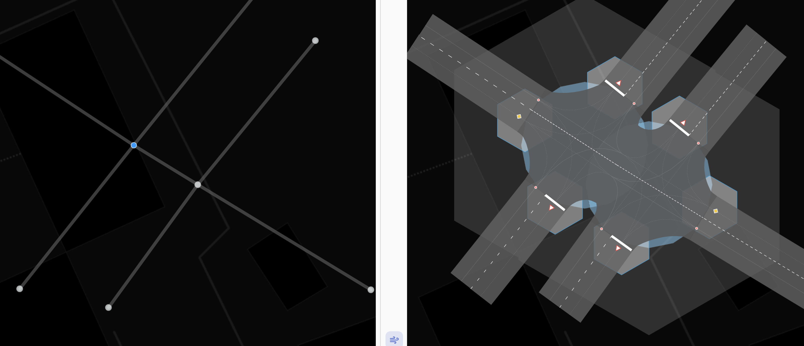
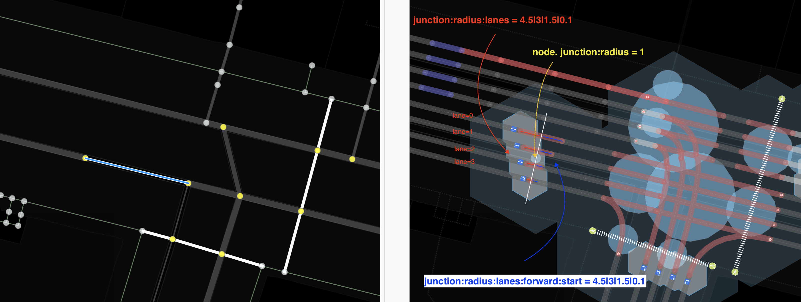

#junction:radius - тэг для указания максимально возможной зоны конфликта на пересечении

###Синтаксис
~~~
node.tags {
   junction:radius: number[1..N]
}

way.tags {
   junction:radius:lanes: number[1..N]|number[1..N]|...
   junction:radius:lanes(:forward|backward)(:start|end) number[1..N]|number[1..N]|...
}
~~~
 
###Применяется для объектов

Когда этот тэг применяется  для объектов типа  `node`, эта эта точка должна являться пересечением. 
Тэг указывает радиус окружности в которую может быть вписана зона конфликта путей для данного пересечения

`junction:radius` - радиус окружности соотносящийся с зоной конфликта, в котором участвуют 
транспортные средства

Когда этот тэг применяется дл объекта way, то обязательно применять суффикс lanes. Значения переопределяют радиус
конфликтной зоны пересечения индивидуально для каждой полосы, если заданы. 

Рассмотрим несколько примеров. На рисунках ниже голубая окружность в правой части рисунка и есть визуализация
значения данного тэга.

**Пример 1**

`junction:radius = 4`
Зона конфликта не описывается окружностью указанного радиуса(ширина и количество полос), значение задано неверно.

**Пример 2**

`junction:radius = 8`
Все верно, стоп лнии и другие точки входа в пересечение находятся на окружности.

**Пример 3**

`junction:radius = 12`

Если в пределах указанного радиуса, существуют другие объекты(ноды или вэйи), 
то они начинают изменять/влиять на зону конфликта. 
Радиус же описывает лишь предельно возможную площадь зоны конфликта.

**Пример 4**

`junction:radius = 8` Для каждой из нод. Видно что  близкие ноды влияют на зону конфликта. 
Форма пересечения усложняется. Развороты между двумя параллельными путями имеют другую кривизну/радиусы;

**Пример 5**

Тэги для ноды левого верхнего пешеходного перехода

~~~
junction:radius = 3
junction:shape = rectangle
highway = traffic_signals
~~~

Тэги для ноды правого нижнего пешеходного перехода
~~~
junction:radius = 6
highway = traffic_signals
~~~

Именно радиус определяет насколько широкой будет зона конфликта. А соседние точки(node) прекращают влияние значения 
тэга `junction:radius` для того way которому они принадлежат. Если пересекаются радиусы двух соседних `node[junction = yes]` то промежуточное ребро уменьшается
до предельно малой длинны и позиционируется пропорционально отношению этих соседних радиусов, между этими двумя нодами.

###Тонкие настройки, для каждой полосы

Для этого тэга можно применять суффиксы forward и backward для указания стороны way.
Для односторонних путей значение forward - является  значеним по умолчанию.

А так же start и end для указания направления  движения к пересечению. 
start - указывает, что значения будет применяться для узла(пересечения) из которого начинается
движение по данному way. 
 end - указывает, что значения будут применяться для узла в который осуществляется  движение для данного пути.
 end - является значением по умолчанию, те если не указано ничего. Это сделано для ассоциации с тегом поворотов
 так как они указываются всегда для конечных узлов.
 
~~~
 way.tags {
     oneway = yes
     lanes = 3
     junction:radius:lanes = ||2
     junction:radius:lanes:forward:end = ||2
 }
  
~~~ 

 два последних тэга эквивалентны, и означают, что надо переопределить для 3 полосы значение `junction:radius` в той точке, к которой
 присоединен данный `way`, остальные будут использованы по умолчанию из точки, если указаны.
 
**Внимание !** Если way для которого указаны эти тэги, содержит в себе несколько node, которые могут считаться `junction=*`, см статью [junction](./node.tags.junction.md),
то они будут применены к каждой полосе каждого пересечения!  
  
Для `junction:radius` центром является координаты node, но если мы переходим к суффиксам `:lanes`, то значение радиуса будет отсчитываться
от пересечения полосы с конфликтующим `way` или (если его нет) от перпендикуляра проведенного из ноды к данному `way`. 
  
 
   **Пример 6**
   
   Рассмотрим тэги иих значения, которые надо указать, чтобы получить следующую картину - стоп линия на светофоре - лесенкой.
   
   
   
   Для вэй1 выделенным голубым цветом укажем следующие тэги и значения:
   
~~~ 
way.id = way1
way.tags = {
    oneway = yes
    lanes = 4
    junction:radius:lanes = 4.5|3|1.5|0.1
}
~~~
  Для точки Node1 куда приходит этот вэй укажем следующие тэги. Радиус намерено сделаем небольшим и
  укажем тип формы перекрестка см. [junction:shape](./node.tags.junction:shape.md)
 
 ~~~ 
node.id = node1
node.tags = {
    junction:shape = staggered
    junction:radius = 1
} 
~~~
   
Если смотреть в отладочном режиме, то можно видеть, что длины отрезков соединений в данном микро перекрестке не только выстраиваются ступенькой,
но и неравны по длине друг другу. Это связано с тем, что для примера, для way2 мы тоже переопределили значения тэга для каждой полосы 
  

   
~~~
way.id = way2 
way.tags = {
 
   oneway = yes
   lanes = 4
   junction:radius:lanes:forward:start = 4.5|3|1.5|0.1
}
~~~