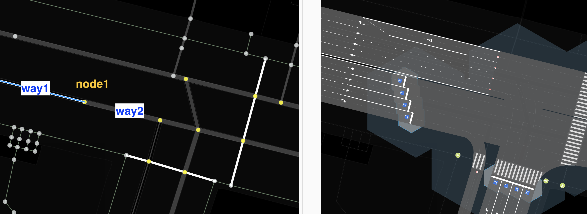

# junction:radius — тег для указания зоны конфликта на пересечении

Зона конфликта — это геометрическая фигура, внутри которой находятся все возможные пересечения маневров участников движения через это пересечение.
`junction:radius` — радиус окружности, в которую вписывается зона конфликта.

### Синтаксис
~~~
node.tags {
   junction:radius: number[1..N]
}

way.tags {
   junction:radius:lanes: number[1..N]|number[1..N]|...
   junction:radius:lanes(:forward|backward)(:start|end) number[1..N]|number[1..N]|...
}
~~~

### Применение

Данный тег применим для объектов типа `node`, если они являются пересечением ways.
В этом случае тег определяет радиус окружности, в которую вписывается зона конфликта для всех lanes.

Данный тег применим для объектов типа way с обязательным суффиксом lanes. Значения переопределяют радиус
конфликтной зоны пересечения индивидуально для каждой заданной полосы.

Рассмотрим несколько примеров. На рисунках ниже голубая окружность в правой части рисунка — визуализация
значения данного тега.

**Пример 1**

`junction:radius = 4`
Зона конфликта не описывается окружностью указанного радиуса (ширина и количество полос), значение задано неверно.

**Пример 2**

`junction:radius = 8`
Указание верное: стоп-линии и другие точки входа в пересечение находятся на окружности.

**Пример 3**

`junction:radius = 12`

Если в пределах указанного радиуса существуют другие объекты (nodes или ways), то они влияют на возможные маневры и тем самым изменяют форму зоны конфликта.
При этом радиус продолжает описывать окружность, в которую вписывается зона конфликта.

**Пример 4**

`junction:radius = 8` для каждой из нод. Видно, что близкие ноды влияют на зону конфликта.
Форма пересечения усложняется. При этом развороты между двумя параллельными путями имеют топологически недостоверную кривизну.

**Пример 5**

Теги для ноды левого верхнего пешеходного перехода

~~~
junction:radius = 3
junction:shape = rectangle
highway = traffic_signals
~~~

Теги для ноды правого нижнего пешеходного перехода
~~~
junction:radius = 6
highway = traffic_signals
~~~

Именно радиус определяет, насколько широкой будет зона конфликта. А соседние точки (node) прекращают влияние значения
тега `junction:radius` для того way, которому они принадлежат. Если пересекаются радиусы двух соседних `node[junction = yes]`, то промежуточное ребро уменьшается
до предельно малой длины и позиционируется между этими двумя нодами на расстоянии, соответствующем отношению этих соседних радиусов.

### Тонкие настройки для каждой полосы

Суффиксы forward и backward для этого тега указывают сторону way.
Для односторонних путей значение forward является значением по умолчанию.

Суффиксы start и end указывают направление движения к пересечению.
start указывает, что значение будет применяться для узла (пересечения), из которого начинается
движение по данному way.
end указывает, что значения будут применяться для узла, в который осуществляется движение по данному way.
end является значением по умолчанию, т.е. если суффикс не указан. Это сделано для ассоциации с тегом поворотов, так как они указываются всегда для конечных узлов.

~~~
way.tags {
    oneway = yes
    lanes = 3
    junction:radius:lanes = ||2
    junction:radius:lanes:forward:end = ||2
}
~~~

Два последних тега эквивалентны и означают, что надо переопределить для 3 полосы значение `junction:radius` в той точке, к которой
присоединен данный `way`, остальные будут использованы по умолчанию из точки, если указаны.

**Внимание!** Если way, для которого указаны эти теги, содержит в себе несколько node, которые могут считаться `junction=*` (см. статью [junction](./node.tags.junction.md)),
то они будут применены к каждой полосе каждого пересечения.

Для `junction:radius` центром являются координаты node, но если мы переходим к суффиксам `:lanes`, то значение радиуса будет отсчитываться
от пересечения полосы с конфликтующим `way` или (если его нет) от перпендикуляра, проведенного из ноды к данному `way`.

**Пример 6**

Рассмотрим теги и их значения, которые надо указать, чтобы получить следующую картину: стоп-линия на светофоре размечена лесенкой.

Для вэй1, выделенного голубым цветом, укажем следующие теги и значения:

~~~
way.id = way1
way.tags = {
    oneway = yes
    lanes = 4
    junction:radius:lanes = 4.5|3|1.5|0.1
}
~~~

Для точки Node1, куда приходит этот вэй, укажем следующие теги. Радиус намеренно сделаем небольшим и
укажем тип формы перекрестка, см. [junction:shape](./node.tags.junction:shape.md).

~~~
node.id = node1
node.tags = {
    junction:shape = staggered
    junction:radius = 1
}
~~~

Если смотреть в отладочном режиме, то можно видеть, что длины отрезков соединений в данном микро-перекрестке не только выстраиваются ступенькой,
но и неравны по длине друг другу. Это связано с тем, что, например, для way2 мы тоже переопределили значения тега для каждой полосы.

~~~
way.id = way2
way.tags = {
    oneway = yes
    lanes = 4
    junction:radius:lanes:forward:start = 4.5|3|1.5|0.1
}
~~~

### Заключение

Тег junction:radius определяет радиус окружности, в которую вписывается зона конфликта для данного пересечения. Вне этой окружности маневры участников движения не пересекаются. Используя суффиктсы для данного тега, можно достаточно достоверно картировать сложные перекрестки.

### Рекомендуемые статьи

    - [junction:cluster:radius](./node.tags.junction:cluster:radius.md)
    - [crossing:corner](./node.tags.crossing:corner.md) 
