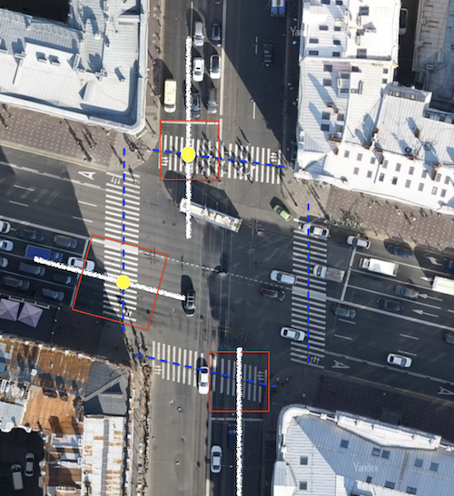
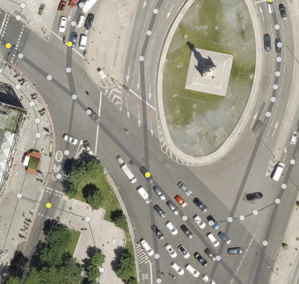
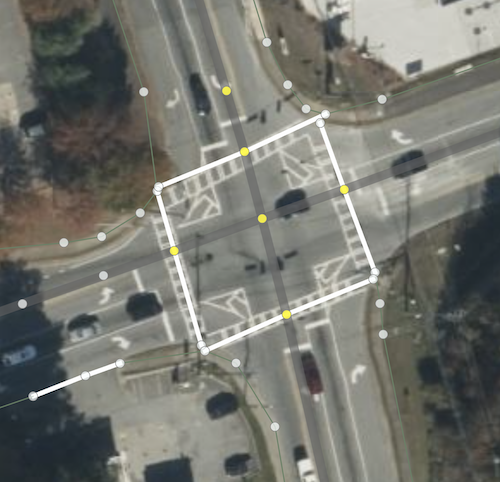
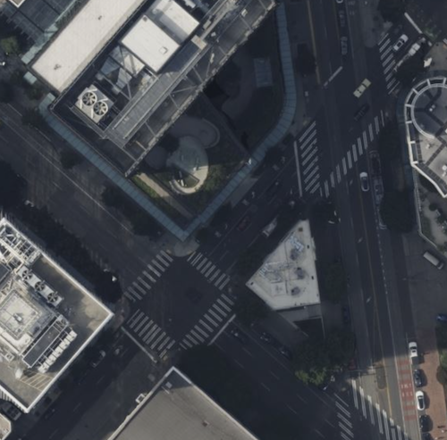
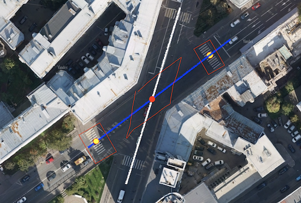

# junction:shape — тег для указания характерной формы пересечения двух путей

### Синтаксис
```
node.tags {
   junction:shape: rectangle|oblique|staggered
}
```

### Применение

Этот тег применяется только для объектов типа `node`, являющихся пересечением двух или четырех way.
Чаще всего тег применяется для самых распространенных пересечений двух дорог или одной дороги с пешеходным переходом. Для пересения трех, пяти и более way тег не применим.

Тег отражает форму пересечения и отношения между стоп-линиями (воображаемыми или реальными) конфликтующих путей в этом пересечении.

Данный тег не нужен при картировании дорог и пешеходных переходов с использованием только осевых линий way. 
Но как только мы повышаем требование к детальности изображений или добиваемся, чтобы площадные объекты выглядели, как в реальности, воспроизводя топологически достоверно "зебры", стоп-линии и их отношения, данный тег становится необходим, при этом его необходимо указывать явно.
(см. первый и четвертый примеры в конце статьи)

### Причины введения
Две дороги могут пересекаться под разными углами (см. примеры ниже), но углы пересечения иногда не отражают, каким образом автомобили, пешеходы и другие участники движения будут останавливаться перед этим пересечением, то есть как расположены стоп-линии или границы зоны конфликта.
Реальную форму перекрестка задает проект организации дорожного движения, то есть в конечном счете — фантазия проектировщика. В таких случаях невозможно вычислить форму перекрестка и необходимо задать ее явно.

### Значения
- rectangle - стоп-линии конфликтующих путей находятся примерно под прямым углом друг относительно друга. 
Точки стоп-линий для каждой полосы `lanes` откладываются по перпендикуляру от осевой. 
Стоп-линия одна, общая линия для всех lanes (рисунки 1,4,5).  

- oblique - стоп-линии конфликтующих путей находятся под углом, существенно отличающимся от 90 градусов, обычно от 30 до 70 градусов. 
Точки стоп-линий для каждой полосы `lanes` откладываются параллельно пути, который конфликтует с данным way. 
Стоп-линия одна, общая линия для всех lanes (рисунки 2,4,5).

- staggered - в данном угол пересечения ways может быть любой, принципиальное отличие
в том, что для каждой lane своя отдельная стоп-линия на разных расстояниях от node (рисунок 3,5).

### Примеры
| 1 | 2 | 
| :------- | :------ |
||| 
| Несмотря на то, что пешеходный переход идет под углом к улице, в желтых точках значение тега будет `junction:shape = rectangle`. Угол между стоп-линией и полосами зебры примерно 90 градусов. | В желтых точках значение тега будет `junction:shape = oblique`, так как стоп-линии нарисованы параллельно (или почти) пересекаемой дороге, а угол пересечения существенно отличается от прямого. | 

| 3 | 4 |
| :------- | :------ |
||  | 
| В этом случае для большинства точек пересечения с пешеходными переходами можно использовать значение `staggered`, так как стоп-линии идут на различном расстоянии от пешеходного перехода. Само расстояние регулируется [junction:radius](./node.tags.junction:radius.md) с использованием суффиксов `:lanes`, `:start,:end` и `:forward,:backward` для двустороннего way. | Отличный пример в одном месте, на котором очевидно отличие `junction:shape = oblique` от `junction:shape = rectangle`. | 

| 5 | 6 |
| :------- | :------ |
|||
|В желтых точках значение тега будет `junction:shape = rectangle`, в красной используются значения `junction:shape = oblique` и `junction:shape = staggered`|| 

### Рекомендуемые статьи
       - [junction:radius](./node.tags.junction:radius.md)
       - [junction:cluster:radius](./node.tags.junction:cluster:radius.md)
