# AveGeo + OSMPie — Технология построения HD-карт дорожных сетей


## 1. Цели и мотивация, при разработке AveGeo + OSMPie


- **Исходная задача — моделирование дорожного движения**: AveGeo создавалось для построения пополосных графов, пригодных для симуляции трафика и оптимизации светофоров
- **Новое поколение map matching**: HD-карта с пополосной детализацией позволяет привязывать подключённые ТС к конкретной полосе — основа для высокоточной поведенческой аналитики движения [транспортных средств](https://rutube.ru/channel/57320216/videos/)
- **Переиспользовать OSM**: максимум из того что уже есть в OpenStreetMap. Недостающая информация добирается через обогащение тегов
- **Теги, а не геометрия**: управление моделью/рендером через теги (3 типа OSM-объектов: узел, линия, отношение), а НЕ через ручное перемещение конечных точек. **Геометрия = функция от тегов**
- **Готовность к ИИ**: обучение и калибровка ML работать с тегами 3х типов OSM-объектов — достаточно простая задача (в отличие от обучения на сложной геометрии)
- **Работа через API, MCP**: всё на сервере, отдаётся через REST API — клиент может быть любым: веб-приложение, ГИС-система, или встраивание в любой внешний процесс


## 2. Bake — единица обработки

| Перекрёсток | Район | Город |
|:-----------:|:-----:|:-----:|
| 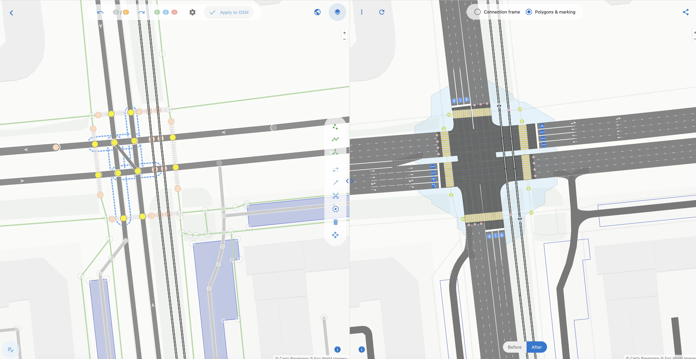 | 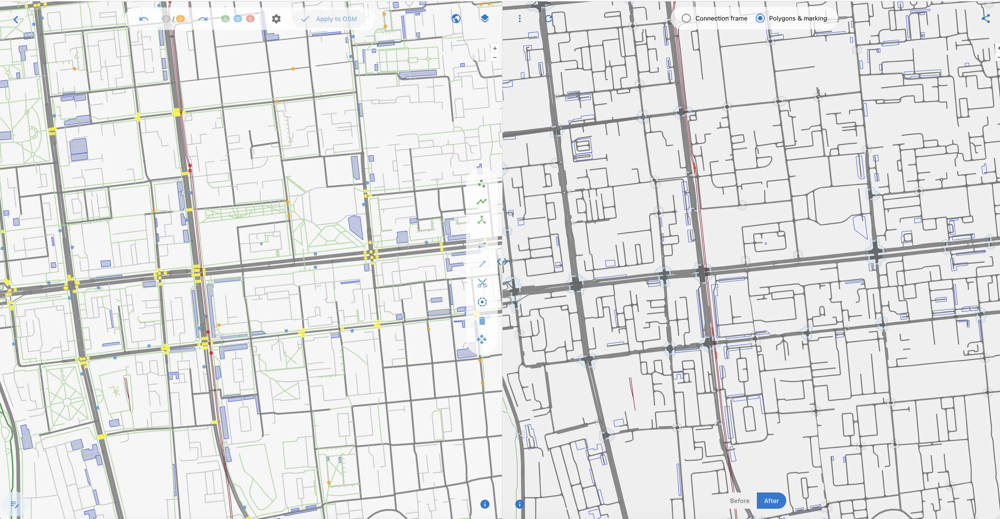 | 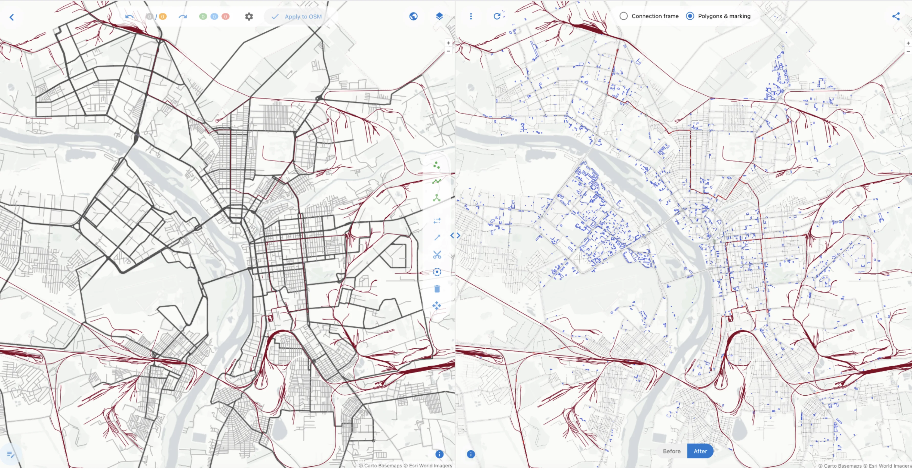 |

**Bake** — именованная область на карте (полигон), которая является контейнером и единицей всего жизненного цикла данных. Один bake проходит через все этапы: загрузка OSM-данных из указанного полигона → обогащение → построение графа → генерация трёх представлений (поверхность, скелет, объектная модель) → конвертация в Lanelet2, XODR, Shapefile. Все шаги конвейера работают с одним и тем же bake.

- **Масштаб варьируется**: от [одного перекрёстка](https://osmpie.org/app/editor?pos=73.389316&pos=54.973229&zoom=19.96&bakeId=36691234-709c-476f-a0c4-147036ce50e9&tile=Carto+Light) (для детальной настройки) до [целого города](avegeo-osmpie-overview.md) (для аналитики)
- **Общий ресурс**: несколько пользователей работают с одним bake — редакторы видят ту же область, результаты обработки переиспользуются на всех шагах

В  Bake хранится слепок OSM данных взятый из основного хранилища, и changeset для модификации этих данных, от пользователя(ИИ)

**Доступ через [API](https://osmpie.org/api/)**: 
- `/ave-geo/bakes/{bake_id}/transform/{type}` — один bake_id, разные выходные форматы
- `/ave-geo/bakes/{bake_id}` - [считать Bake](https://osmpie.org/api/#/Bakes/BakesController_bakeFindOne)

## 3. Конвейер обработки данных


**Входные данные** — несколько форматов OSM на выбор:
- OSM XML (.osm), PBF (.pbf), OSML JSON (Overpass API) — загрузка существующих данных
- OSM Changeset XML — результат редактирования клиентом, сливается на сервере

**Обработка на сервере** — последовательный конвейер:
1. Фильтрация — отбор по области, удаление лишнего
2. Обогащение тегов — полосы, повороты, скорость, смещение оси
3. Разбиение линий — на перекрёстках и препятствиях
4. Построение графа — точки и рёбра по каждой полосе
5. Определение перекрёстков — маршруты, матрица корреспонденций

**Выходные данные** — три независимых формата:
- [Поверхность (GeoJSON)](https://osmpie.org/api/#/Bakes/BakesController_bakeTransformGeoJsonDebug) — полигоны покрытия и объекты разметки
  `Цель: Отрисовка поверхности дороги + Тайлы`
- [Скелет (GeoJSON)](https://osmpie.org/api/#/Bakes/BakesController_bakeTransformGeoJsonDebug) — линейная схема сети (осевые), линии (рёбра), точки (стоп-линии, узкие места), полигоны (перекрёстки) 
  `Цель: Визуализация схемы сети на карте + Роутинг)`
- [Объектная модель (JSON)](https://osmpie.org/api/#/Bakes/BakesController_bakeTransformObjectDebug) — полный граф для дальнейшей обработки
  `Цель: объектный формат документа для передачи между шагами пайплайнов`

**Конвертация из данных на предыдущем шаге:**
- → [Lanelet2(Autoware): Lanelet OSM (.osm) + Lanelet GeoJSON](https://osmpie.org/hdmap-viewer/app/transform?bakeId=7761ac81-5ade-4256-a5e2-af4b31582e6d&toFile=lanelet2&pos=73.387362&pos=54.970829&zoom=20.627777777777776&tile=Carto+Dark) (для отображения) 
- → OpenDRIVE: XODR (.xodr) + XODR GeoJSON (для отображения)
- → Shapefile (.shp) (для интеграции с ГИС)

**Обратная связь:** OSM Changeset → слияние в основное хранилище → обратно в OSM


---

## 4. Модель графа AveGeo, Ключевое отличие от OSM и SD-карт

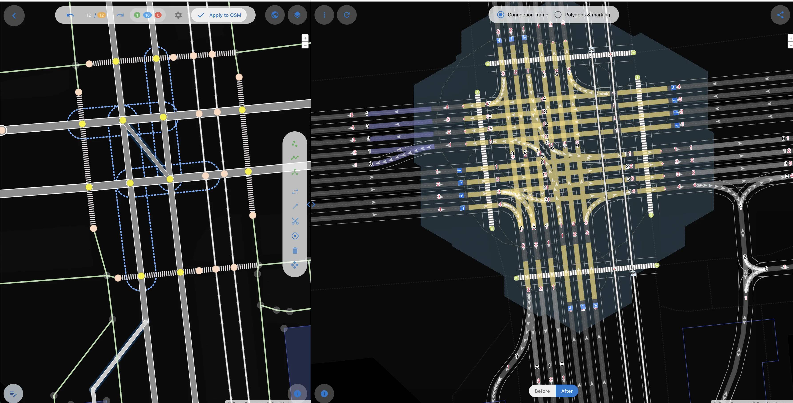

AveGeo — **пополосный направленный граф**. Каждая полоса = отдельное ребро, каждое направление движения — отдельно.

В OSM и обычных графах SD-карт есть только **линия** (way) и **узел** (node). В AveGeo появляются сущности, которых нет в стандартной модели. Каждая точка и ребро хранят ссылки на исходные OSM-объекты — всегда известно, из какого узла и линии этот объект получился. Это обеспечивает прослеживаемость и обратную совместимость.

| | AveGeo | Lanelet2 | OpenDRIVE |
|---|---|---|---|
| **Полоса** | Независимое ребро с полной геометрией (центр + лево + право) | Пара граничных линий (лево/право), общих с соседней полосой | Смещение от осевой линии дороги |
| **Связи** | Явные «откуда → куда» между точками | Смежность через общую границу | Привязка к s-координате вдоль осевой |
| **Семантика** | В каждом ребре: поворот, тип, разметка, поток насыщения | В тегах граничных линий | В lane section вдоль road |

---

## 5. Сравнение с Lanelet2 и OpenDRIVE

| Критерий | AveGeo | Lanelet2 | OpenDRIVE |
|----------|--------|----------|-----------|
| **Детализация** | Рёбра на уровне полос | Пары границ (лево/право) | Секции дорог + смещения полос |
| **Перекрёстки** | Явные зоны + маршруты + матрица корреспонденций | Управляющие элементы + ограничения поворотов | Связи между секциями |
| **Конфликты** | Явная матрица конфликтов + расстояния | Нет (выводятся неявно) | Нет |
| **Светофоры** | Группы сигналов + матрица конфликтов сигналов | Управляющие элементы (светофор) | Объекты на дороге |
| **Мультимодальность** | Авто/пешеход/трамвай/вело/автобус — единый граф | Отдельные типы (тротуар, велодорожка) | Типы полос (тротуар, велополоса) |
| **Геометрия** | Левая/правая границы + центральная линия | Граничные линии (общие у соседних) | Осевая линия + параметрические смещения |
| **Разметка** | 8 типов разделителей + зебра + остановки + стоп-линии | Тип линии (сплошная/прерывистая) на границах | Объекты на дороге |
| **Готовность к симуляции** | Поток насыщения, матрица корреспонденций, расстояния конфликтов | Нет (карта, не модель для симуляции) | Нет (геометрическая модель) |

**Ключевой вывод**: Lanelet2 и OpenDRIVE — модели **описания** дороги. AveGeo — тоже самое + **для анализа и симуляции**: определение конфликтов, матрица корреспонденций, потоки насыщения — доступны из коробки.

---

## 6. Конфликтные точки и перекрёстки

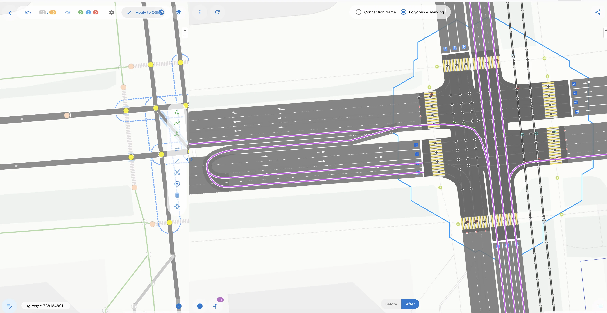

### Автоматическое определение перекрёстков

- **Регулируемые** — перекрёстки со светофорами
- **Нерегулируемые** — пересечения без светофоров (определяются по топологии)
- **Определение зоны** — группировка узлов по близости. Формирование полигона зоны перекрёстка

### Матрица корреспонденций

Для каждого перекрёстка автоматически строится полная матрица: все возможные маршруты от каждой входной стоп-линии к каждой точке выезда. Каждый маршрут — последовательность рёбер через перекрёсток.

### Определение конфликтов

Маршруты → пересечение геометрий → классификация → конфликтная точка с расстояниями от каждой стоп-линии.

Конфликты классифицируются по двум осям:

| По допустимости | По видам транспорта |
|----------------|---------------------|
| Разрешён светофором | Авто ↔ авто |
| Уступи дорогу | Авто ↔ пешеход |
| Главная дорога | Авто ↔ трамвай |
| Равнозначный | Вело ↔ авто |

**Матрица конфликтов сигналов**: какие группы светофоров конфликтуют между собой — основа для расчёта фаз.

---

## 7. Примеры пайплайнов

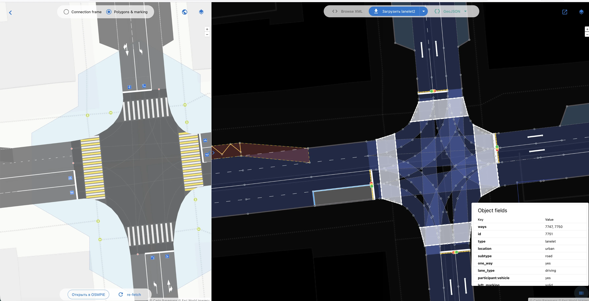

### Пайплайн 1: Редактирование и обратная связь

1. **Хранилище OSM** → пользователь выбирает область
2. Создание **bake** — слепок данных из хранилища
3. Пользователь (или ИИ) добавляет **changeset** в [bake — правки тегов](https://osmpie.org/app/editor?bakeId=88178350-e28a-4c26-9498-a983e774f03c&pos=73.376196&pos=54.983216&zoom=18.39&tile=Carto+Light)
4. Сервер обрабатывает bake → **рендер в GeoJSON** (поверхность, скелет)
5. GeoJSON возвращается пользователю — визуальная обратная связь
6. Changeset **[мержится](https://www.openstreetmap.org/changeset/179216500#map=19/54.983366/73.376171) в основное хранилище** OSM

### Пайплайн 2: Генерация тайлов

1. Подгрузка данных из **внешнего хранилища OSM** (город целиком или крупные районы)
2. Создание большого **bake** с накопленными правками
3. Генерация **GeoJSON полигонов** (поверхность — дорожное покрытие, разметка)
4. Передача в **тайл-генератор**
5. Выход: **тайлы на сервер** (раздача клиентам) + **тайлы для рендера** ([визуализация в редакторе](http://omsk.aveproject.ru/styles/surface/?vector#18.94/54.971956/73.3894996/-40/64))

### Пайплайн 3: Конвертация города в Lanelet2 (параллельный)

1. Исходный ресурс — **PBF-файл города**
2. Город размечается на участки — **несколько bake** по границам
3. Для каждого bake **параллельно**:
   - Фильтрация PBF по границам bake
   - Конвертация → **объектная модель AveGeo**
   - Генерация **Lanelet2 документов** (.osm) + **Lanelet GeoJSON** [(для анализа пользователем)](https://osmpie.org/hdmap-viewer/app/transform?bakeId=7761ac81-5ade-4256-a5e2-af4b31582e6d&toFile=lanelet2&pos=73.387362&pos=54.970829&zoom=20.627777777777776&tile=Carto+Dark)
4. **Склейка** результатов всех bake в общий документ Lanelet2

---

## 8. Интеграция с ГИС

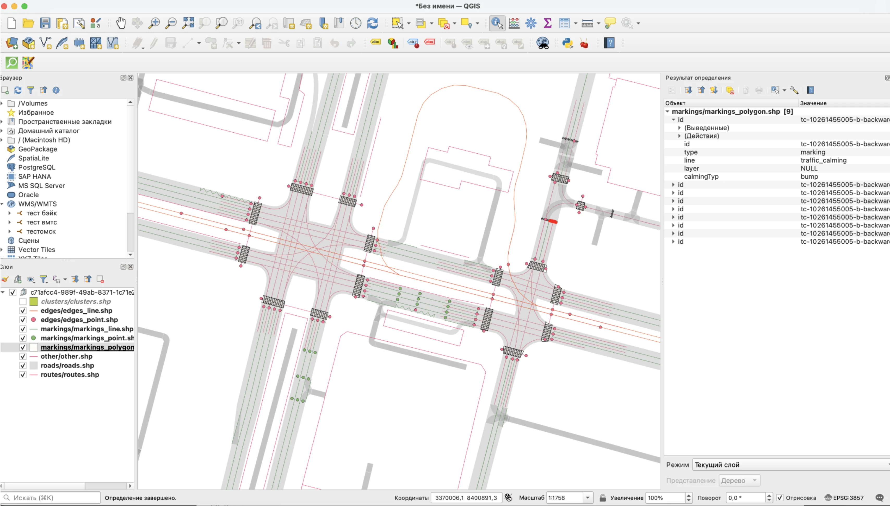

Все три типа выходных данных из секции 3 (поверхность, скелет, объектная модель) доступны для ГИС-систем двумя способами:

- **Экспорт в Shapefile** — по слоям (дорожное покрытие, разметка, скелет, перекрёстки и т.д.). Готовые .shp/.shx/.dbf файлы для импорта в любую ГИС
- **Прямое подключение через API** — QGIS и другие ГИС принимают на вход API-эндпоинты, возвращающие GeoJSON-объекты (features). Это позволяет создавать **векторные слои** напрямую из AveGeo без промежуточного экспорта:
  - `/bakes/{id}/transform/surface` → слой дорожного покрытия и разметки
  - `/bakes/{id}/transform/skeleton` → слой скелета сети (осевые, стоп-линии, перекрёстки)
  - `/bakes/{id}/transform/object` → полный граф для аналитики
- **Lanelet2 данные** — результаты конвертации также доступны для ГИС:
  - Lanelet GeoJSON — визуализация полос и связей в формате Lanelet2 как векторный слой
  - Lanelet OSM (.osm) — импорт в JOSM или любой OSM-совместимый инструмент

Данные обновляются при каждом запросе — ГИС всегда показывает актуальное состояние bake.

---

## 9. Производительность

### Масштаб обработки

- **Максимальная площадь**: 500 000 м² на один запрос
- **Обработка**: один поток Node.js (1 ядро)

### Результаты по bake

| Типовой bake (район) | г. Омск | Москва, Ленинградский пр. — Волоколамское ш. |
|:--------------------:|:-------:|:--------------------------------------------:|
| 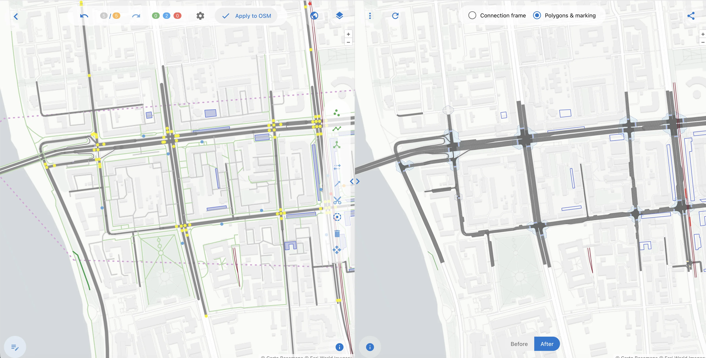 | 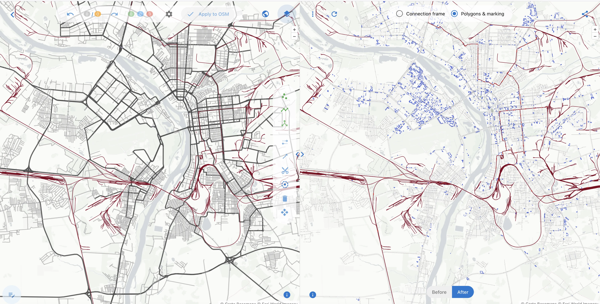 | 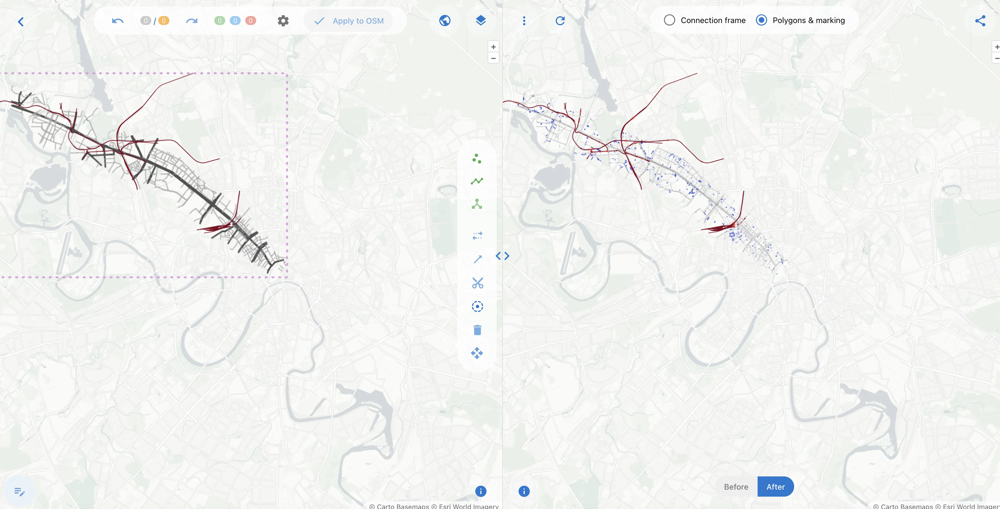 |

| Bake | OSM-объектов на входе | Время обработки (1 ядро) | Объектов на выходе |
|------|----------------------|--------------------------|-------------------|
| [Типовой bake (район)](https://osmpie.org/app/editor?pos=73.385405&pos=54.973485&zoom=16.14&bakeId=7761ac81-5ade-4256-a5e2-af4b31582e6d&tile=Carto+Light) | ~2100 | 1,6 сек | features: 1694, Polygon: 393, LineString: 711, Point: 528, MultiPolygon: 62 |
| [г. Омск весь](https://osmpie.org/app/editor?pos=73.401969&pos=54.948626&zoom=11.71&bakeId=e9ae572a-1666-4fce-8bed-22dc87fb459b&tile=Carto+Light) *Придется подождать | ~300K | **~3,5 мин** | features: 203274, Polygon: 66100, LineString: 116524, Point: 18934, MultiPolygon: 1716, size: 121.42MB |
| [Москва, Ленинградский пр. — Волоколамское ш.](https://osmpie.org/app/editor?pos=37.566483&pos=55.793313&zoom=11.70&bakeId=a2ba0706-dd6e-408a-9818-9f6d8c23036b&tile=Carto+Light) | ~117K | ~35 сек | features: 39097, Polygon: 9204, LineString: 21466, Point: 7484, MultiPolygon: 943, size: 22.31MB |

---

## 9. Особенности обработки, ручные исправления и типовые ошибки

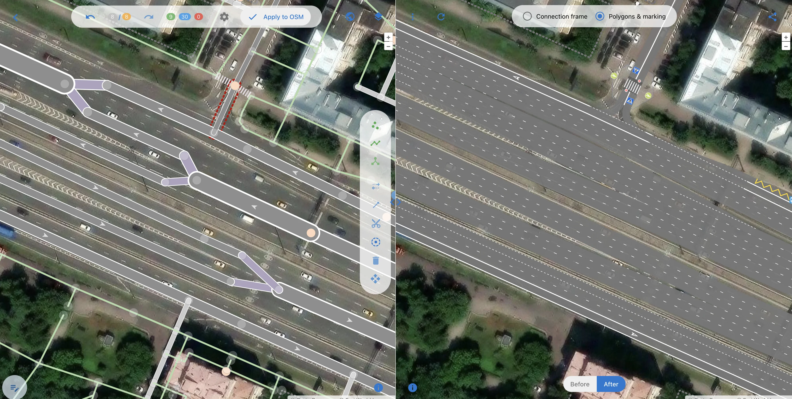

### Сервисные дороги

Дворовые проезды и парковки — высокая плотность, часто скрыты под деревьями, плохо размечены. Ключевая проблема: маневры на перекрёстках в OSM привязаны к основным дорогам, а не к сервисным — при разбиении way приходится переносить ограничения. Обработка сервисных дорог опциональна: включается только если нужна полная детализация.

### Велосипедная инфраструктура

Велодорожки, велополосы и буферные зоны включаются в единый граф наравне с автомобильными полосами, конфликты вело↔авто определяются автоматически. Усложняет обработку специфичная разметка (велобоксы, отдельные фазы). Визуализация велоинфраструктуры в настоящее время прорабатывается.

### Проблема «ложных осевых» (placement)

В OSM линия дороги (way) идёт «по середине». Но на развилках, слияниях и при смене числа полос середина смещается — way перестаёт лежать на реальной оси дороги.

```
Пример: 3 полосы → 2 полосы (правая полоса заканчивается)

До:    |====|====|====|      way идёт по центру 3-полосной дороги
            ↓

После: |====|====|            way идёт по центру 2-полосной дороги
           ↓ (центр сместился!)

Зона перехода:
       |====|====|====|
            ↓~~~~↓            way плавно смещается
              |====|====|
```

Большинство OSM-мапперов не знают про тег [`placement`](https://wiki.openstreetmap.org/wiki/Proposal:placement) и рисуют way так, чтобы он красиво выглядел на карте, а не по реальной оси. На развилках way часто идёт по одному краю, делает резкий изгиб в точке ветвления, не имеет `placement=transition` тега, а число полос не сходится: N полос → A + B, но A+B ≠ N. Это систематическая ошибка — ~90% развилок в OSM не имеют этого тега.

**Как решается**: тег `placement` указывает где реально проходит ось. Если его нет — ось вычисляется из количества полос и ширины. Можно сделать эвристику, для замазывания проблемы, но тут жду что ИИ справиться лучше. В OSMPIE оставлено намерено, чтобы не вводить пользователй в заблуждение, что все хорошо.

[Смотри пример](https://osmpie.org/app/editor?pos=37.52365&pos=55.802935&zoom=18.00&bakeId=0a2a6de1-ffab-40e9-b526-7007c7d5860f&tile=Carto+Light) на том же Ленинградсоком, переключить было - стало на обоих половинах.

### Проблема пропущенных пешеходных переходов

На регулируемом перекрёстке primary×secondary в хорошо размеченном городе **всегда** есть пешеходный переход (`footway=crossing`). Но на практике переходы часто забывают разметить. Три типа ошибок:

| Тип | Суть проблемы |
|-----|---------------|
| **Забытый переход** | На перекрёстке вообще нет пешеходного перехода, хотя по контексту (светофор, тип дорог, число подходов) он должен быть |
| **Footway без тега** | Линия пешеходного пути пересекает дорогу, но нет тега `footway=crossing` — система не понимает что это переход |
| **Необрезанный footway** | Линия перехода не начинается/заканчивается на краю проезжей части, а тянется дальше — невозможно определить ширину перехода |


