# `connectivity`, `placement=transition`, `junction:radius`

В этой статье хотелось бы на простейших примерах показать и рассказать о том, какую пользу несет применение новых тегов, которые используются в OSMPIE. И самое главное — как они связаны с теми тегами, что уже используются в OSM.

Предложенные теги не были придуманы, они скорее были «открыты»: они изначально присутствовали в OSM в других тегах, но их значения не были проявлены, хотя функции присутствуют, и это можно заметить даже просто внимательно читая документацию.

Зачастую сложно рассматривать каждый тег (`relation`) отдельно, потому что их финальное действие (функция, рендер) сложно переплетено между собой.

[Рабочий пример с простейшими конструкциями](https://osmpie.org/app/editor?pos=35.565451&pos=32.799122&zoom=19.86&bakeId=ca46777f-6c92-4a49-b193-bad5aa04f4c1&tile=Carto+Light)

Вот рабочий пример с простейшими конструкциями, на который будем ссылаться по ходу статьи. Для того чтобы можно было самостоятельно изучить нюансы на практике.

(В настройках лучше выключить подсветку изменений и переключиться на режим «Connection frame» в правом окне.)

Также рекомендуется освежить понимание по темам `connectivity` и особенно разглядеть картинки в статье про `placement` в самом низу статьи.

- [Статья о `connectivity`](https://wiki.openstreetmap.org/wiki/Relation:connectivity)
- [Предложение о `Placement`](https://wiki.openstreetmap.org/wiki/Proposal:Placement)

**Итак, начнем,**

но сначала нам нужны некоторые базовые понятия, аксиомы, если хотите, на которых будет строиться рассуждение.

**Основные признаки пересечений**

- **Участники** — в пересечении участвуют **2 и более `way`**, имеющих общую точку (`node`).
- **Размер** — в реальности пересечение — это область, где возможен конфликт транспортных средств (и других участников дорожного движения), двигающихся по разным путям (полосам). При картировании мы описываем пересечение при помощи некой геометрической фигуры, которая соотносится с реальными линейными размерами места. Размер этой фигуры (обычно линейный размер, определяющий её площадь) является неотъемлемым атрибутом пересечения.
- **Связность** — на каждом `way`, участвующем в пересечении, появляются точки входа в пересечение и выхода из него. Необходимо указать (атрибутировать) их связи друг с другом. См. `connect:lanes`, `relation`[`type=connectivity`].
- **Конфликтные точки** — необязательный, но часто встречающийся признак, определяющий факт конфликта одних связей с другими, а также местоположение этого конфликта.

У некоторых может вызвать сомнение, что пересечение с 2x `way`, а не 3x, может таковым считаться. Это действительно кажется краевым эффектом, который было удобно отбросить. Однако ниже мы рассмотрим даже пример, где пересечения из 2x `way` могут обладать и связностью, и конфликтностью (!). А наличие даже одного примера уже подтверждает правильность оснований. (Для нетерпеливых — это Пример 6.)

## Соединение 2x `way` с изменением числа полос

### Пример 1А

| way | lane |
| :--- | :--- |
| 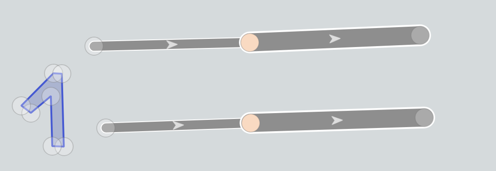 | 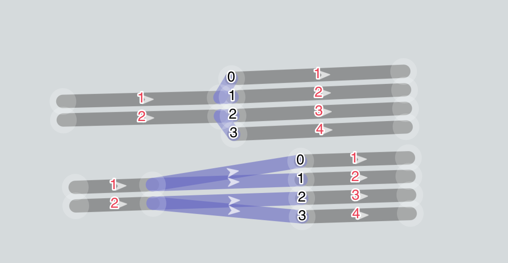 |

Очень частый и распространенный случай. Не имея такого понятия, как `junction:radius`, у нас появляется неопределенность в интерпретации: а каким линейным размером обладает данное соединение? Разрешая числовой атрибут в точке (`node`), мы устраняем это недоразумение — неопределенность. Соединение приобретает полноту. И самое главное — **не надо дробить `way`** на мелкие куски, все решается в точке (`node`).

### Пример 1B

| way | lane |
| :--- | :--- |
| 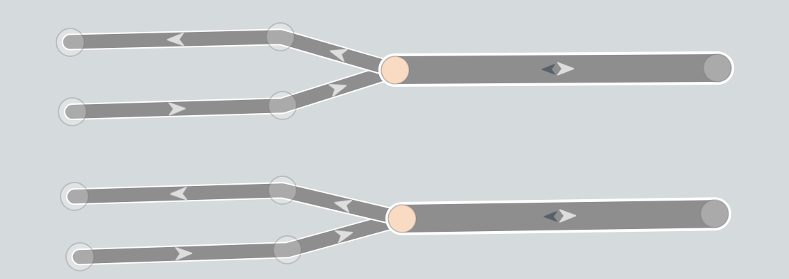 | 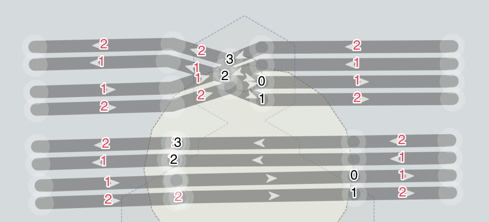 |

Также крайне распространенная ситуация: 2 oneway + 1 двусторонний `way`.

Без точного задания радиуса в этой точке (`node`) мы лишены правильной размерности. К примеру, в верхнем случае — радиус минимален, тогда мы должны следовать вилке и прокладывать пути по осевой (которая на самом деле такой не является) и получаем искаженную геометрическую картину.

Если же мы зададим радиус предельно большим, то картина становится более правильной. Но неопределенность никуда не уходит.

В OSM существует гениальная подпорка (это не ирония и не сарказм), чтобы решить эту проблему, — встречайте, **`placement = transition`**.

И хотя по задумке авторов и названию этот тег нужен для указания положения осевой, но работает он и как указатель длины в том числе, подобно рода пересечений.

## Примеры 2А и 2B

| way | lane |
| :--- | :--- |
|  | 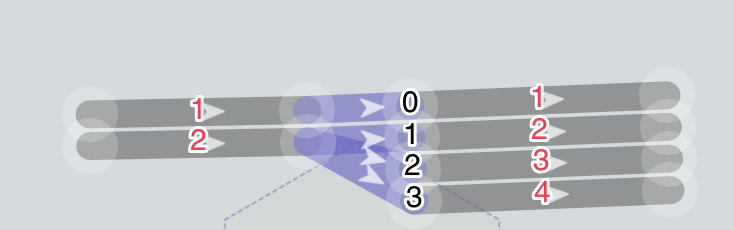 |

**2A** Изменение полос с 2 до 4 — точное положение осевой + дополнительный [`way`[`placement = transition`]](https://wiki.openstreetmap.org/wiki/File:Lane_Transition_2.png).

| way | lane |
| :--- | :--- |
|  |  |

**2B** Соединение из 3x `way` — которые «на земле» являются одной дорогой, с разделением между направлениями, в левой половине.

В обоих этих примерах наличие такого ключа(тэга) для `way` позволяет «закрыть дырку» в размерности пересечения и переменном числе полос, но порождает много других вопросов. При этом неявно полагается, что на концах такого `way` радиус предельно мал, что его не существует.

Также этот `way` автоматически выпадает из `connectivity`, так как имеет **неопределенное** (опять) число полос. То есть мы не можем явно указать соединение между 1-м и средним или средним(2-м) и 3-м.

 

То есть получается так, что `way`[`placement=transition`] как бы есть, но его как бы и нет, его осевая игнорируется, в `connectivity` он не участвует. А его концы — это как бы одно целое. `Node` — разнесенная в пространстве и состоящая из 2-3 других `node`.

Но с проявлением радиуса как измеримой линейной величины все становится намного проще и целостней. А с уточнением радиуса до полосы раскрываются новые возможности.

| way | lane |
| :--- | :--- |
|  | 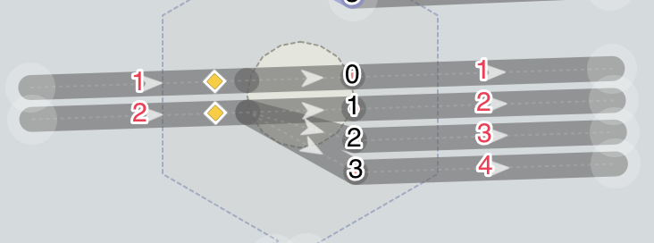 |

**3А** Явное соединение без лишних сущностей (`connectivity`) + гибкое управление линейным размером `junction:radius`.

| way | lane |
| :--- | :--- |
| 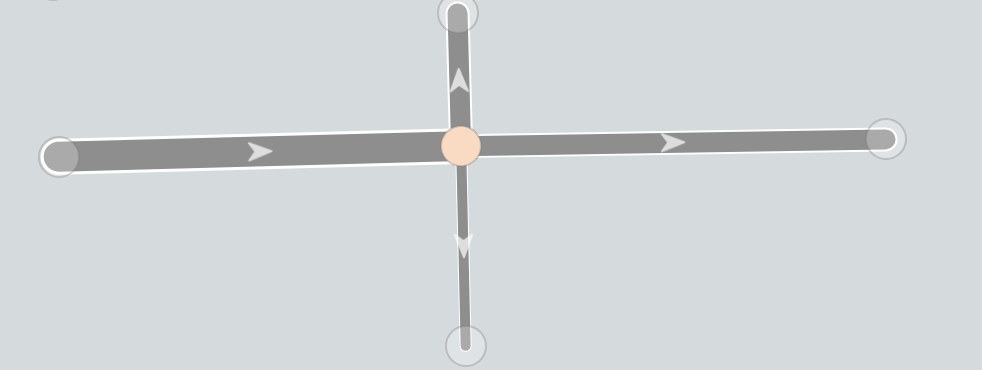 | 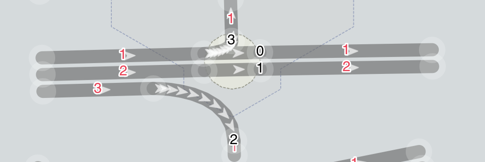 |

**3B** Явное задание (переопределение радиуса перекрестка для правой полосы) позволяет избежать (минимизировать) рисование дополнительных `way` (линков) там, где перекрестки очень большие, и нет физического обособления, а только краска. 
[Пример](https://osmpie.org/app/editor?bakeId=8e6d87b4-3f58-4876-9e5e-1c0d7469f0e8&pos=73.342014&pos=54.972697&zoom=19.55&tile=Esri+World).

Для центральной `node` задан малый радиус:

`junction:radius: 5`

Но для `way` он переопределен, и опять без отрыва от контекста, вписан в идеологию `*:lanes:*`:

`turn:lanes: left;through|through|right`

`junction:radius:lanes:forward:end: ||15` <- только для 3 полосы

На пересечениях с более чем 2-мя участниками использовать `way`[`placement=transition`] для целей указания линейных размеров уже неоднозначно, в связи с наличием центральной `node` перекрестка, не говоря уж о гибкости управления размером по отдельным полосам.

Хотя по поводу применения `way`[`placement=transition`] на сложных перекрестках много интересных и тонких моментов, которые, вероятно, раскроем в других статьях.

## Реализация `connectivity` с помощью `relation` и `connect:lanes`

Попробуем для наглядности реализовать простую, но необычную/неправильную схему соединения полос на перекрестке.

| way | lane |
| :--- | :--- |
| 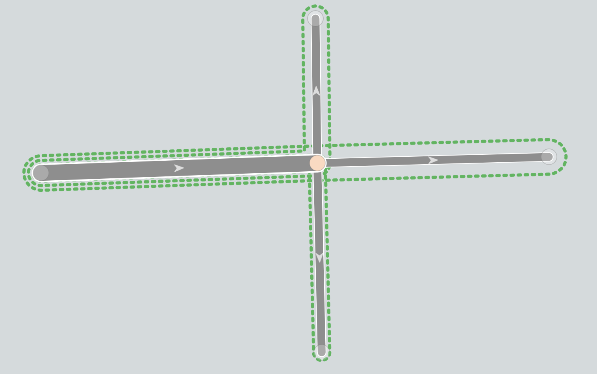 | 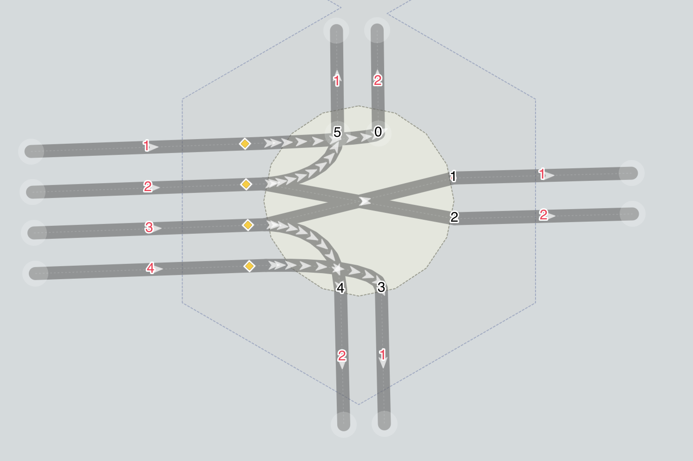 |

**4A** Необходимо целых три `relation`, в каждом из которых надо указать свою комбинацию полос (красные цифры), вручную!

1. `connectivity: 3:2|4:1`
2. `connectivity: 1:2|2:1`
3. `connectivity: 2:2|3:1`

## Реализация `connectivity` с помощью атрибута `way` — `connect:lanes`

| way | lane |
| :--- | :--- |
| 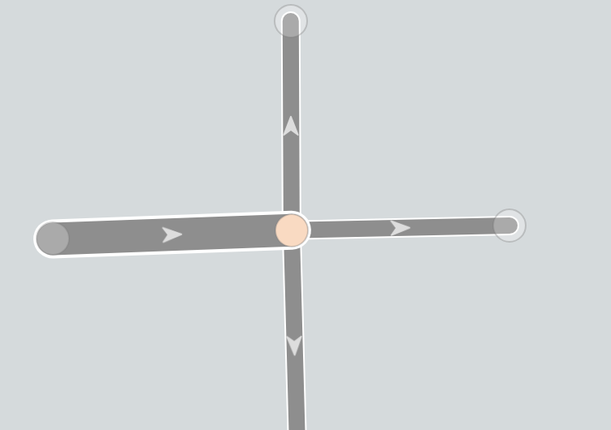 | 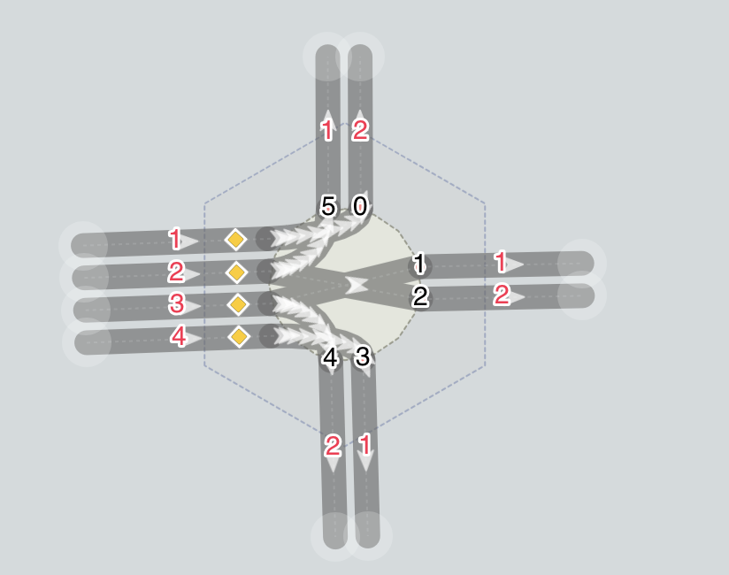 |

**5A** При этом идентичные комбинации легко указываются как атрибут `way` и удаляются вместе с ним, если это необходимо. Черные цифры — индексы выходных полос в пересечении.

`connect:lanes: 0|5;2|1;4|3`

`turn:lanes: left|left;through|through;right|right`

При этом это делается (вносится-редактируется) в одном контексте вместе с `turn:lanes`, а не в разных, как в примере с `relation`.

Насколько мне известно, в OSM не существует именно тегов, реализующих `connectivity`.

И при этом многие объекты можно задать несколькими способами — парковки, тротуары и велодорожки, как тегом, так и отдельным объектом.

## Идем в дебри

Примеры 4B и 5B более сложны для понимания, но хочется явно тут подсветить.

В OSM для указания связности считается возможным использовать `way` в качестве `via` в самых крайних и редких случаях.

Однако явно не указано, что этот `way`, который используется в `via`, должен быть явно задан как `placement=transition`. Потому как если он имеет четкое определение кол-ва полос, а мы пробрасываем связность за него, то это ошибка. Или опять очередная **неопределенность**.

В примере 5B показано, что связность через `connect:lanes` также будет игнорировать `way`[`placement=transition`], и индексы полос будут считаться совместно для обоих `node`.

И также показано, что этой всей сложности можно избежать, используя `node` и `radius` для отображения линейных размеров пересечения. Результат идентичный.

Ну и наконец, Пример 6, где представлена реализация пересечения, в состав которого входят 2 `way`, оно имеет протяженность (размер), специфическую связность и конфликт. Что показывает и доказывает то, что `junction` может применяться для `node`, где всего два `way`.

Для верхней дороги используется реализация `way`[`placement=transition`] + `relation`[`type=connectivity`], а в нижней — `connect:lanes` + `junction:radius`.

| way | lane | lane|
| :--- | :--- |  :--- |
| 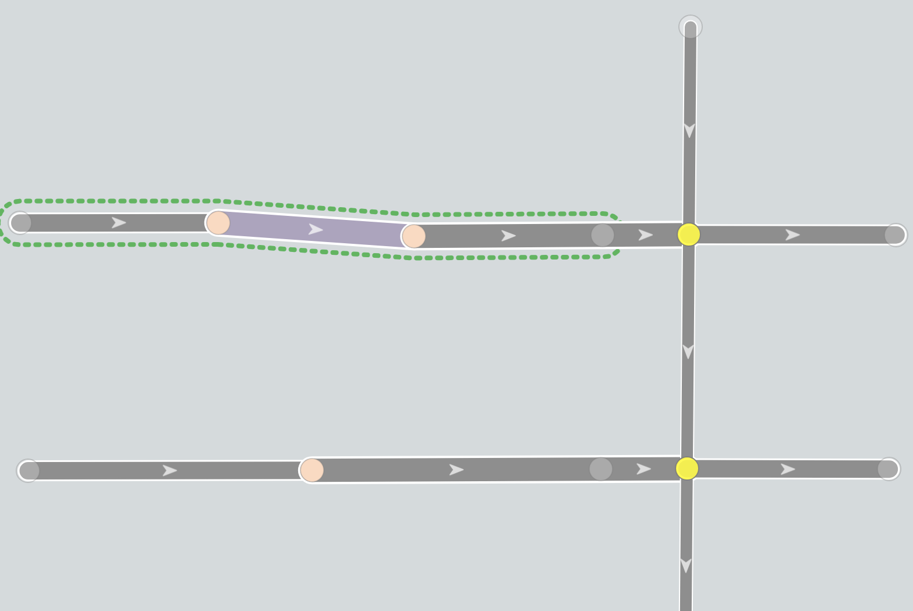 | 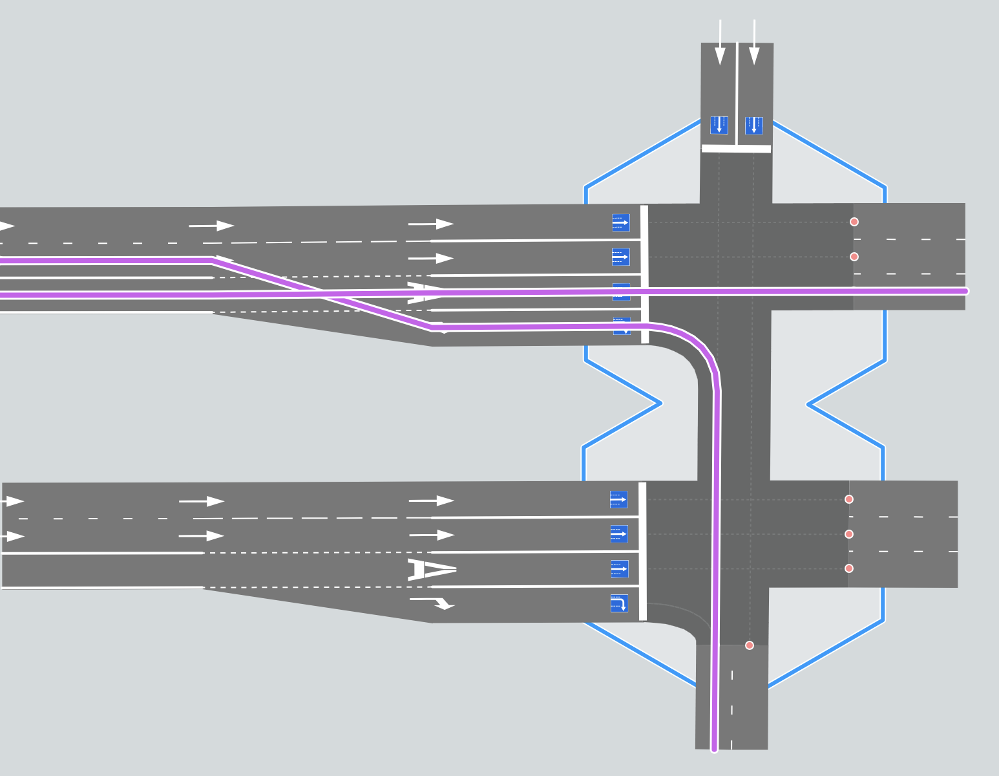 |  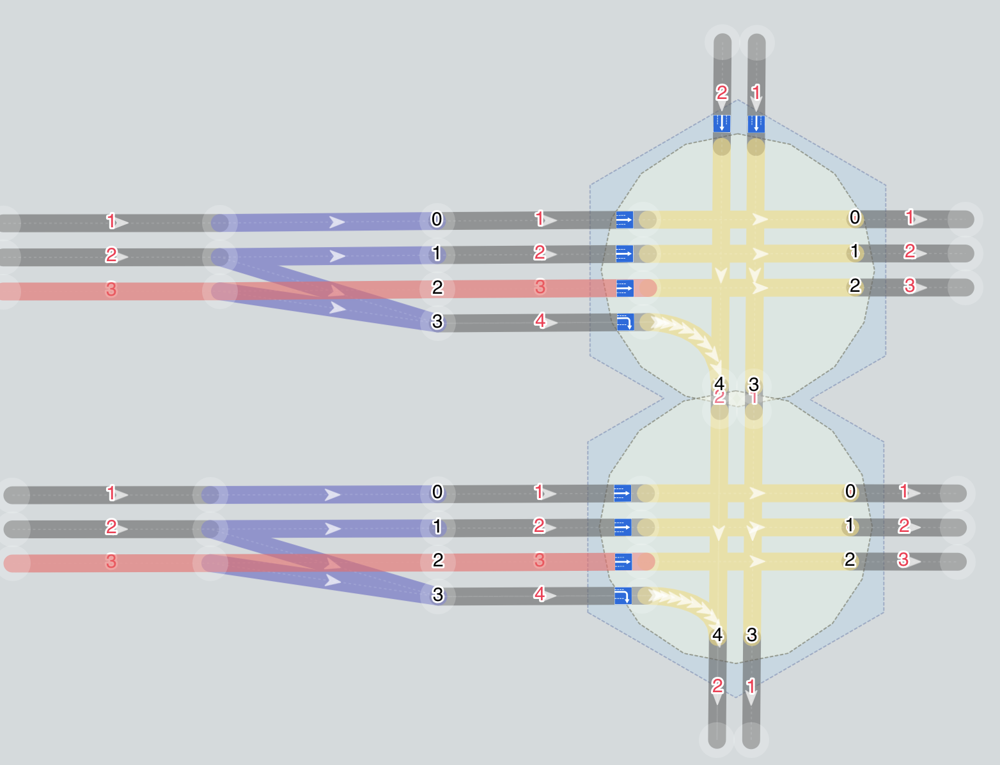 |

## Выводы

*   `Placement=transition` — это [скрытый или утерянный `junction`](https://wiki.openstreetmap.org/wiki/File:Lane_Placement_3.png) (сегмент 2, 4), состоящий одновременно из 2x `node` (начала и конца). Это гениальный костыль, чтобы дать возможность указать протяженность (размер) за счет 2x координат, но порождающий вопросы и неоднозначности о связности таких `way`.
*   `connect:lanes` и `junction:radius` являются идеальным дополнением существующей схеме тегирования связности и размерности пересечений (`way`[`placement=transition`] + `relation`[`type=connectivity`]), упрощая ручное внесение и консистентность. Явно размечая линейные размеры пересечения атрибутами вместо неявного. И не отрицая и не противореча существующей системе указания связности.
*  `relation[type=connectivity]` - хороший инструмент,пока  **via -  это node**, дальше опять пока слишком много неопределенности.
*   `junction` - надо считать начиная с соединения 2х way.  

И ту, и другую схему стоит применять только в случае, если `turn:lanes` не разрешилось автоматически однозначно или правильно с точки зрения truth on the ground.

Надеюсь, данная статья и примеры в ней поможет многим разобраться с особенностями различных схем реализации связности на пересечениях, а OSMPIE послужит наглядным практическим, а не умозрительным учебным пособием.