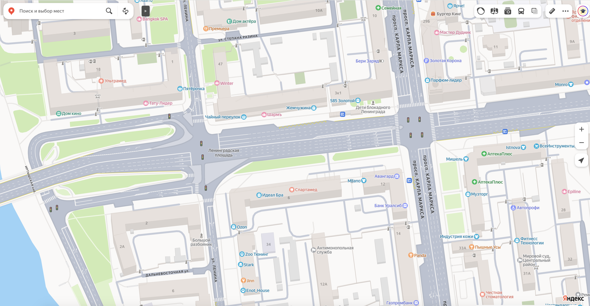
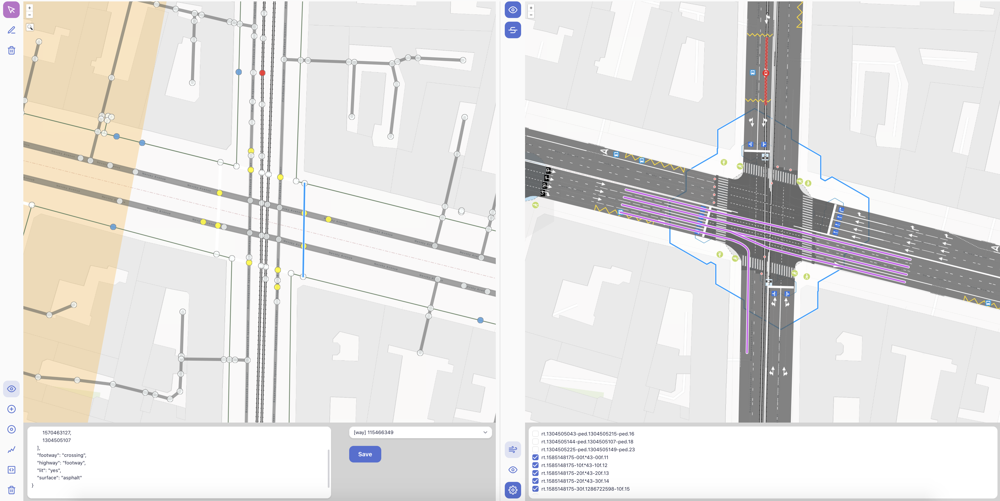

### 1. Кто вы и чем занимаетесь? Что привело вас в OpenStreetMap?

Меня зовут Михаил Кузин, мне 41 год. Я христианин, женат, воспитываю двух сыновей. Занимаюсь разработкой программного обеспечения более 20 лет, а также научными исследованиями и дата-сайенсом в области дорожного движения. Имею степень Master's Degree in Computer Science и Ph.D. in Computer Sciences (Mathematical Modeling).

Руковожу группой разработчиков ПО в сфере Интеллектуальных Транспортных Систем (ИТС) и занимаюсь развитием небольшого, но «революционного» стартапа в сфере анализа данных подключенных автомобилей.

Не секрет, что многие научные работы основаны на данных OSM. Мы, как и многие другие разработчики ПО для моделирования дорожного движения или автономных автомобилей, обратились к данным о дорогах ([1](https://sumo.dlr.de/docs/Tutorials/Import_from_OpenStreetMap.html), [2](https://github.com/CommonRoad/commonroad-scenario-designer/discussions/20), [3](https://commonroad-scenario-designer.readthedocs.io/en/latest/details/osm/), [4](https://docs.aimsun.com/next/22.0.2/UsersManual/OSMImporter.html) и многие другие).

У нас уже было разработано несколько собственных моделей дорожных сетей, которые решали специфические задачи. И, как и все остальные, мы принялись писать конвертер (загрузчик) дорог из формата OSM в свои модели.

Построение хорошей и точной сети — трудоемкая задача, и всегда испытываешь недоумение: зачем снова рисовать то, что уже много где есть? Мы быстро поняли, что бесшовно и в полной мере это сделать не получится, потому что перекрестки реально сложны по своей структуре, а вариативность их отображения высока из-за человеческого фактора — каждый вносит данные так, как видит.

### 2. Что такое OSMPIE? Что побудило вас создать его? Зачем нам еще один редактор OSM?

Редактор — это инструмент, отражающий потребности человека в решении его задач. Если задачи специфические, почему бы не существовать более удобному редактору, где меньше отвлекающих объектов? Если окинуть взглядом все множество объектов OSM, очевидны явные кластеры: здания, дороги, местность (реки, горы, моря, леса и отдельные деревья) и POI. Для каждого из них есть свои особенности внесения данных.

Тем более с развитием [идеи микромаппинга](https://strassenraumkarte.osm-berlin.org/?map=micromap#18/52.47379/13.44164). Мы уже привыкли к возможностям современных картографических систем ([Yandex](https://yandex.ru/maps/66/omsk/?ll=73.380364%2C54.972583&z=18), [2GIS](https://2gis.ru/omsk/geo/282213711094197/73.382814%2C54.970556?floor=0&m=73.383523%2C54.970326%2F18.52&immersive=on), [Gaode](https://www.google.com/search?q=gaode%20navigation%20app%20roads%20screen&hl=ru&udm=2&tbs=rimg:CR2ONwVl2iipYZAlZjQg4Hn2sgIAwAIA2AIA4AIA&sa=X&ved=0CB4QuIIBahcKEwjIqp2d3KqQAxUAAAAAHQAAAAAQBw&biw=1775&bih=925&dpr=2#vhid=UxvCU0q04wI5_M&vssid=mosaic)). Маппить каждое дерево или скамейку — это «низко висящие фрукты», их легко сорвать. С дорогами все не так!

Микромаппинг дорог, то есть переход от [уровня гранулярности](https://www.sciencedirect.com/science/article/pii/S1569843225004509?clckid=ef46d8dd) `way` к `lane`, порождает суперэкспоненциальный взрыв связей (`relations`) между новыми объектами или требует неимоверного количества действий.

Недавно было одобрено предложение по разметке, но даже на небольших площадях поддерживать такое количество объектов очень трудоемко. Однако на самом деле разметка на дорогах не случайна — большинство линий нанесено не просто так (хотя и такое случается...), они имеют смысл (семантику) и определенный алгоритм. OSMPIE — это попытка воссоздать эти алгоритмы.

Здесь есть два подхода: «сканер» и «функция».
-   **Сканер** — когда робот/программа/ИИ распознает объекты с геопривязанных фото.
-   **Функция** — мы пытаемся восстановить объект, исходя из смысла атрибутики его и его соседей (эвристики).

OSMPIE меняет многие концепции:

1.  **Автоматизация.** Мы подумали: если наша задача — бесшовно конвертировать дорожную сеть OSM с уровня гранулярности `way` до уровня `lane`, то чего нам не хватает? Почему каждый раз приходится вручную двигать точки в конечной модели? Как уменьшить эту ручную работу, а в идеале — полностью от нее избавиться?

2.  **Философия данных.** OSM — это карта? База данных? Давайте посмотрим иначе. OSM — это не просто теги и точки, это объектно-семантическая модель, своего рода язык программирования со своей структурой и «кодом», подобный HTML/CSS.

3.  **Семантика перекрестков.** В OSM семантическая область перекрестков не очень хорошо проработана из-за их сложности и многообразия отношений. Одной из главных задач было не просто добавить новые теги, а сделать их количество **минимальным** и, самое главное, вписать в текущую идеологию, например, `*:lanes:*`. На это ушло несколько лет.

4.  **Коллаборация.** Маппер всегда герой-одиночка. Я, возможно, не сильный знаток редакторов OSM, но в Miro или Google Docs я могу работать совместно, получать оценки и комментарии — это настоящая совместная работа. Почему в OSM это не так? В OSMPIE сделан первый шаг к этому — можно делиться черновиками или результатами процесса «выпечки» перекрестков. Когнитивная сложность перекрестков очень высока, и, как у нас говорят, одна голова хорошо, а две лучше.

Мы уже несколько лет пользовались этим редактором для своих нужд и создавали модели городов или их крупных частей для транспортной аналитики. [Вот так он выглядел ранее](https://photos.google.com/album/AF1QipPJoOPiKseqQQ8L6ZG9jJXSN5HAqgKpWxDlqacJ).

В 2025 году мы решили предложить его сообществу, так как нам казалось, что работы там немного — улучшить процесс редактирования, изменить авторизацию и место для сохранения чейнджсетов в общую базу OSM. Ха...

Мы были бы рады, если наши идеи будут обсуждены, улучшены или приняты сообществом. Тогда можно будет думать о дальнейшем развитии: расширении API, плагинах для других приложений и опенсорсе. Если же они будут отвергнуты... что же, Боже, благослови OSM.

### 3. В чем заключаются уникальные проблемы при маппинге перекрестков в OpenStreetMap?

1.  **Отсутствие единой модели.** В объектной модели OSM нет стройной, однозначной и распространенной модели перекрестков.

2.  **Геометрическая точность vs. Упрощение.** Перекресток — это не просто точка пересечения линий дорог. Это область со своими границами, где дороги сливаются, разделяются, имеют закругления, островки безопасности и несколько полос движения. Как точно передать эту форму, не усложняя карту до невозможности ее редактирования и использования? (см. `placement`, см. `radius`).

3.  **Семантическая модель (Логическая структура).** В OSM важно не только то, как перекресток выглядит, но и то, как он функционирует. Какие повороты разрешены? Где находятся пешеходные переходы? Как светофоры управляют потоками? Какими тегами и правилами описать эту логику, чтобы навигационные программы и картографические сервисы могли ее правильно интерпретировать? Это самая большая «уникальная проблема».

4.  **Топология (Связность дорожной сети).** Крайне важно, чтобы дороги в месте перекрестка были правильно соединены. Одна ошибка — и маршрутизатор «подумает», что проехать здесь нельзя. Обеспечить бесшовную связность всех въездов, выездов и полос, особенно на сложных развязках, — сложная задача. Когда мы переходим к микромаппингу и гранулярности уровня `lane`, эта проблема становится одной из основных.

    Тег `connect:lanes` был предложен сообществу именно из практических соображений. Он не отменяет `relation[type=connectivity]`, так же как тег `way[highway=* + cycleway:right=lane]` не отменяет `highway=cycleway`. Они сосуществуют. `connect:lanes` позволяет удобно задать связность как атрибут, а не создавать отдельный объект. [Пример с cycleway](https://osmpie.org/app/editor?pos=13.425174&pos=52.486&zoom=20.15&bakeId=7edb9995-b958-4776-be55-5a7426c76916&tile=Carto+Light). Когда вы попробуете сами разметить дороги целого города, вы сможете сделать выбор.

5.  **Динамичность и детализация.** Перекресток — динамичный объект. Появляются новые полосы, меняется организация движения, ставятся новые знаки. Как поддерживать актуальность такой сложной модели и в каком объеме детализации это необходимо? Нужно ли отмечать каждую стрелку на асфальте?

### 4. Какие шаги может предпринять сообщество OpenStreetMap для улучшения маппинга перекрестков и дорог в целом?

Ответ может показаться банальным, но максимальный эффект даст правильная расстановка тегов `lanes:` и `turn:lanes`. Только это уже даст значительные улучшения. Далее, конечно, важен `placement` — в городах на перекрестках и развязках. Следует рисовать пешеходные переходы отдельными `way` (одна «зебра» — один `way`), а не одним `way` вокруг всего перекрестка. И для этого не нужны специальные редакторы.

Мапперы многих городов делают прекрасные дороги. Открывая их в OSMPIE, я просто говорю: «Совершенство! Нечего исправлять, все на своих местах». Их работа и опыт заслуживают внимания и уважения. Они делают это «вслепую», без подсказок ИИ или детализированных рендеров, только своим воображением и внутренним видением.

### 5. В прошлом году OpenStreetMap отпраздновал 20-летие. Как вы думаете, что будет с проектом через еще 20 лет?

Слишком большой срок для точных прогнозов. OSM — это в первую очередь люди. Если в нем будут заинтересованные люди, то все будет хорошо. Я думаю, с OSM все будет в полном порядке. OSM как точка входа в мир новых идей всегда будет привлекать и ученых, и просто тех, кто хочет навести порядок в своем дворе.

Но, конечно, многое может измениться, и не нужно будет ждать 20 лет. В ближайшее время я ожидаю появление «вайб-маппинга» по аналогии с «вайб-кодингом». Появление специализированных редакторов с ИИ на борту, как Cursor. Тот же OSMPIE может дать обучающие выборки «from-to» или «as is-to be» . Объектная модель OSM плюс конечный результат OSMPIE, если векторизовать эти данные, то в совокупности, это откроет новые возможности для структурного и семантического «жонглирования» объектами OSM для ИИ, ровно так же, как сейчас оно жонглирует словами и смыслами в тексте.

Конечно, продвинется микромаппинг и распознавание объектов с фотографий с переносом их в векторный вид. Любых объектов. Зачем вообще вносить дерево или скамейку как точку? Почему нельзя просто сфотографировать телефоном и нажать «ОК»? Может, это или подобное уже есть, просто я не в курсе событий.