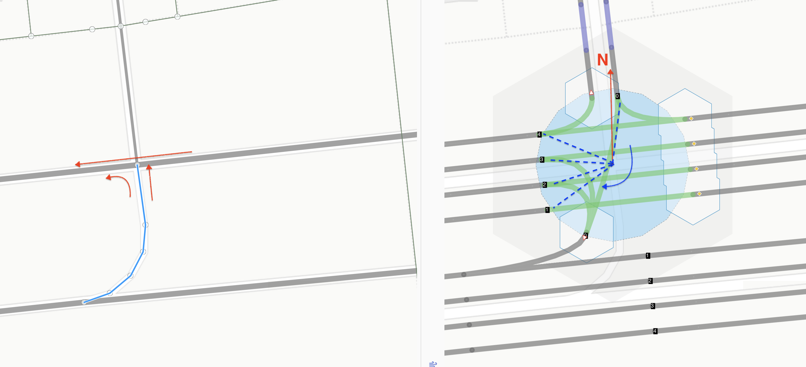
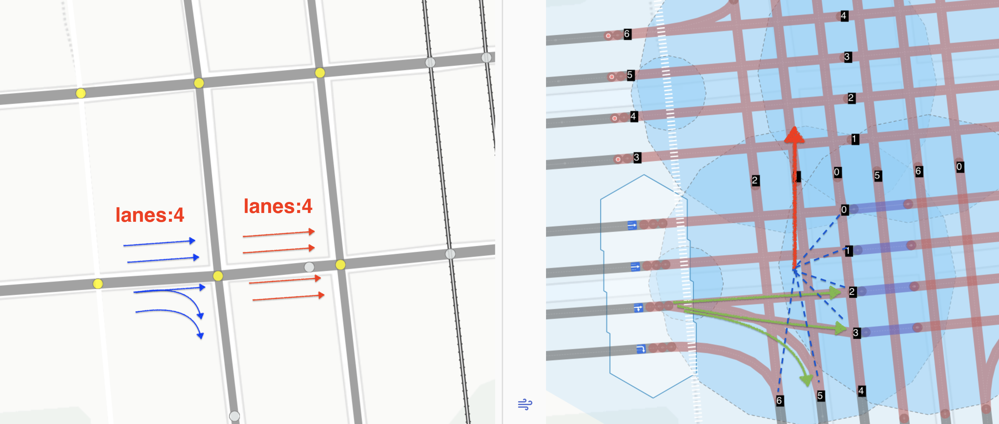
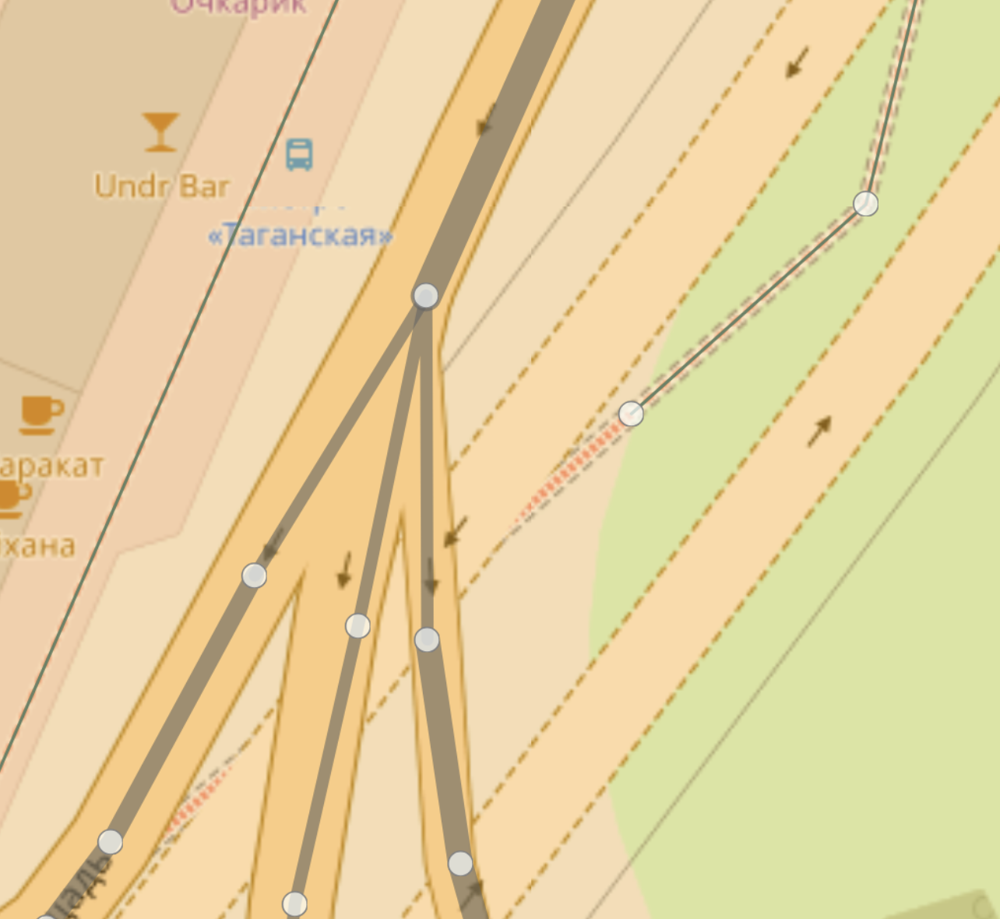
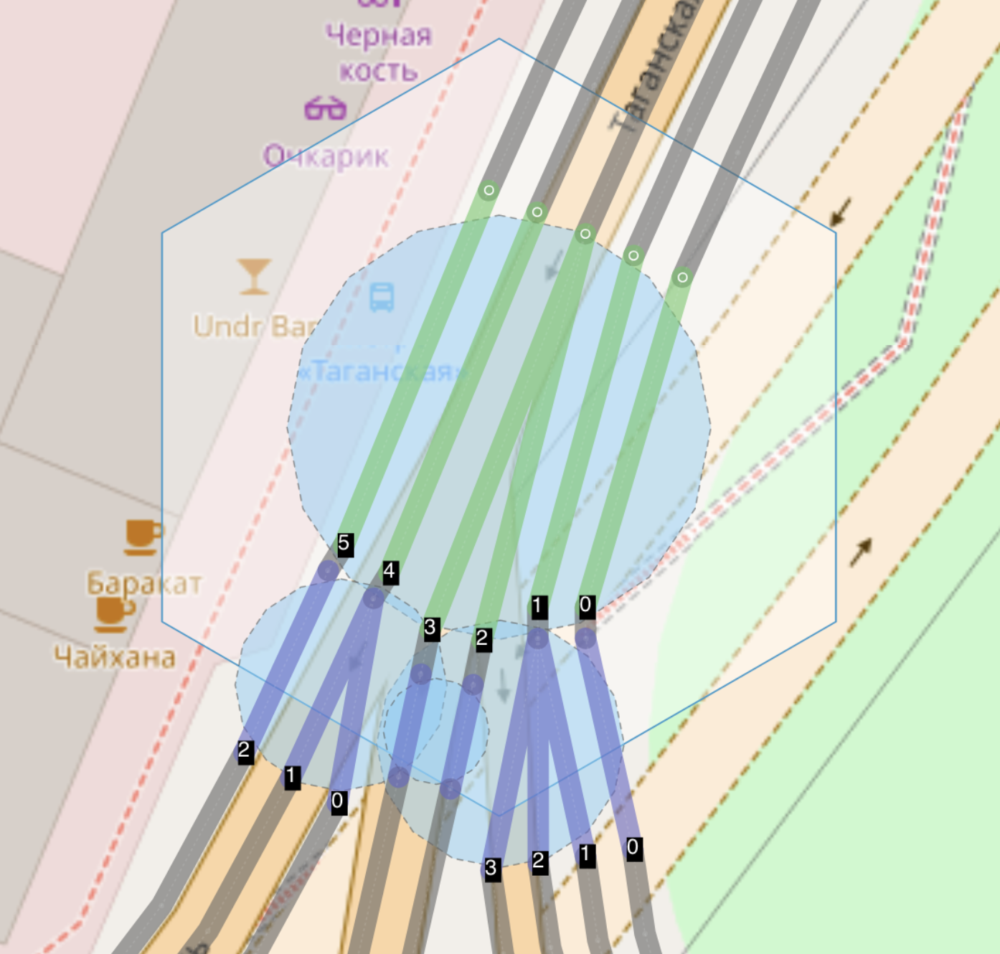
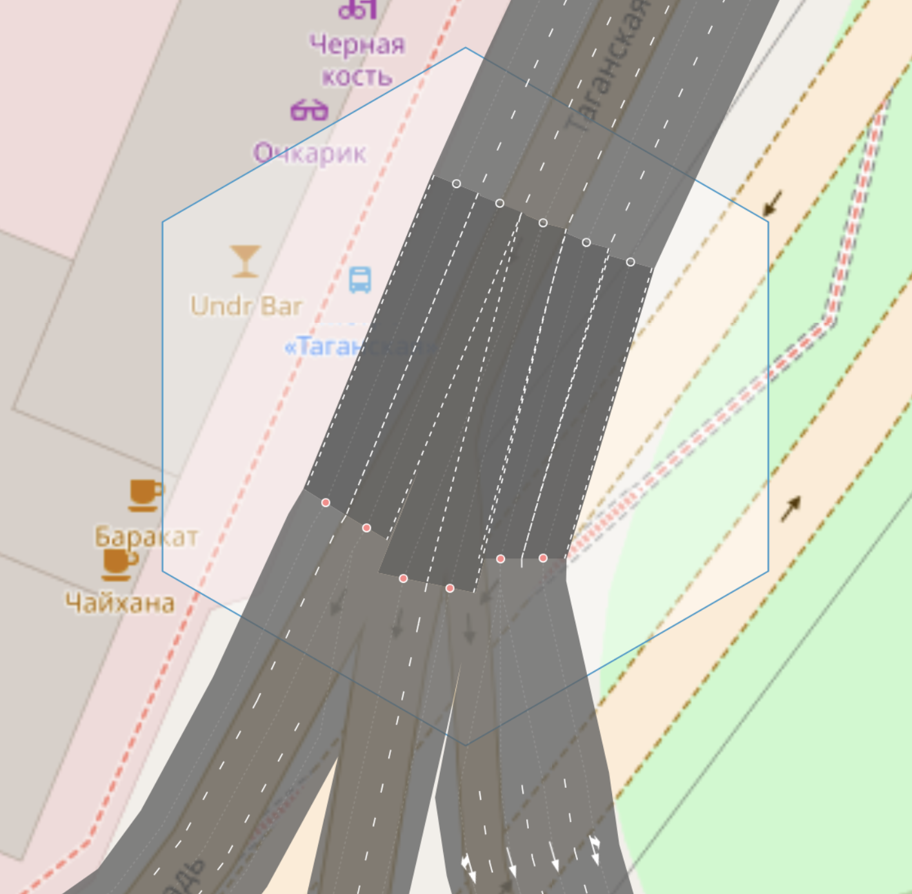
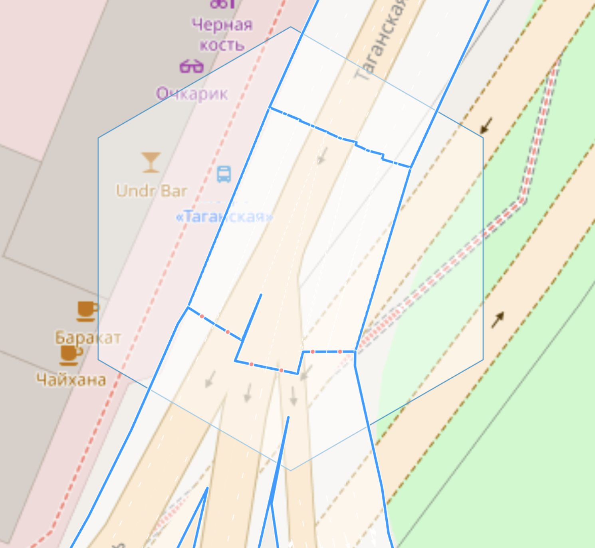

#connect - ключ для указания связности полос на пересечении


###Синтаксис
```
way.tags {
   connect(:lanes(:forward|backward)): number;number;...||
}
```
 
###Применяется для объектов

Этот тэг применяется только для объектов типа  `way` и может быть расширен двумя широко применяющимеся суффиксами `:lanes` и `:forward|backward`


###Причины введения
Сейчас в OSM существует способ для точного задания связности между полосами с помощью  отношений. [relation:connectivity](https://wiki.openstreetmap.org/wiki/Relation:connectivity)

Основным недостатками этого являются, то что это:

1. Очень громоздко, создавать отношение или даже несколько для одного way (from)
2. Отношения очень хрупкие и их легко сломать, постоянно нужен контроль их целостности
3. Для выходов из одного way в разные стороны (несколько way назначения) может понадобиться несколько relation - нельзя сделать одним объектом 
4. Повышенные требования к редактору и опыту маппера
5. Привнесенная сущность, нарушает бритву Оккама, с поворотми(`turn:lanes`) получилось же без relation. 


Для решения проблемы однозначного ввода/редактирования связности полос на перекрестке, 
нужно более простое решение, и желательно типовое.

За основу можно взять существующий подход с поворотами:

```md
way.tags:
    lanes:forward = 3
    turn:lanes:forward = through|through;right|right
```
 
Отлично, всем понятно и широко применимо. Непосредственно для объекта типа `way`
задается несколько тэгов со связным содержимым. От количества полос зависит количество секций
на которые будет разбито значения тега   `turn:lanes:forward` **из** каждой полосы
мы задаем направление поворота. 

Можем ли мы наследовать этот подход, но при этом задавая что-то, что будет адресовать 
полосу приемник?

Например, таким образом

```md
way.tags:
    lanes:forward = 3
    turn:lanes:forward = through|through;right|right
    connect:lanes:forward = 0|1;2|3
```

Самое простое в этой ситуации это использование числовых индексов, но полосы могут принадлежать
разным объектам `way`, которые выходят из точки - пересечения. Значит необходимо, 
как-то адресоваться еще и к ним.
При этом `way` может быть еще и дву-сторонним, надо отедлять полосы назначения 
`forward` стороны от `backward`

```md
way.tags:
    lanes:forward = 3
    turn:lanes:forward = through|through;right|right
    connect:lanes:forward = {way1.id}:backward:0|{way2.id}:backward:1;{way3.id}:backward:2|{way3.id}:forward:0
```

Выглядит ужасно запутано и вероятно еще сложнее, чем `relation[type=connectivity]`.
Можно ли этого всего избежать, этой сложной адресации? 

Да если задать одно глобальное соглашение.

##Соглашение:

```
Для всех соединенных/пересекающихся в одной точке `node` объектов  типа `way`
общий, для всех полос всех `way`, индекс(порядок) исходящй из этой `node` полосы движения 
определяется углом между прямой с координатами `node` и координатами точки начала полосы, 
и прямой проведенной из `node` на север N в направлении по часовой стрелке. 
```

Простыми словами, по часовой стрелке от 0 часов, точки начала полос после выхода из пересечения,
нумеруются по порядку вокруг node этого пересечения. Нумеруются только те полосы по которым осуществляется
движение, и которые учтены в: `lanes`, `lanes:forward`, `lanes:backward` соответствующих way.


**Пример:**

Рассмотрим это на простом примере, см рисунок 1.
Слева представлено пересечение с разворотом и голубым цветом выделен way, для которого 
мы будем задавать связность полос. Направления движения указаны красными стрелками.

| Ground               | Ways & lanes | 
| :---------------- | :------ | 
| | |

Справа изображена связность полос, которую мы хотим аттрибутировать, допустим, разворот не может быть 
совершен в крайнюю левую полосу(радиус поворота автомобиля),а только в средние полосы на магистрали.

Проведем линию из node вверх на север и так же до каждой точки только исходящих полос. 
Входящие полосы для этого узла нас не интересуют.
Значение угла  между красной стрелкой и пунктрной линией и будет определять индекс 
или порядковый номер исходящей из даного узла полосы для адресации к ней.

Преимуществом такого подхода является то, что при постоянном количестве полос для всех `way` этого узла
порядок будет постоянным. Рассмотрим пример, как будет вуглядеть тэг для этого случая.


```md
way.tags:
    lanes = 1
    oneway = yes
    turn:lanes = left;through
    connect:lanes:forward = 0;2;3
```
 
>**Заметим**, что мы неявно ввели понятие как радиус пересечния - голубой круг на рисунке. Смотри тэг `junction:radius` 
[junction:radius](./node.tags.junction:radius.md)


### Целевое назначение
Использовать этот тэг предполагается для более точного картирования соединений на пересечениях, на сложных перекрестках,
где тэга  `turn:lanes` недостаточно. Он может являтся дополнением к тэгу `turn:lanes` для уточнения маневров только для 
конкретных полос, например, здесь соединение явно задано только для третьей полосы, остальное определятся
в тэге `turn:lanes` 

```md
way.tags:
    lanes = 3
    oneway = yes
    turn:lanes = left|through|slight_right;right
    connect:lanes:forward = ||4;5
```

В будущем для средств автоматизированной обработки или программ редактирования, вероятно можно будет реализовать конвертер тэга 
`connect:lanes` в `relation[type=connectivity]` и обратно - выглядит относительно простой задачей.

**Рассмотрим еще один пример:** 



Одно из пересечений сложного перекрестка. 4 полосы c маневрами указанными синими стрелками (слева)
Приходит в путь тоже из 4х полос. Очевидно, что если не использовать дополнительные указания (slight_right),
а пользоваться только указанными поворотами, то вход крайней правой полосы(3) будет без соединения. 
Явное добавление `slight_right` искажает знак движения по полосе - вводит в заблуждение водителя, поэтому 
его указание невозможно.


```md
way.tags:
    lanes = 4
    oneway = yes
    //turn:lanes = through|through|through;slight_right;right|right <<-- wrong
    turn:lanes = through|through|through;right|right 
    connect:lanes:forward = ||2;3;5|
```


**Пример развилки:**

Крайне полезным данный тэг будет на перекрестках с широкими проезжими частями(много полос) и наличием
плавных развилок на две или более дороги. Можно рассмотреть на примере Таганской площади в Москве.


| OSM Ways               | lanes connectivity | 
| :---------------- | :------ | 
| | |


Развилка вида куриная лапка, и сразу за ней идет увеличение полосности, с двух до трех - четырех для разных 
way. Решить такое только тэгами поворотов крайне затруднительно. Хотя и от них отказываться нельзя,
так как отни отражают знаки движения по полосам установленные ПДД(если они есть на/над дорогой).


```
way.tags:
    lanes = 5
    highway = primary,
    oneway = yes,
    connect:lanes = 0|1|2;3|4|5,
    turn:lanes = left|left|through;right|right|right
```

Значения  `turn:lanes` сложно правильно соотенсти с геометрией маневра в таких случаях.
Если же мы захотим воспользоваться `relation[type=connectivity]` то для первой точки их придется создать минимум 3 штуки.


**Результаты применения:**

Подобный подход в сочетании с тэгами `placement` и `junction:radius`, `junction:shape` и другими, позволит более точно
отражать  связность полос, маневров для навигации и рендерить полигон дорог и пересечений,
что может быть важно на широких магистралях и их узлах.

| Road view               | Road & intersection polygons | 
| :---------------- | :------ | 
| | |

