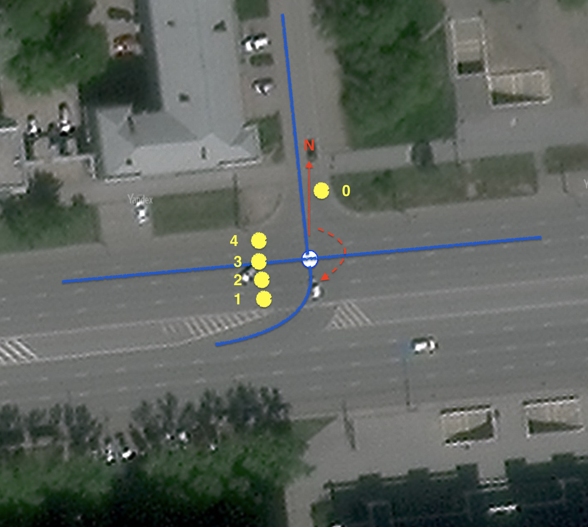

# connect – ключ для указания связности полос на пересечении

## Синтаксис
```
way.tags {
   connect(:lanes(:forward|backward)): number;number;...||
}
```

### Применимость

Этот тег применяется только для объектов типа `way` и может быть расширен двумя суффиксами `:lanes` и `:forward|backward`.

### Необходимость тега и логика его использования
В OSM связность между полосами устанавливается с помощью отношений ([relation:connectivity](https://wiki.openstreetmap.org/wiki/Relation:connectivity))

Основные недостатки этого метода:

1. Создать все отношения для каждого way – долгая кропотливая работа.
2. Полученный набор отношений может оказаться неактуальным в процессе редактирования перекрёстка, поэтому требуется постоянный контроль целостности relations.
3. Для выходов из одного way в разные стороны (множество way назначения) может понадобиться несколько relations, и их нельзя сделать одним объектом.
4. Повышенные требования к редактору и опыту маппера.

При этом сущность relation не является необходимой. Например, с поворотами(`turn:lanes`) удалось обойтись без relation.

Для решения проблемы однозначного ввода/редактирования связности полос на перекрёстке необходимо простое типовое решение, лишённое перечисленных недостатков.

За основу можно взять существующий подход с поворотами:

```md
way.tags:
    lanes:forward = 3
    turn:lanes:forward = through|through;right|right
```

Развивая эту логику, для объекта типа `way` задаётся несколько тегов со связным содержимым. Поскольку мы задаём направление поворота **из** каждой полосы, от количества полос зависит количество секций,
на которые будет разбито значение тега `turn:lanes:forward`.

Также нам нужно привязаться к полосе-приёмнику. Например, таким образом:

```md
way.tags:
    lanes:forward = 3
    turn:lanes:forward = through|through;right|right
    connect:lanes:forward = 0|1;2|3
```

Мы не можем использовать числовые индексы, поскольку полосы могут принадлежать разным объектам `way`, выходящим из точки-пересечения. Значит, необходимо указывать адрес конкретного way, а в случае двустороннего way, отделять полосы назначения `forward` от `backward`. Например:

```md
way.tags:
    lanes:forward = 3
    turn:lanes:forward = through|through;right|right
    connect:lanes:forward = {way1.id}:backward:0|{way2.id}:backward:1;{way3.id}:backward:2|{way3.id}:forward:0
```

Выглядит громоздко и сложнее, чем `relation[type=connectivity]`.
Можно ли избежать этой сложной адресации?
Да, если задать глобальное соглашение.

## Соглашение:

```
Для всех объектов "way", которые соединяются или пересекаются в выбранном "узле" ("node"),
применяется следующий принцип индексации.
Для каждой из полос ("lane") всех "ways", исходящих из этого «узла» индекс определяется углом между линией,
проведённой из «узла» на север (N), и линией, идущей от «узла» до начальной точки полосы,
при этом угол увеличивается по часовой стрелке.
```

Простыми словами: представим, что стрелка часов начала своё движение от положения "на север", и когда она указывает на начало полосы на выходе из перекрёстка, мы присваиваем этой полосе следующий номер. Нумеруются только те полосы, по которым осуществляется движение и которые учтены в: `lanes`, `lanes:forward`, `lanes:backward` соответствующего way.

Преимуществом такого подхода является то, что при постоянном количестве полос для всех `way` этого узла
порядок будет постоянным.

**Пример:**

Рассмотрим это на простом примере, см. рисунок 1.
Слева представлено пересечение с разворотом. На схеме ways голубым цветом выделен way, для которого задаётся связность полос. Направления движения указаны красными стрелками.

| Ground               | Ways & lanes |
| :---------------- | :------ |
| | |

Справа изображена связность полос, которую необходимо атрибутировать. Разворот возможен только в средние полосы магистрали. В правую полосу он запрещён, а разворот в крайнюю левую не позволяет радиус поворота автомобиля.

Проведём красную линию из node вверх на север. Затем отметим пунктиром направление из node до точки начала каждой из исходящих полос. Входящие полосы для этого узла нас не интересуют. Значение угла между красной стрелкой и пунктирной линией определяет индекс (порядковый номер) исходящей из данного узла полосы для адресации к ней.

```md
way.tags:
    lanes = 1
    oneway = yes
    turn:lanes = left;through
    connect:lanes:forward = 0;2;3
```

>**Заметим**, что мы неявно ввели такое понятие, как радиус пересечения – голубой круг на рисунке. См. тег `junction:radius`
[junction:radius](./node.tags.junction:radius.md)

### Целевое назначение
Использовать этот тег предполагается для более точного картирования соединений на сложных перекрёстках,
где тега `turn:lanes` недостаточно. Он может являться дополнением к тегу `turn:lanes` для уточнения манёвров только для
конкретных полос. Например, здесь соединение явно задано только для третьей полосы, остальное определяется
в теге `turn:lanes`.

```md
way.tags:
    lanes = 3
    oneway = yes
    turn:lanes = left|through|slight_right;right
    connect:lanes:forward = ||4;5
```

В будущем для средств автоматизированной обработки или программ редактирования, возможно, будет реализован конвертер тега
`connect:lanes` в `relation[type=connectivity]` и обратно.

**Рассмотрим ещё один пример:**


Одно из пересечений сложного перекрёстка. 4 полосы с манёврами, указанными синими стрелками (слева), приходят в путь из 4х полос. Очевидно, что если не использовать дополнительные указания (slight_right), а пользоваться только указанными поворотами, то вход крайней правой полосы(3) останется без соединения. Явное добавление `slight_right` искажает знак движения по полосе, что вводит в заблуждение водителя, поэтому его использование неприемлемо.

```md
way.tags:
    lanes = 4
    oneway = yes
    //turn:lanes = through|through|through;slight_right;right|right <<-- wrong
    turn:lanes = through|through|through;right|right
    connect:lanes:forward = ||2;3;5|
```

**Пример развилки**

Польза данного тега очевидна для перекрёстков с большим количеством широких проезжих частей и плавными развилками на две дороги или более. Рассмотрим применение тега на примере Таганской площади в Москве.

| OSM Ways               | lanes connectivity |
| :---------------- | :------ |
| | |

Развилка вида "куриная лапка" с увеличением полосности с двух до трёх полос для левого way и до четырёх для правого. Мы используем теги поворотов, так как они отражают знаки движения по полосам, установленные ПДД. Но картировать все маршруты (routes) только этими тегами затруднительно, а порой невозможно.

```
way.tags:
    lanes = 5
    highway = primary,
    oneway = yes,
    connect:lanes = 0|1|2;3|4|5,
    turn:lanes = left|left|through;right|right|right
```

В подобных случаях значения `turn:lanes` сложно правильно соотнести с геометрией манёвра.

Если бы мы решили воспользоваться тегом `relation[type=connectivity]`, то пришлось бы выстроить крайне громоздкую конструкцию, поскольку только для первой точки их придётся создать минимум 3 штуки.

**Результаты применения:**

Подобный подход в сочетании с тегами `placement` и `junction:radius`, `junction:shape` и другими позволит более точно рендерить полигон дорог и пересечений, отражая связность полос, манёвров для навигации. Зачастую это важно на широких магистралях и их узлах.

| Road view               | Road & intersection polygons |
| :---------------- | :------ |
| | |

## Рекомендуемые статьи

Тег [junction:shape](./node.tags.junction:shape.md)

Тег [junction:radius](./node.tags.junction:radius.md)

Тег [junction:cluster:radius](./node.tags.junction:cluster:radius.md)

Тег [crossing:corner](./node.tags.crossing:corner.md)