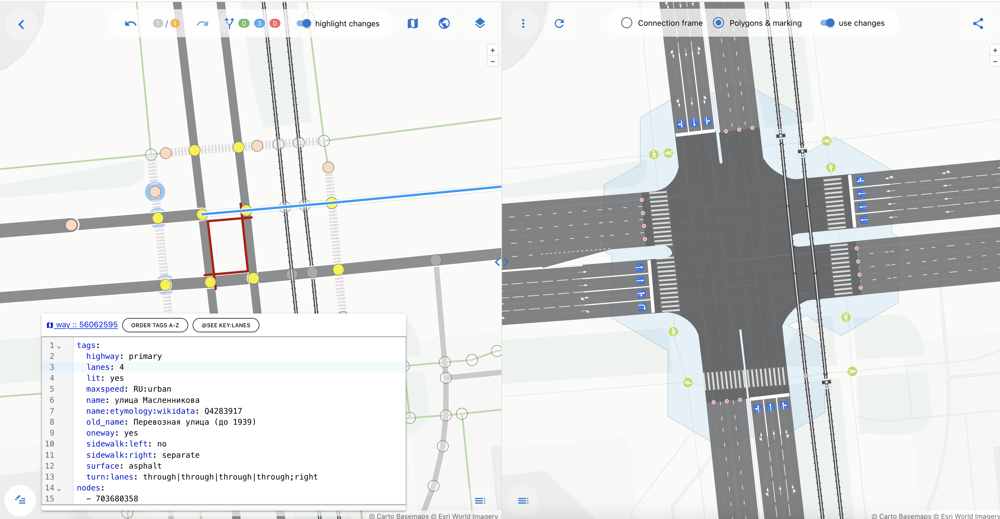
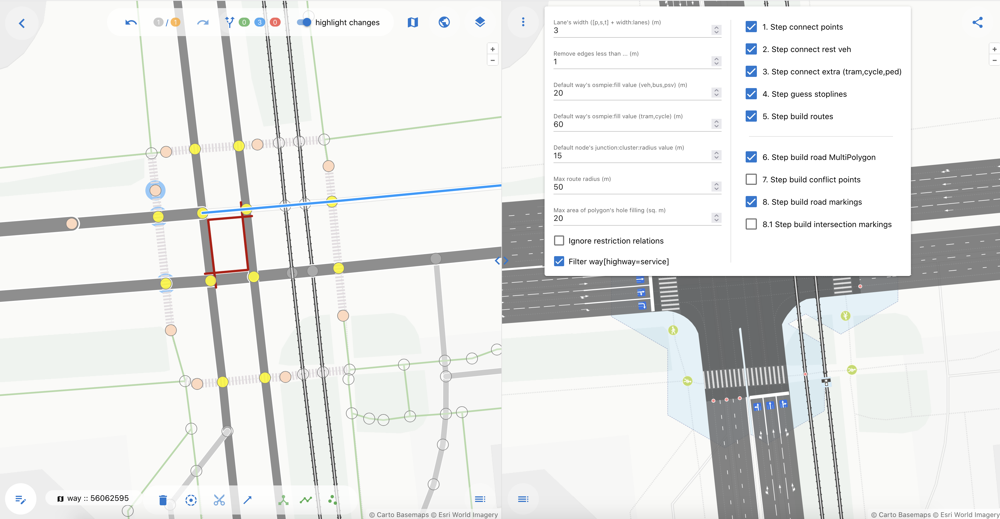
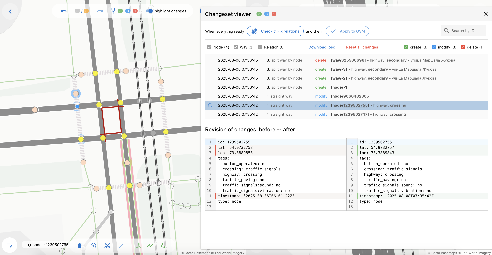
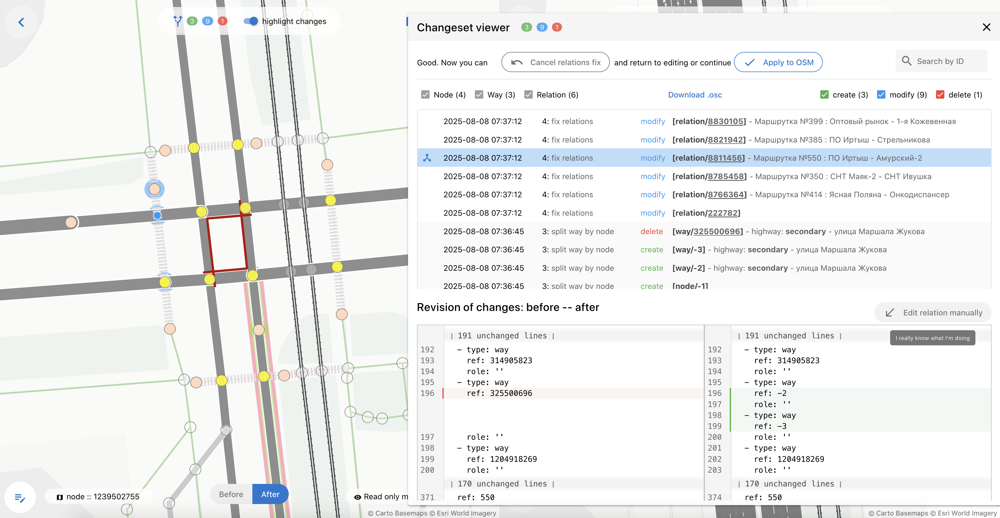
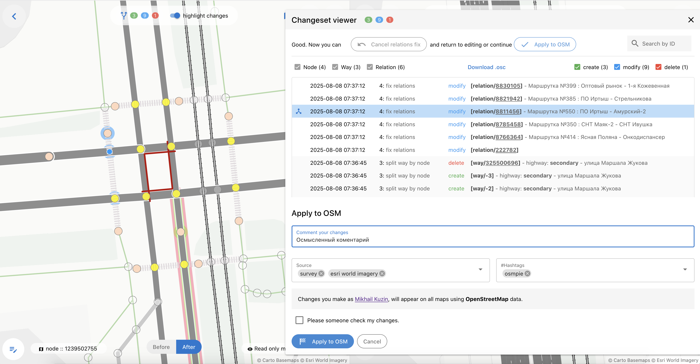
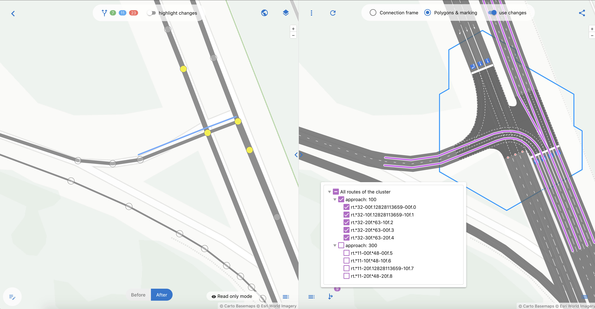

## 1. Порядок работы и формы ввода

Общий порядок работы с OSMPIE.

1. Загруженные из OSM данные отражаются в левой (редактор) и правой (рендер) частях экрана.
2. Редактируйте объекты в левой части экрана при помощи манипулятора "мышь": выделяйте, добавляйте, удаляйте и меняйте объекты. Доступные функции представлены в меню, расположенном вдоль правой стороны левого экрана. В правом экране отражается внешний вид отредактированного перекрестка.
3. Окно просмотра **Сhangeset viewer** позволяет посмотреть, какие были сделаны изменения и что будет отправлено на сервер OSM. Здесь можно скачать **OSMcs** файл. Кнопки рядом с кнопкой 'Changeset viewer' отменяют последние шаги (Undo) и возвращают отмененные (Repeat).
4. Если в процссе редактирования вы удалили ключевой объект перекрестка (node или way) или разделили (split) way, то перед отправкой изменений на сервер OSM вам будет предложено исправить все **relations**, связанные с удаленными объектами. Если система не выявила конфликтов, переходим к шагу отправки.
5. В случае автоматического исправления relations дальнейшее редактирование будет запрещено, а ваша модель переведена в режим "только чтение". При наличии достаточных навыков вы можете вручную исправить relatioins. Либо необходимо отменить этот шаг и вернуться к редактированию.
6. В любой моммент времени вы можете поделиться ссылкой с другим участником для обсуждения вашей модели. Изменения в проект может вносить только автор, остальным участникам доступен только просмотр.
7. После отправки в OSM ваша работа переходит в режим "только чтение" для автора тоже.

---

## 2. Окно редактирования свойств объекта

Для редактирования свойств объекта его надо выделить мышкой и нажать кнопку **ViewChange Object's** в левом нижнем углу экрана. Она активирует режим просмотра/редактирования свойств.

Данные представлены в формате **YAML!** со всеми вытекающими из этого [плюсами и минусами](https://ru.wikipedia.org/wiki/YAML).

В форме работает автозаполнение для ускорения рутинной работы по исправлению свойств. Имейте ввиду, что представленные схемы тэгов не полные.

Чтобы деактивировать режим просмотра/редактирования свойств, необходимо еще раз нажать на ту же кнопку.

---

## 3. Окно опций рендера OSMPIE (Options and Defaults)

Данное окно вызывается нажатием на кнопку с тремя вертикальными точками, находящуюся в верхнем левом углу правого экрана (рендер). В этом окне необходимо отредактировать параметры выбранного объекта с целью максимально точно воспроизвести его топологические особенности.

| Опциия | Назначение/описание |
| :------- | :------ |
| `Lane's width ([p,s,t] + width:lanes) (m)` | Базовая ширина полосы в метрах для основных дорог (primary, secondary, tertiary). Остальные значения получаются умножением этого значения на соответствующие коэффициенты. Значения можно переопределить тэгом `width:lanes: *` |
| `Remove edges less than ... (m)` | Удаляет ребра результирующего графа длиной менее Х метров (иногда при отладке полезно установить 0) |
| `Default way's osmpie:fill value (veh,bus,psv) (m)` | Устаналивает новую точку каждые Х метров для дорог |
| `Default way's osmpie:fill value (tram,cycle) (m)` | Устанавливает новую точку каждые Х метров для трамваев и велосипедов |
| `Default node's junction:cluster:radius value (m)` | Базовое значение junction:cluster:radius для всех точек, если иное не переопределено в свойствах node |
| `Max route radius (m)` | Расстояние от центра перекрестка до начала и конца микро-роутов |
| `Max area of polygon's hole filling (sq. m)` | Предельная площадь "дырок" полигона, которые нужно заливать цветом асфальта|
| `Ignore restriction relations` | Позволяет игнорировать все relation типа restriction. Иногда это удобно |
| `Filter way[highway=service]` | Если установить эту опцию, то way[service] будуть попадать в рендер. Иногда это позволяет получить идеальный результат |
| `1. Step connect points` | Шаги с 1 по 4 отладочные, рекомендуется оставить их включенными |
| `2. Step connect rest veh` | ... |
| `3. Step connect extra (tram,cycle,ped)` | ... |
| `4. Step guess stoplines` | ... |
| `5. Step build routes` | Определяем, необходимо ли строить микро-маршруты (micro-routes) через перекрестки |
| `6. Step build road MultiPolygon` | Строим полигоны дороги |
| `7. Step build conflict points` | Поиск конфликтных точек на перtсечении |
| `8. Step build road markings` | Рисуем линейную разметку на дорогах |
| `8.1 Step build intersection markings` | Рисуем разметку на перекрестке |

---

## 4. Changeset viewer – просмотр изменений

В данном окне представлен полный пошаговый список внесенных вами правок. 
Окно вызывается нажатим на кнопку с цифрами в кружочках, расположенную в верхнем меню левой части экрана. 

В списке представлены элементы, которые были удалены, добавлены или изменены.
Список упорядочен по времени изменения (новые сверху). Можно отфильтровать нужные элементы по операции, объекту или идентификатору.
Выбирав определенный объект в нижней части окна, мы видим подсвеченными изменения, произведенные с этим объектом относительно его начального состояния, которое было загружено в последний раз из OSM.
Работа с различиями организована по подобию с [Git] (https://git-scm.com).

---

## 5. Changeset viewer – целостность ссылок, исправление relations

Если вы удаляли объекты way или node либо применяли операцию split к объекту way, то редактор предложит вам автоматически исправить ссылки на удаленные объекты. Нажмите кнопку **Check & fix relation**, чтобы программа обратилась к **overpass API** и выберала все relations, которые имеют отношение к удаленным объектам.

1. Для разделенных (splitted) way старые ссылки в member будут заменены на ссылки новых way (c учетом порядка для route).
2. Для удаленных объектов система просто удалит ссылки.
3. В случае если вы удалили way и вместо него создали новый way, то необходимо будет исправить relations в ручную.
4. После фикса relations редактирование будет запрещено, редактор перейдет в режим 'только чтение'.
5. Вернуться к редактированию можно, нажав кнопку отмены **Cancel relation fix**

---

## 6. Changeset viewer – отправка изменений в OSM

Когда внесены все необходимые изменения и отредактированы все ссылки, вы можете отправить свой перекресток в OSM. Нажимайте кнопку **Apply to OSM**, чтобы перейти к финальному шагу.
Останется только ввести коментарий к вашему changeset и выбрать или дописать свои тэги источников. 
Поздравляем вас с новым совершенным перекрестком в OSM!

---

## 7. Просмотр микро-маршрутов для валидации перекрестка

Свойстава объектов, воспроизведенных рендером на правом экране, можно просмотреть, выбрав объект манипулятором "мышь". При выборе объектов типа кластер (облако гексагонов) появляется дополнительное окно, позволяющее выбрать и отобразить микро-маршруты (micro-routes), которые были построены OSMPIE для этого перкрестка.

Данная визуализация позволяет бустро оценивать правильность структуры полос и связность по каждому подходу.

---

## 8. Редактор в режиме "только чтение"

Режим "только чтение" исключает возможность внесения изменений. Он активируется после того, как были исправлены relations или changeset отправлен в OSM. Также ваша работа представляется в таком виде пользователю, которому вы отправили ссылку на созданные вами изменения.

Вы можете использовать этот режим не только для того, чтобы обсуждать детали своей работы с другими участникам, но и для того, чтобы сравнить несколько вариантов одного 
перекрестка в разных вкладках. 

В окне редактора (левый экран) можно включить режим отображения "было/стало".
В окне рендера (правый экран) можно использовать переключатель **use changes** для этих же целей.

---

## Рекмоендуемые статьи

[Как приготовить идеальный перекресток](./perfect.junction.md)

