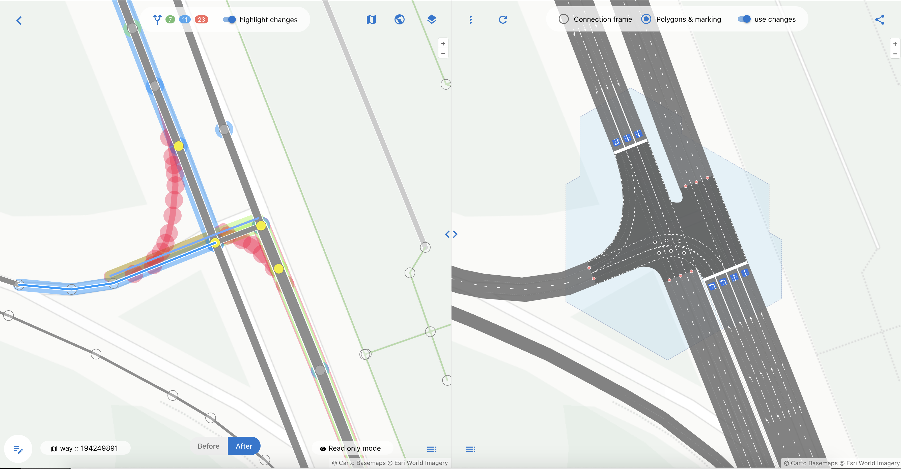

## 1. Порядок работы и формы ввода

Основной флоу работы с редактором OSMPIE предполагается следующий:

1. После загрузки данных, они отражаются в левой и правой окнах редактора
2. Далее выбирая объекты мышкой в левой части, перетаскивая их меняя свойства или добавляя новые объекты, 
вы приводите перекресток к нужному вам виду
3. Далее можно открыть окно просмотра changeset, чтобы понять,какие изменения были сделаны и что отправиться на сервер OSM,
там же можно скачать OSMcs файл
4. Если в процссе редактирования вы удалили(node или way) или сплитнули way, то перед тем как перейти к отправке изменений вам будет предложено починить
все relations связанные с удаленными объектами. Если ничего не удаляли то сразу к шагу отправки.
5. В результате автоматического исправления relation дальнейшее редактирование будет запрещено, и модель переведена в режим только чтение. 
Однако останется возможность вручную исправить relatioins, если вы понимаете что делаете. Или отменить этот шаг и вернуться к редактированию.
6. В любой моммент времени вы можете поделиться ссылкой с другим участником для обсуждения вашей работы, только автор может вносить исправления, 
для всех остальных можно только просмотреть изменения.
7. После отправки в OSM ваша работа останется в режиме только для чтения уже для всех и для автора в том числе.

---

## 2. Окно редактирования свойств объекта

Для редактирования свойств объекта, его надо выделить мышкой, и нажать кнопку в левом нижнем углу экрана.

Она активирует/деактивирует режим просмотра/редактирования свойств.

Да это **YAML!** со всеми вытекающими из этого [плюсами](https://ru.wikipedia.org/wiki/YAML) и минусами. 
В форме есть автокомплит(схемы тэгов не полные) для ускорения рутинной работы по исправлению свойств.

Выкючить режим просмотра/редактирования свойств - еще одно нажатие на эту кнопку.

---

## 3. Окно опций рендера OSMPIE

| Опциия | Назначение/описание |
| :------- | :------ |
| `Lane's width ([p,s,t] + width:lanes) (m)` | Базовая ширина полосы в метрах, для основных дорог (primary, secondary, tertiary), остальные значения получаются коэффициентами от этого значения. Разумеется все можно переопределить тэгом `width:lanes: *` |
| `Remove edges less than ... (m)` | Удалять ребра результирующего графа длинной менее Х метров, иногда полезно ставить  0, при отладке  |
| `Default way's osmpie:fill value (veh,bus,psv) (m)` | Установить новую точку каждые Х метров для дорог |
| `Default way's osmpie:fill value (tram,cycle) (m)` | Установить новую точку каждые Х метров для трамваев и велосипедов |
| `Default node's junction:cluster:radius value (m)` | Базовое значение junction:cluster:radius для всех точек если не переопределено в свойствах node |
| `Max route radius (m)` | Расстояние от центра перекрестка до начала и конца микро-роутов |
| `Max area of polygon's hole filling (sq. m)` | Предельная площадь дырок, которые нужно заливать цветом асфальта|
| `Ignore restriction relations` | Иногда удобно игнорировать все relation типа restriction |
| `Filter way[highway=service]` | Если установить эту опцию, то и way[service] будуть попадать в рендер, дольше больше возни, ну для красоты пойдет |
| `1. Step connect points` | Шаги с 1 по 4 чисто отладочные не рекомендуем выключать |
| `2. Step connect rest veh` | ... |
| `3. Step connect extra (tram,cycle,ped)` | ... |
| `4. Step guess stoplines` | ... |
| `5. Step build routes` | Строить или нет микро роуты через перекрестки |
| `6. Step build road MultiPolygon` | Строить полигоны дороги |
| `7. Step build conflict points` | Находим конфликтные точки на пеерсечении |
| `8. Step build road markings` | Рисуем линейную разметку на дорогах |
| `8.1 Step build intersection markings` | И отдельно опция для того же, но на перекрестке |

---

## 4. Changeset viewer - просмотр изменений

---

## 5. Changeset viewer - ссылочная целостность - исправление relations

---

## 6. Changeset viewer - отправка изменений в OSM

---

## 7. Просмотр микро-маршрутов для валидации перекрестка

---

## 8. Редактор в режиме только-чтение

---

